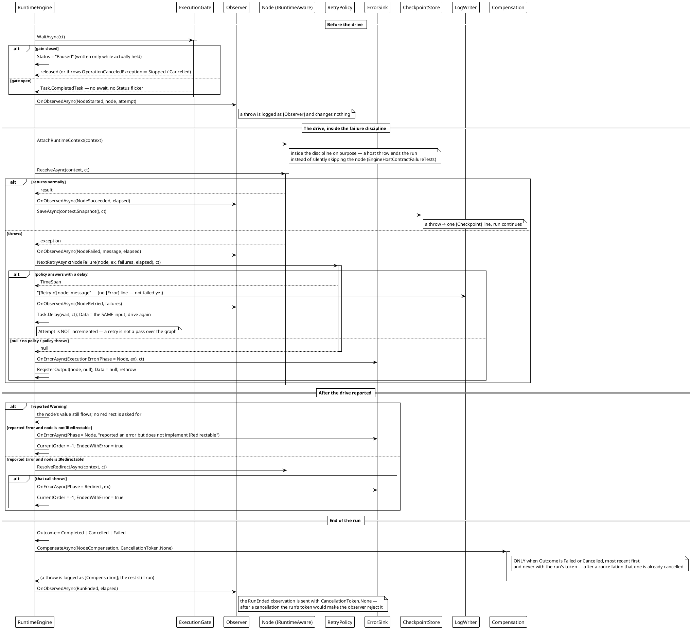

# Workflow System — Host Capabilities Around One Drive

The seven optional seams (2026-09-27) wrapped around a single node drive. Every one is read off the concrete `RuntimeContext` through a private `Session()` helper, so it also works inside a fan-out; every one left unset reproduces the pre-2026-09-27 behavior exactly.



## The order is the contract

| # | Step | Read from | A throw means |
|---|---|---|---|
| 1 | `ExecutionGate.WaitAsync(ct)` | `RuntimeContext.ExecutionGate` | `OperationCanceledException` ⇒ `Stopped` / `Cancelled` |
| 2 | `Observer` — `NodeStarted` | `.Observer` | logged as `[Observer]`, run unchanged |
| 3 | `IRuntimeAware.AttachRuntimeContext` | the node | **the run ends** (not a silent skip) |
| 4 | `ReceiveAsync` | the node | goes to step 5 |
| 5 | `RetryPolicy.NextRetryAsync` | `.RetryPolicy` | treated as "no more retries" |
| 6 | `ErrorSink.OnErrorAsync` | `.ErrorSink` | swallowed, logged as `[ErrorSink]` |
| 7 | `CheckpointStore.SaveAsync` | `.CheckpointStore` | logged as `[Checkpoint]`, run continues |
| 8 | `Compensation.CompensateAsync` | `.Compensation` | logged as `[Compensation]`, the rest still run |
| — | `LogWriter.Write` | `.LogWriter` | dropped, reported on `RuntimeContext.LogWriteFailed` |

Two rules hold across all of them: **the engine writes no log line for a cancellation**, and **a report never fails the run that made it**.

**Verified behavior** (reproduced against the shipped library — one session per capability):

```text
[5] paused: status=Paused isPaused=True running=True data=<null>
[6] observed: NodeStarted:TickerNode, NodeSucceeded:TickerNode, NodeStarted:BiasNode, NodeSucceeded:BiasNode, NodeStarted:PrinterNode, NodeSucceeded:PrinterNode
[6] sink on a clean run: 0 records
[8] retry: status=Completed data=ok drives=3 attempt=1
[8] retry logs: 01. FlakyNode | 02. [Retry 1] FlakyNode: flaky #1 | 03. [Retry 2] FlakyNode: flaky #2
[9] logfile: fileLines=3 retained=2      (the writer keeps every line; Logs keeps the newest 2)
[10] compensate: status=Stopped outcome=Failed currentOrder=-1 reversed=[BoomNode]
```

*Sources: `Src/Core/VeloxDev.Core/WorkflowSystem/CompilerEx/Runtime/RuntimeEngine.cs` (`DriveAsync` 412-506, `NextRetryAsync` 511-531, `ReportErrorAsync` 534-540, `NotifyErrorAsync` 543-557, `CompensateAsync` 561-581, `ObserveAsync` 585-599, `OutcomeOf` 602-610, `Session` 672-678); `CompilerEx/Runtime/Model/RuntimeContext.cs` (`AppendLog` 260-279, `ReportNodeAsync` 329-342). Demo: `Examples/Workflow/Common/Lib/ViewModels/Workflow/WorkflowDemoSession.cs`, `ConfigureRun`. Tests: `CompilerEx/Execution{Gate,Observer,Retry,ErrorSink,Compensation}Tests.cs`, `NodeReportTests.cs`, `CompilerLogWriterTests.cs`.*
