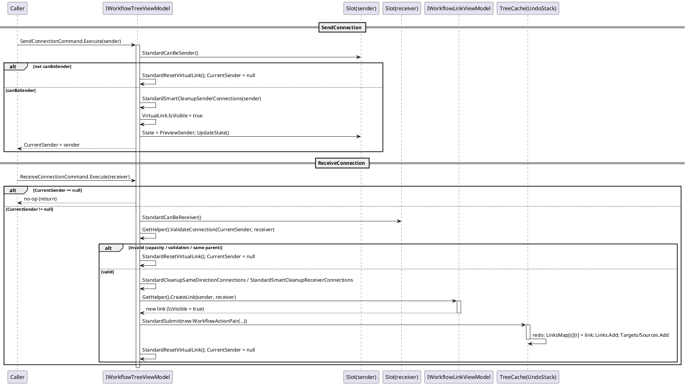
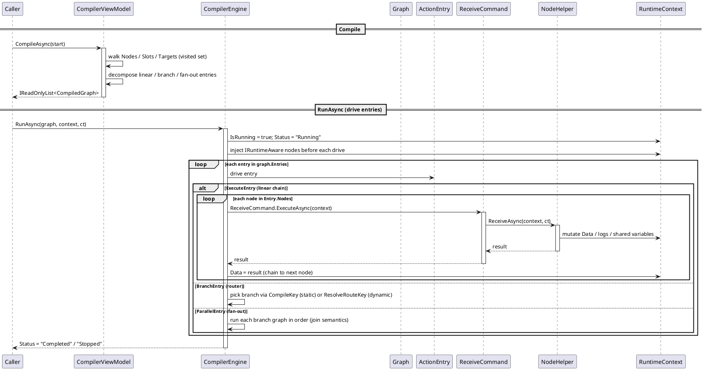
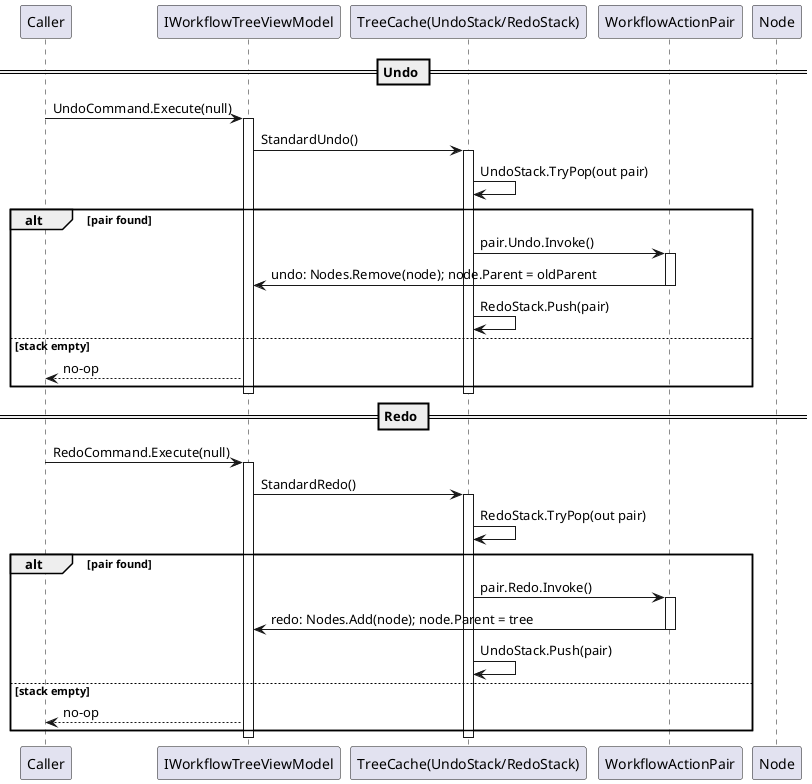
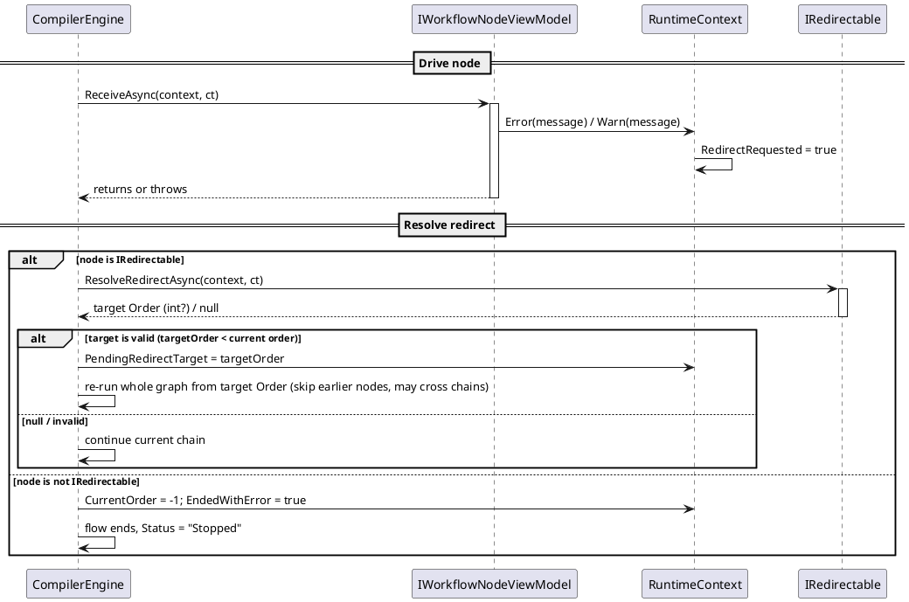
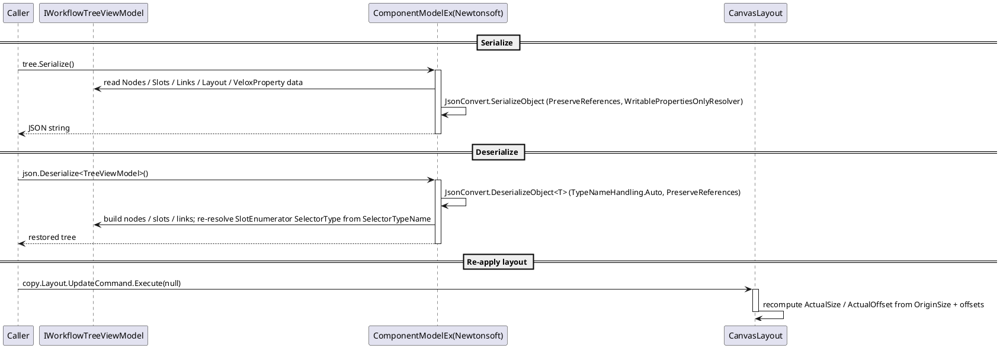

# Data Flow — Workflow System

Five PlantUML sequence diagrams trace the main data flows. Every participant is declared, every `activate` has a matching `deactivate`, and `alt/else/end` blocks are balanced.

## 1. Connect Flow — `SendConnection` → `ReceiveConnection` → `CreateLink`

A connection is built in two phases. `SendConnection(sender)` checks sender capacity, shows the `VirtualLink` and sets `PreviewSender`. `ReceiveConnection(receiver)` validates capacity + `ValidateConnection`, cleans up conflicting same-direction links, creates the link via `GetHelper().CreateLink(...)`, and submits the whole connection as one undoable `WorkflowActionPair`.

Error path: any failed validation (capacity, custom `ValidateConnection`, same-node connection) resets the virtual link and leaves no connection; existing same-direction connections are atomically replaced through a submitted `WorkflowActionPair`.

*Source: `Src/Core/VeloxDev.Core/WorkflowSystem/StandardEx/WorkflowTreeEx.cs`, `StandardSendConnection` lines 97-128, `StandardReceiveConnection` lines 130-171, `StandardCreateNewConnection` lines 375-428.*

## 2. Compile + Run — `CompileAsync` → `CompilerEngine.RunAsync` → `ReceiveAsync`

`CompilerViewModel.CompileAsync(start)` decomposes the subgraph reachable from the start node into `CompiledGraph`s (linear segments → `ExecuteEntry`, branches → `BranchEntry`, fan-outs → `ParallelEntry`). `CompilerEngine.RunAsync(graph, context, ct)` drives entries one by one, invoking each node's `ReceiveCommand → ReceiveAsync(context, ct)` and writing the return value back to `RuntimeContext.Data` to chain to the next node.

Cancellation path: `ct.ThrowIfCancellationRequested()` aborts the chain; an `OperationCanceledException` from a node rethrows immediately (cancellation is not a redirect).

*Source: `Src/Core/VeloxDev.Core/WorkflowSystem/CompilerEx/CompilerViewModel.cs`, `CompilerEngine.cs` (`RunGraphAsync` lines 63-89, `RunExecuteAsync` lines 96-148). Test evidence: `CompilerExTests.CompileThenRun_EngineDrivesGraph_WithRuntimeContext`.*

## 3. Undo / Redo

Every mutating operation is submitted as a `WorkflowActionPair(redo, undo)` onto a `ConcurrentStack`. `UndoCommand` pops the pair and runs its `Undo` action, then pushes it onto the redo stack; `RedoCommand` does the inverse.

Error path: if `pair.Redo/Undo.Invoke()` throws, `StandardSubmit`/`StandardUndo`/`StandardRedo` catch the exception and log via `Debug.WriteLine` — the stack is left unchanged.

*Source: `Src/Core/VeloxDev.Core/WorkflowSystem/StandardEx/WorkflowTreeEx.cs`, `StandardSubmit` lines 210-222, `StandardUndo` lines 224-239, `StandardRedo` lines 193-208.*

## 4. Error / Redirect — `RuntimeContext.Error()` → `IRedirectable` re-run

A node that calls `RuntimeContext.Error()/Warn()` or throws during `ReceiveAsync` requests a redirect. If it implements `IRedirectable`, the engine re-runs the whole graph from the returned `CompileContext.Order` (skipping earlier nodes, possibly cross-chain); otherwise the flow ends with status `-1`.

Redirects are abandoned after 50 attempts (`MaxRedirects` → throws `InvalidOperationException`). If the target Order is a Router, the engine re-routes only without recomputing the router.

*Source: `Src/Core/VeloxDev.Core/WorkflowSystem/CompilerEx/CompilerEngine.cs` (`RunAsync` lines 20-60, `RunExecuteAsync` lines 96-148), `IRedirectable.cs`. Test evidence: `RedirectTests.RedirectGate_RedirectsToChainHead_ThenSucceeds`, `RedirectTests.RedirectCrossChain_SkipsPriorAndReruns`, `RedirectTests.RedirectToRouter_ReroutesWithoutRecompute`.*

## 5. Async / Serialization — `Serialize` / `Deserialize`

`ComponentModelEx` serializes the whole graph to JSON via Newtonsoft with `PreserveReferencesHandling.Objects` and a writable-properties-only resolver; deserialization rebuilds the graph and re-resolves `SlotEnumerator.SelectorType` from the serialized `SelectorTypeName`. The caller then re-applies layout via `Layout.UpdateCommand`.

Error path: `TryDeserialize` returns `false` for null/empty/malformed input without throwing; `Deserialize` throws `JsonSerializationException` when the result is null.

*Source: `Src/Core/VeloxDev.Core.Extension/ComponentModelEx.cs`. Test evidence: `WorkflowSerializationTests.TreeWithEnumNode_RoundTripsSelectorType`. Demo load path: `Examples/Workflow/WPF/Demo/Views/Workflow/WorkflowView.xaml.cs`, lines 46-51.*
