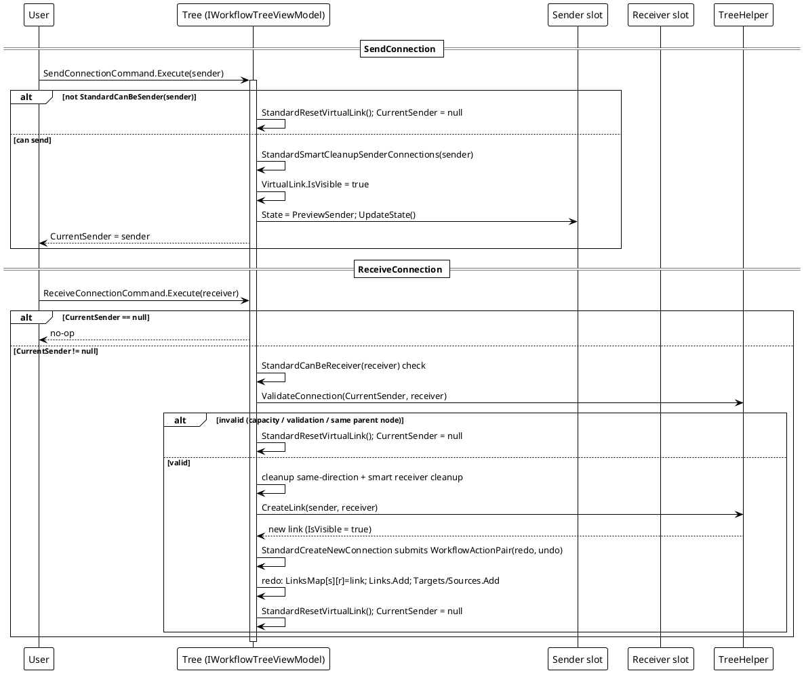
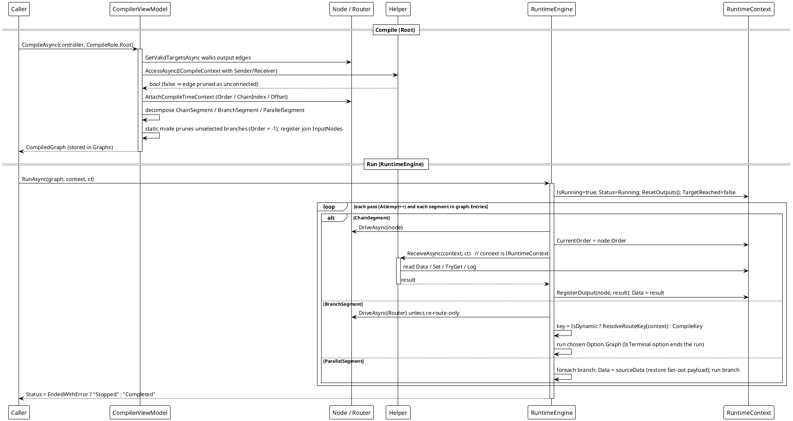
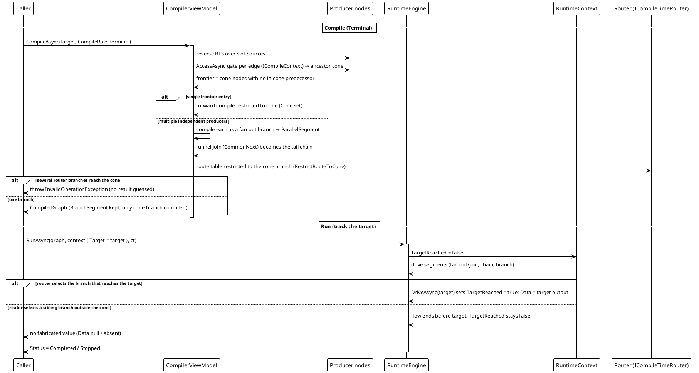
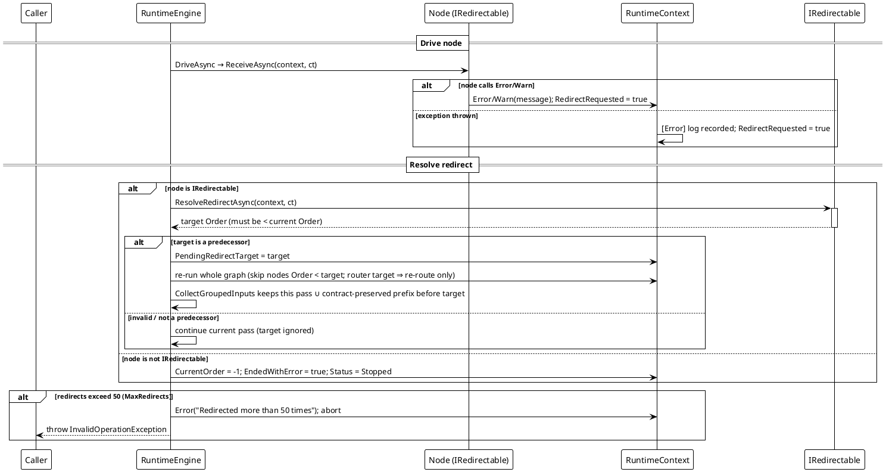
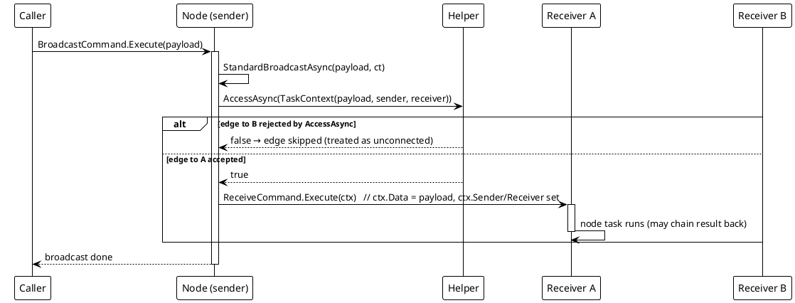

# Data Flow — Workflow System

PlantUML sequence diagrams trace the core data flows of the workflow-system feature. Participants are declared before use, `activate`/`deactivate` are balanced, and `alt/else/end` blocks are balanced.

## 1. Connect Flow — `SendConnection` → `ReceiveConnection` → `CreateLink`

A connection is built in two phases. `SendConnection(sender)` validates sender capability, cleans up conflicting sender connections, shows the `VirtualLink` and sets `CurrentSender`. `ReceiveConnection(receiver)` validates capability + custom `ValidateConnection` + the same-node rule, cleans up same-direction conflicts, then `StandardCreateNewConnection` asks the tree helper for a new link and submits the whole connection as one undoable `WorkflowActionPair`.

The submitted pair is executed immediately (`redo`) and pushed onto the undo stack; `StandardUndo`/`StandardRedo` later run `undo`/`redo` and swap stacks (see the [Command pattern](../../02_design-patterns/00_workflow-system/03_command-pattern/index.md)). Any failed validation resets the virtual link and leaves no connection.

*Source: `Src/Core/VeloxDev.Core/WorkflowSystem/StandardEx/WorkflowTreeEx.cs`, `StandardSendConnection` lines 97-128, `StandardReceiveConnection` lines 130-171, `StandardCreateNewConnection` lines 375-428.*

## 2. Compile + Run (Root) — `CompileAsync(role: Root)` → `RuntimeEngine.RunAsync` → `ReceiveAsync`

Two phases. **Compile** walks the sub-graph reachable from the controller and builds immutable segments: linear runs become `ChainSegment`, a node implementing `ICompileTimeRouter` becomes a `BranchSegment`, a multi-target fan-out becomes a `ParallelSegment`. Each node's output edge is statically validated by calling the sender's `AccessAsync` with an `ICompileContext` (a rejected edge is treated as unconnected and omitted); every reachable node receives a fixed compile identity (`Order`/`ChainIndex`/`Offset`) via `ICompileTimeAware`, and multi-input join points are registered with their input source nodes. **Run** drives those segments: the engine owns downstream dispatch, calls `Helper.ReceiveAsync` directly with an `IRuntimeContext`, writes the return value back as `context.Data`, and registers each node's output.

Cancellation path: `ct.ThrowIfCancellationRequested()` aborts the pass; `OperationCanceledException` from a node is rethrown immediately (cancellation is **not** a redirect) and `RunAsync` sets `Status = "Stopped"`.

*Sources: `Src/Core/VeloxDev.Core/WorkflowSystem/CompilerEx/Compile/CompilerViewModel.cs` (lines 26-57 entry, 59-232 decomposition, 385-430 `GetValidTargetsAsync`); `CompilerEx/Runtime/RuntimeEngine.cs` (`RunAsync` lines 19-68, `RunExecuteAsync` 106-160, `RunParallelAsync` 205-214, `DriveAsync` 227-261). Demo: `Examples/Workflow/Common/Lib/ViewModels/Workflow/ControllerViewModel.cs` lines 30-58. Test evidence: `CompilerEx/RuntimeEngineRunTests.cs`, `CompilerEx/EntrySemanticsTests.cs`.*

## 3. Reverse / Terminal cone flow — `CompileAsync(role: Terminal)` → run with `Target`

`CompileRole.Terminal` computes a sink node's result from its **ancestor cone**: reverse BFS over `Sources`, validating each edge with the sender's `AccessAsync` (rejected edges are not ancestors). The cone's own entry frontier (nodes with no in-cone input) is derived automatically — no controller/start node required. A router on the cone **keeps real `BranchSegment` semantics** but only the branch that leads into the cone is compiled (`RestrictRouteToCone`); several independent producers funnel into the target as a `ParallelSegment` then a common join chain. Reachability is reported by `RuntimeContext.Target`/`TargetReached`; no value is fabricated.

*Sources: `Src/Core/VeloxDev.Core/WorkflowSystem/CompilerEx/Compile/CompilerViewModel.Reverse.cs` (`BuildAncestorConeAsync` lines 33-74, `CompileConeAsync` 82-134); `CompilerViewModel.cs` `RestrictRouteToCone` lines 286-308. Test evidence: `CompilerEx/CompileToReverseTests.cs` (`RouterOnConePath_SelectedBranchMatchesTarget_ReachesAndReturnsResult`, `RouterOnConePath_SelectedSiblingBranch_TargetNotReached_FlowEndsWithoutValue`, `FanOutJoin_TargetAfterJoin_CompilesConeFunnel_GroupDataAtJoin`).*

## 4. Redirect re-run — `RuntimeContext.Error()` → `IRedirectable` → whole-graph re-run

An in-node `Error()`/`Warn()` call or a `ReceiveAsync` exception is a redirect request. With `IRedirectable` the node returns a predecessor `Order`; `RunAsync` re-runs the whole graph toward that state — nodes with `Order < target` are skipped, so a redirect may skip forward across chains and resume later. The output registry is *not* cleared between passes; stale outputs are filtered by pass stamp and `ActiveRedirectTarget` so a join never aggregates results the re-run superseded.

*Sources: `Src/Core/VeloxDev.Core/WorkflowSystem/CompilerEx/Runtime/RuntimeEngine.cs` (`RunAsync` lines 19-68, `RunExecuteAsync` 106-160); `CompilerEx/Runtime/Model/RuntimeContext.cs` (`Error`/`Warn` lines 87-98, `RegisterOutput` 111-115, `CollectGroupedInputs` 127-140); `CompilerEx/Runtime/Contracts/IRedirectable.cs`. Test evidence: `CompilerEx/RuntimeRedirectTests.cs`.*

## 5. Broadcast dispatch — `StandardBroadcastAsync` (stateless / edge-level)

The model has three execution entries: ① a single-node task (`ReceiveCommand.Execute(ctx)` with an `ITaskContext`), ② edge-level broadcast, and ③ the chain-level compiled run. This diagram shows entry ②: `StandardBroadcastAsync` iterates the node's output-slot targets, builds a `TaskContext(parameter, sender, receiver)` per edge, applies the runtime `AccessAsync` gate — a rejected edge is treated as unconnected and skipped — and delivers each accepted edge via `ReceiveCommand.Execute(ctx)`. Entry ③ never uses this path: the compiled engine dispatches downstream itself and never triggers node commands.

*Source: `Src/Core/VeloxDev.Core/WorkflowSystem/StandardEx/WorkflowNodeEx.cs`, `StandardBroadcastAsync` lines 109-139 (reverse: `StandardReverseBroadcastAsync` lines 141-169, walking `Sources`). Test evidence: `CompilerEx/EntrySemanticsTests.cs` (`StandardBroadcast_DeliversTaskContextPerValidEdge_SkipsAccessRejectedEdge`, `CompiledRun_DrivesOnlyThroughHelper_NeverExecutesNodeCommands`).*

Join aggregation (`IGroupData`) and serialization round-trip are analyzed on the [Complexity](../../04_complexity/00_workflow-system/index.md) and design-patterns pages.
