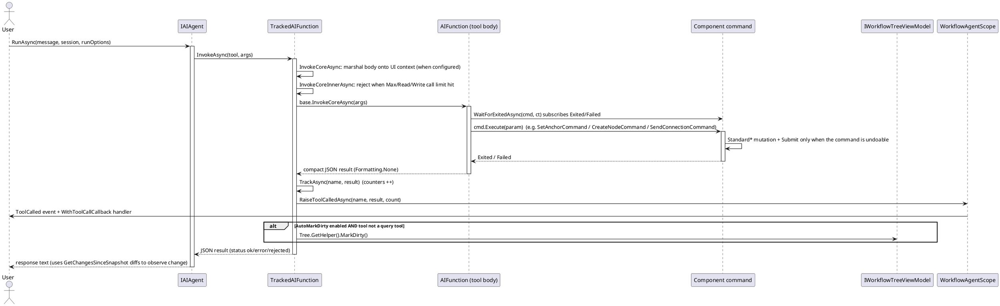

# Data Flow — Agent Tool Call

A user message is passed to the agent. On a tool call, `TrackedAIFunction.InvokeCoreAsync` marshals onto the UI context if configured, `InvokeCoreInnerAsync` pre-flights the call limits and runs the underlying `AIFunction`. The tool body mutates the tree through exactly one component command and awaits real completion; afterwards `TrackAsync` raises `ToolCalled` and optionally marks the tree dirty. The framework's undo/redo stack is the single source of truth — the toolkit never submits its own gestures.

Notes:

- Awaiting command completion (`WaitForExitedAsync`, `WaitForCommandAsync`, `WaitForNDispatchesAsync`, `SendReceiveAsync`) means the next tool call never observes a stale-state window.
- Query tools never trigger auto-dirty; a state-observation tool (`TakeSnapshot` / `GetChangesSinceSnapshot`) is a separate, opt-in call.

> Source: `Src/Core/VeloxDev.Core.Extension/Agent/Workflow/Functions/WorkflowAgentToolkit.cs`, `TrackedAIFunction` lines 178-242, `TrackAsync` lines 264-281, wait helpers lines 2672-2767; `WorkflowAgentScope.cs`, `RaiseToolCalledAsync` lines 444-450.
