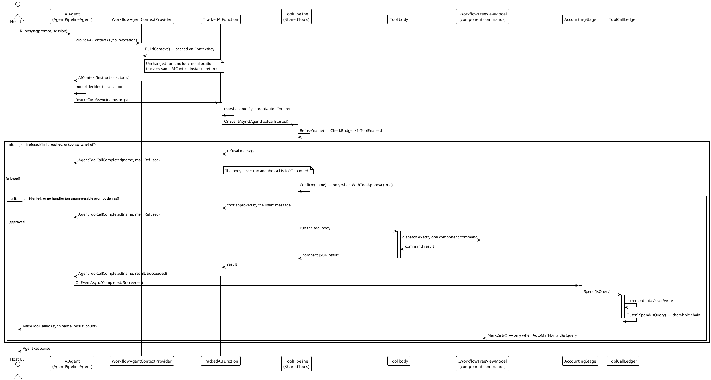

# Data Flow — A Tool Call, End to End

Every tool call — built-in, developer-registered, MCP-sourced, skill-sourced or a sub-agent spawn — travels the same path: the model calls a `TrackedAIFunction`, which marshals onto the host's context and hands the call to the scope's **one shared `ToolPipeline`**, which applies the budget/host-policy refusal and the human approval gate before the tool body runs. The body dispatches a component command, and the completion event is counted by the accounting stage.

```plantuml
@startuml
!theme plain

actor "Host UI" as Host
participant "AIAgent\n(AgentPipelineAgent)" as Agent
participant "WorkflowAgentContextProvider" as Provider
participant "TrackedAIFunction" as Tracked
participant "ToolPipeline\n(SharedTools)" as Gate
participant "Tool body" as Tool
participant "IWorkflowTreeViewModel\n(component commands)" as Tree
participant "AccountingStage" as Acct
participant "ToolCallLedger" as Ledger

Host -> Agent: RunAsync(prompt, session)
activate Agent
Agent -> Provider: ProvideAIContextAsync(invocation)
activate Provider
Provider -> Provider: BuildContext() — cached on ContextKey
note right of Provider
  Unchanged turn: no lock, no allocation,
  the very same AIContext instance returns.
end note
Provider --> Agent: AIContext(instructions, tools)
deactivate Provider

Agent -> Agent: model decides to call a tool
Agent -> Tracked: InvokeCoreAsync(name, args)
activate Tracked
Tracked -> Tracked: marshal onto SynchronizationContext
Tracked -> Gate: OnEventAsync(AgentToolCallStarted)
activate Gate

Gate -> Gate: Refuse(name)  — CheckBudget / IsToolEnabled
alt refused (limit reached, or tool switched off)
    Gate --> Tracked: refusal message
    Tracked -> Agent: AgentToolCallCompleted(name, msg, Refused)
    note right of Tracked
      The body never ran and the call is NOT counted.
    end note
else allowed
    Gate -> Gate: Confirm(name)  — only when WithToolApproval(true)
    alt denied, or no handler (an unanswerable prompt denies)
        Gate --> Tracked: "not approved by the user" message
        Tracked -> Agent: AgentToolCallCompleted(name, msg, Refused)
    else approved
        Gate -> Tool: run the tool body
        activate Tool
        Tool -> Tree: dispatch exactly one component command
        activate Tree
        Tree --> Tool: command result
        deactivate Tree
        Tool --> Gate: compact JSON result
        deactivate Tool
        Gate --> Tracked: result
        Tracked -> Agent: AgentToolCallCompleted(name, result, Succeeded)
        deactivate Tracked

        Agent -> Acct: OnEventAsync(Completed: Succeeded)
        activate Acct
        Acct -> Ledger: Spend(isQuery)
        activate Ledger
        Ledger -> Ledger: increment total/read/write
        Ledger -> Ledger: Outer?.Spend(isQuery)  — the whole chain
        deactivate Ledger
        Acct -> Host: RaiseToolCalledAsync(name, result, count)
        Acct -> Tree: MarkDirty()  — only when AutoMarkDirty && !query
        deactivate Acct
    end
    deactivate Gate
end

Agent --> Host: AgentResponse
deactivate Agent
@enduml
```

Source: `WorkflowAgentToolkit.cs` (`CreateTools`, `CheckBudget`, `ConfirmMutationAsync`, `AccountAsync`, `CreateAccountingStage`), `TrackedAIFunction.cs`, `ToolPipeline.cs`, `WorkflowAgentContextProvider.cs`.

## What the diagram pins down

- **The model never sees a tool the gate would refuse.** `CreateTools` filters the switched-off tools out of the list *and* `CheckBudget` refuses them at call time — the test `SwitchedOffTool_IsRefusedAtCallTime_NotJustHidden` captures the `AIFunction` before the switch and calls it after, pinning the refusal rather than the omission.
- **Refusal happens before the body.** A refused or failed call never runs its body, so it is not counted: `AccountingStage` counts only `AgentToolOutcome.Succeeded`. The test `ARefusedTool_IsReportedToTheModel_AndDoesNotCountAsACall` asserts `CallCount == 0`.
- **One policy, every slice.** The gate instance is shared with the MCP and skill providers, so an MCP-sourced tool is charged to the same ledger and refused by the same switches as a built-in.
- **`ResetToolCallLimit` is exempt.** It passes the refusal hook (the escape hatch survives the gate it exists to open), clears the *whole* ledger chain on the user's agreement, and is never itself counted.
- **Spending walks the chain.** For a spawned child the `Spend` call recurses to `Outer`, so the root ledger's total is the number of calls made anywhere in the tree.
