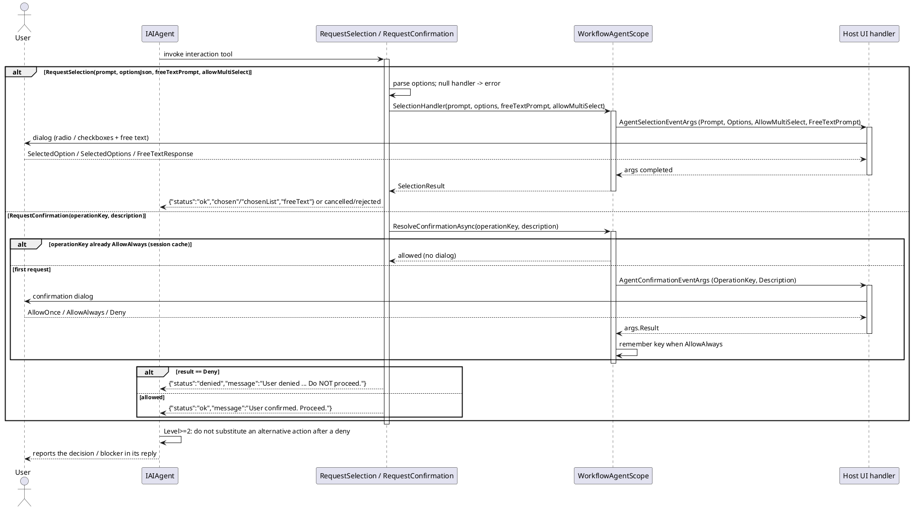

# Data Flow — Interaction & Confirmation

When the agent hits an ambiguous or destructive action it can pause and delegate the decision to the host UI. `RequestSelection` asks the user to pick from options (plus a free-text field); `RequestConfirmation` asks for an allow/deny decision, and `AllowAlways` approvals are remembered per `operationKey` for the rest of the session (`ResolveConfirmationAsync`).

Notes:

- The interaction tools are only registered when a handler exists **and** safety level > 0; a `Deny` is not worked around — higher safety levels forbid substituting an alternative action.
- `SelectionResult` (single/multi/free-text) is returned from the host layer to the toolkit (`WorkflowAgentScope.SelectionResult`).

> Source: `WorkflowAgentScope.cs`, `WithSelectionHandler`/`WithConfirmationHandler`/`ResolveConfirmationAsync` lines 324-450; `WorkflowAgentToolkit.cs`, `RequestSelection` lines 2153-2194, `RequestConfirmation` lines 2197-2208.
