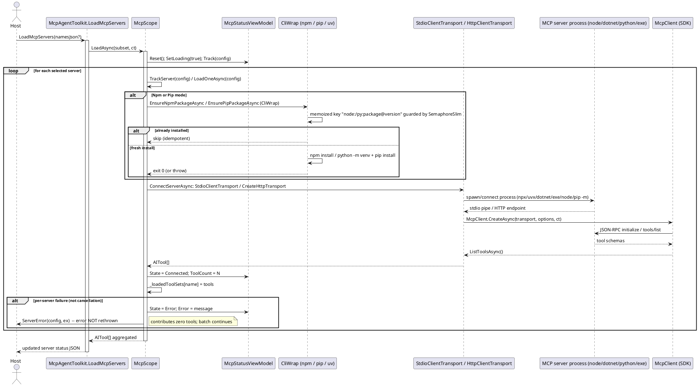

# Data Flow — MCP Server Load

`McpAgentToolkit.LoadMcpServers` funnels into `McpScope.LoadAsync`. Each `McpServerConfiguration` becomes a tool set: local modes install/prepare the runtime (memoized process-wide), `ConnectServerAsync` builds a `StdioClientTransport` (or `HttpClientTransport` for `Http`) and performs the JSON-RPC `initialize`/`tools/list` handshake, and the returned tools are added to `McpScope.LoadedTools` so the per-conversation tool set (`base tools + LoadedTools`) reflects them on the next call.

Notes:

- The `Http` run mode performs no install and connects to `Endpoint` (Streamable HTTP with SSE fallback); optional `headers`/`oauth`/`connectionTimeout`/`transportMode`/`ownsSession` come from `McpServerConfiguration.Options` (unknown keys are rejected).
- Cancellation propagates as `OperationCanceledException` (not caught by the per-server handler). Status updates marshal to the UI context when `WithSynchronizationContext` is registered.

> Source: `Src/Core/VeloxDev.Core.Extension/Agent/MCP/McpScope.cs`, `LoadAsync` lines 167-191, `LoadOneAsync` lines 193-230, `EnsureNpmPackageAsync` lines 300-332, `ConnectServerAsync` lines 382-418; `McpAgentToolkit.cs` `LoadServers` lines 120-162.
