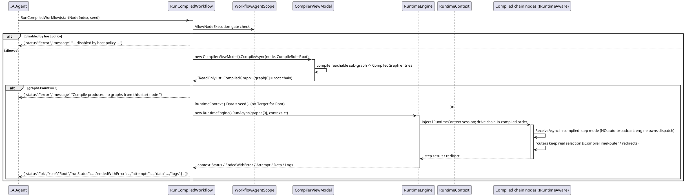

# Data Flow — Root Chain Run (`RunCompiledWorkflow`)

`RunCompiledWorkflow(startNodeIndex, seed)` is the chain-level execution entry — the same path the demo's Run button uses. It compiles the sub-graph reachable from a start node with `CompileRole.Root` and lets `RuntimeEngine` drive the whole chain. This is distinct from `ExecuteNode`, which executes one node via `ReceiveCommand` (node-level EXEC).

Notes:

- Because the engine owns downstream dispatch, a compiled-step node does not auto-broadcast; branch selection happens at runtime through the compile-time router, keeping results identical to a GUI run of the same graph.
- `GetNodeResult` is the sibling *Terminal* entry that computes one node's result from its ancestor cone — see [Terminal result](../04_terminal-result-execution/index.md).

> Source: `WorkflowAgentToolkit.cs`, `RunCompiledWorkflow` lines 1789-1794 and shared `RunCompiledRoleAsync` lines 1804-1861; `WorkflowLifecycleFidelityTests` covers the gating and terminal run contract.
