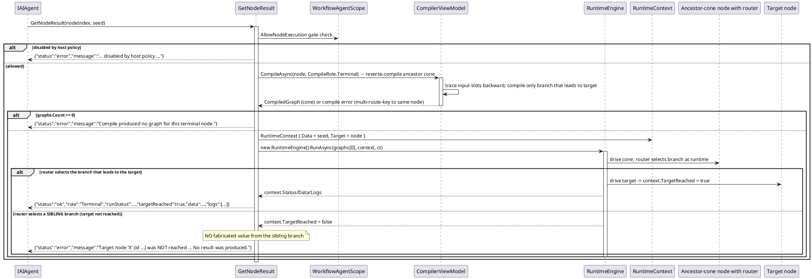

# Data Flow — Terminal Result (`GetNodeResult`)

`GetNodeResult(nodeIndex, seed)` computes a single node's result in isolation. It reverse-compiles the node's **ancestor cone** (the upstream producers feeding its input slots) with `CompileRole.Terminal` and drives that cone with the runtime engine, so no controller/start node is needed. Routers inside the cone keep real branch semantics: only the branch leading to the target is compiled.

This is the exact error contract the embedded prompt spec (and `RunCompiledRoleAsync`) enforces: if a router on the cone selects a sibling branch, the target is **not** reached and the tool returns `status:error` naming the target — it never reports another branch's final payload as this node's result. To succeed, point the router at the branch that leads to the node first, or ask for a node on the actually-selected branch.

> Source: `WorkflowAgentToolkit.cs`, `GetNodeResult` lines 1796-1801 and shared `RunCompiledRoleAsync` lines 1804-1861 (forward-consistent `Target`/`TargetReached` semantics at lines 1827-1836); tests `WorkflowLifecycleFidelityTests.GetNodeResult_*`.
