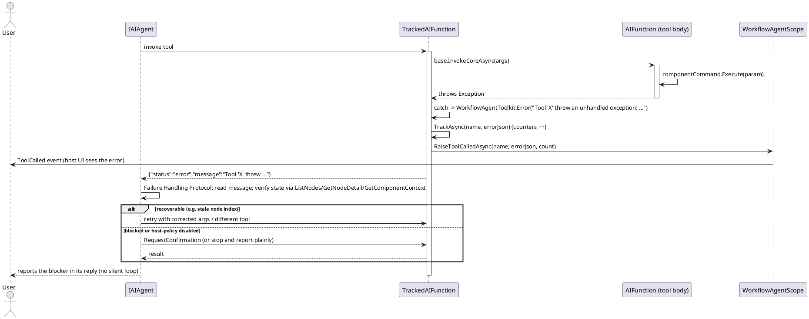

# Data Flow — Error & Recovery

When a tool body throws, `TrackedAIFunction.InvokeCoreInnerAsync` converts the exception into a compact JSON `{"status":"error"}` instead of surfacing an SDK failure, and tracking (counters + `ToolCalled`) still fires. The agent then applies the injected Failure Handling Protocol: read `message`/`reasons`/`hint`/`preferredAlternative`, verify current state, and retry with a different tool — or ask the user. Tools disabled by host policy are reported, never worked around.

Notes:

- Unmounted-component operations are silent no-ops by framework design; the protocol tells the model to verify mount state (`ListNodes` / `GetNodeDetail`) before retrying.
- Gated tools (`ExecuteNode`, `ExecuteCommandOnNode`, `ExecuteCommandById`, `RunCompiledWorkflow`, `GetNodeResult`) return a structured `disabled by host policy` error when the host has not enabled them; the model is instructed not to bypass it.

> Source: `WorkflowAgentToolkit.cs`, `TrackedAIFunction.InvokeCoreInnerAsync` lines 196-219; `WorkflowAgentScope.cs`, `BuildFailureHandlingProtocol` lines 509-523.
