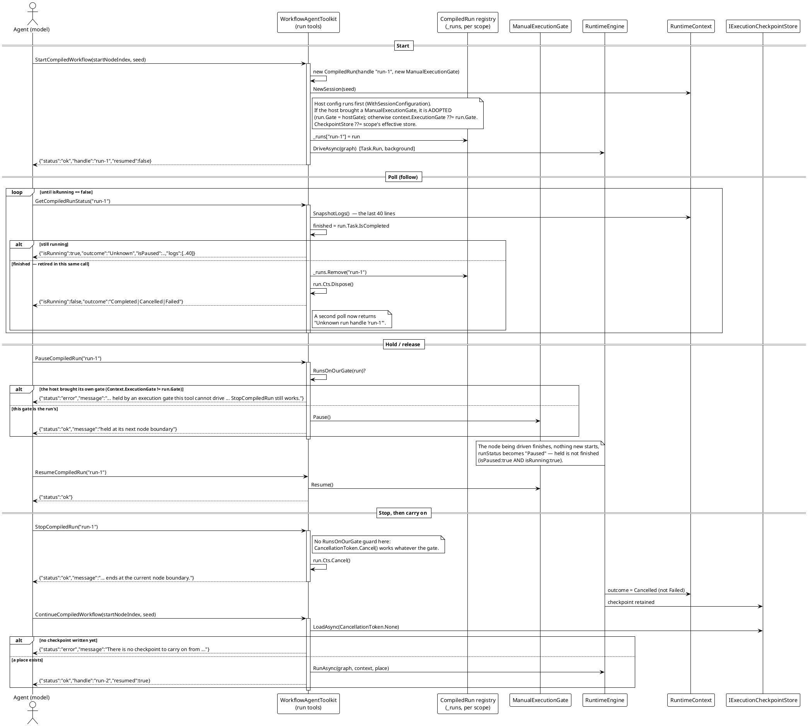

# Data Flow — Compiled Run-Handle Lifecycle

`RunCompiledWorkflow` waits for the end; a run the agent must hold, follow or stop cannot. The run-handle family starts the same compiled chain in the background and returns a handle. This page traces the whole lifecycle: start → poll → hold/release → stop/resume, including the two documented behaviours (handle retirement and the `RunsOnOurGate` guard).

Source: `WorkflowAgentToolkit.cs` (`StartCompiledAsync`, `DriveAsync`, `GetCompiledRunStatus`, `PauseCompiledRun`, `ResumeCompiledRun`, `StopCompiledRun`, `NewSession`, `RunsOnOurGate`, `GateNotOurs`, `CompiledRun`); `RunOutcome.cs`; `RuntimeContext.SnapshotLogs`.

## Behaviour pinned by the diagram

- **Retirement is the answer.** `GetCompiledRunStatus` reads `run.Task.IsCompleted` once and, in the same call, drops the handle and disposes its `CancellationTokenSource` when finished. The answer and the retirement describe one state, so a poll loop exits on `isRunning == false` and a later call is an unknown handle. Test: `CompiledRunControlTests.WaitForEndAsync` — its only exit is `isRunning == false`.
- **The gate the tools drive must be the gate the engine waits on.** `NewSession` adopts the host's `ManualExecutionGate`, so `PauseCompiledRun` / `ResumeCompiledRun` operate the real gate; when the host's gate is *not* the run's, both return an error rather than reporting a pause that did not happen. Tests: `AStartedRun_CanBeHeld_LetGo_AndFollowedToItsEnd`; the guard itself is **source-only** (no test in `Agent/**` asserts it).
- **Stop is a cancellation, not a failure.** `StopCompiledRun` cancels the token; the run ends at a node boundary with `outcome: Cancelled`, and the checkpoint it left is exactly what `ContinueCompiledWorkflow` reads — so a stopped run can be resumed later. Test: `AStoppedRun_EndsAsCancelled_AndTheAgentCanCarryOnFromIt`.
- **Continue never invents a start.** With nothing written yet it returns `"no checkpoint"` rather than silently starting a fresh run. Test: `CarryingOn_WithNothingWrittenYet_IsRefused`.
- **Failures and the log travel with the result.** With a retry policy on the session, `failures` carries `Warning` and `Error` records and `logFile` is an absolute path containing the retry lines. Test: `TheFailureRecords_AndTheLogFile_TravelWithTheResult`.

**Run declaration:** the four `CompiledRunControlTests` above passed in the deterministic suite on 2026-10-01 (`已通过! 失败: 0，通过: 387`); the `RunsOnOurGate` guard and the 40-line log tail are verified against source only.
