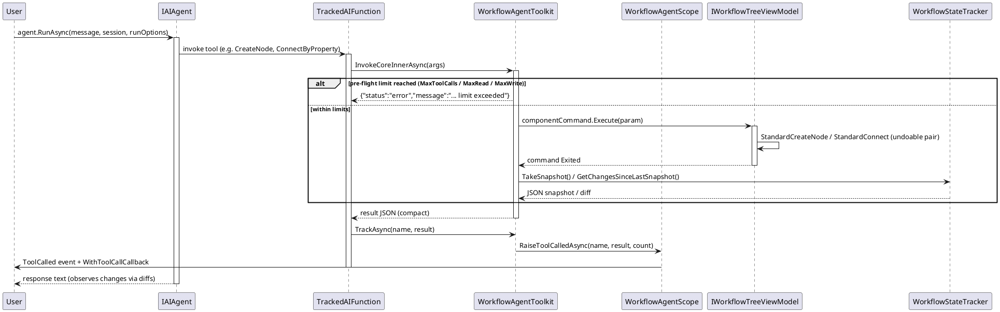
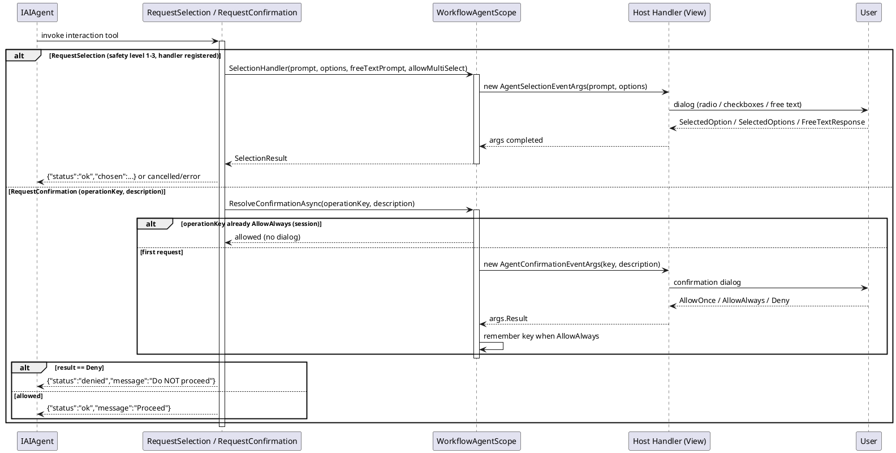
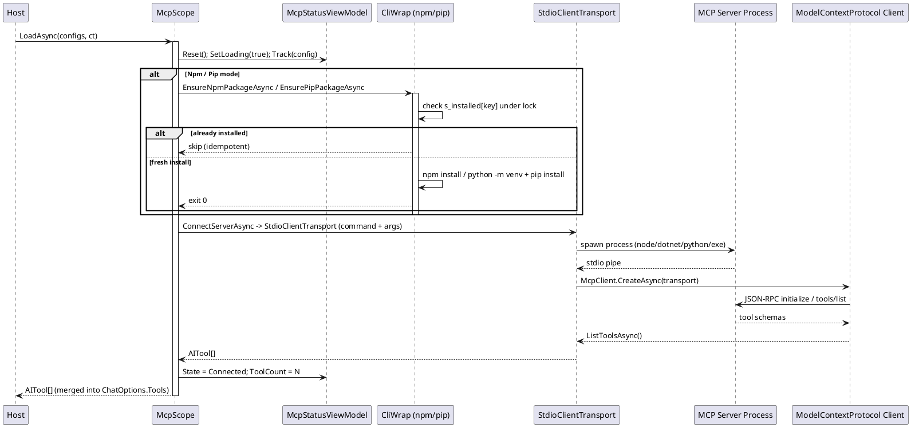
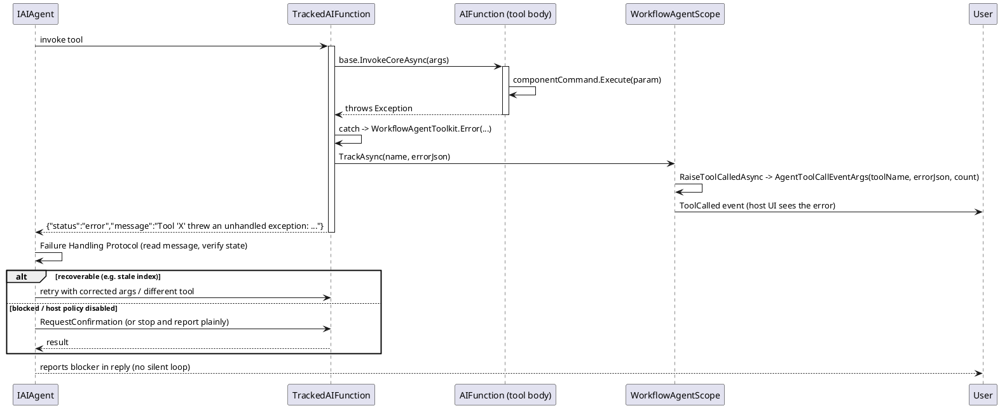

# Data Flow — Workflow Agent

Four sequence diagrams trace the main data flows of the AI control layer. PlantUML syntax is used so the diagrams can be rendered by any PlantUML server.

## 1. Agent tool call flow

A user message is passed to the agent. On a tool call, `TrackedAIFunction` invokes the underlying `AIFunction`, the tool mutates the tree through a component command, and `WorkflowStateTracker` snapshots/diffs so the agent can observe change.

Error path (tool throws): see diagram 4.

*Source: `WorkflowAgentToolkit.cs` `TrackedAIFunction` lines 175-239, `TrackAsync` lines 261-271; `WorkflowAgentScope.cs` `RaiseToolCalledAsync` lines 444-450.*

## 2. Interaction safety / confirmation flow

When the agent hits an ambiguous or destructive action, the `RequestSelection` / `RequestConfirmation` tools pause the run and delegate to the host handlers. `AllowAlways` approvals are remembered per `operationKey` for the session.

If the result is `denied`, the agent must stop and report — it may not substitute an alternative action (Level 3 safety policy).

*Source: `WorkflowAgentScope.cs` `WithSelectionHandler`/`WithConfirmationHandler`/`ResolveConfirmationAsync` lines 387-442; `WorkflowAgentToolkit.cs` `RequestSelection` lines 2106-2147, `RequestConfirmation` lines 2150-2161.*

## 3. MCP handshake

`LoadAsync` installs the server package when needed (idempotent, guarded by a process-wide set + `SemaphoreSlim`), spawns the server over stdio, performs the JSON-RPC MCP handshake and returns the server's tools as `AITool[]`.

Error path: a per-server failure sets `State = Error`, raises `ServerError(config, ex)` and contributes zero tools — the batch continues with the remaining servers. Cancellation propagates as `OperationCanceledException`.

*Source: `McpScope.cs` `LoadAsync` lines 163-187, `LoadOneAsync` lines 189-226, `EnsureNpmPackageAsync` lines 296-328, `ConnectServerAsync` lines 378-413.*

## 4. Error path — a tool throws

`TrackedAIFunction.InvokeCoreInnerAsync` wraps the inner invocation in a try/catch. A thrown exception becomes a JSON `{"status":"error"}` instead of propagating to the model as an SDK failure, and the `ToolCalled` callback still fires. The agent's injected Failure Handling Protocol then tells the model to read the message, verify state, and either retry with a different tool or ask the user.

Note: `disabled by host policy` errors from `ExecuteNode`/`ExecuteCommandOnNode`/`ExecuteCommandById` are not worked around — the protocol instructs the model to report and let the host enable them.

*Source: `WorkflowAgentToolkit.cs` `InvokeCoreInnerAsync` lines 193-216; `BuildFailureHandlingProtocol` in `WorkflowAgentScope.cs` lines 509-523.*
