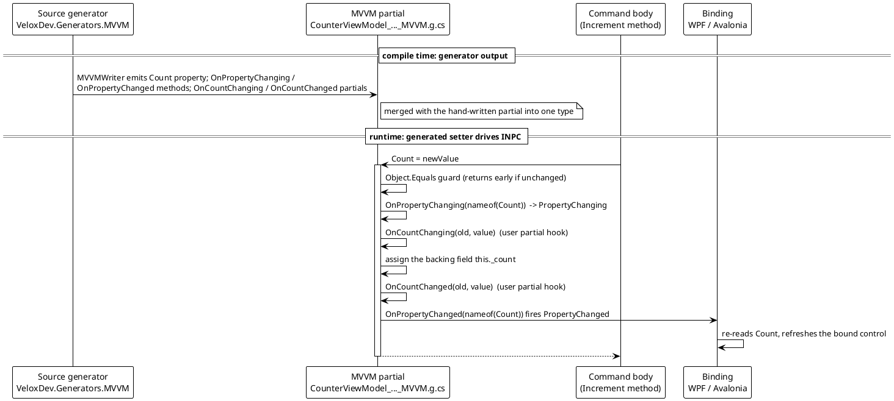
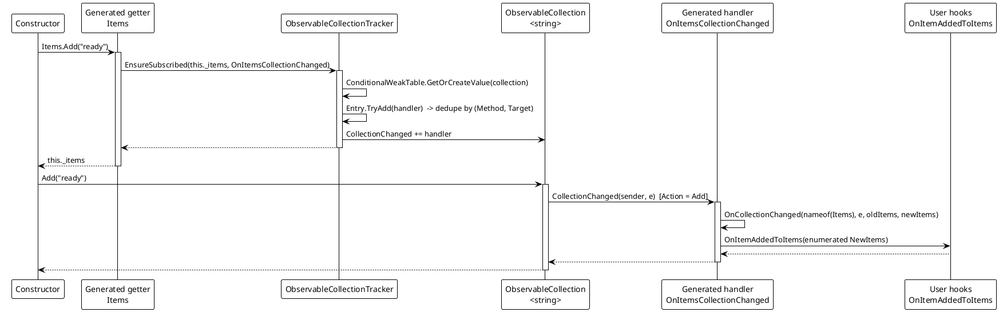
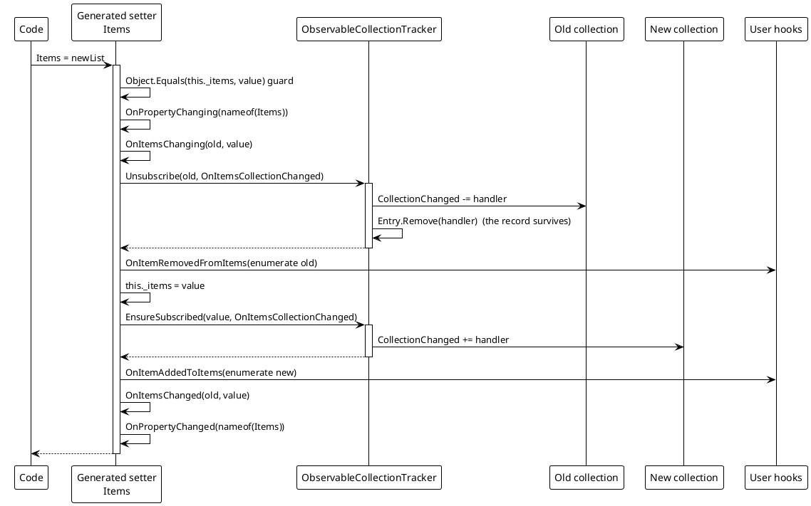

# Data Flow — Property and Collection

The scalar-property path and the collection path share a shape: the generator emits a skeleton at compile time, and the setter drives it at run time. The collection path adds a lazy subscription so that a field initializer (`= []`) cannot leave `CollectionChanged` unobserved.

## (a) Generator output → INPC flow



> Source: `Src/Core/VeloxDev.Core/MVVM/VeloxCommand.cs` is not involved here; the setter shape is emitted by `MVVMPropertyFactory.GetSetterBodyLines` (`Src/Generators/VeloxDev.Core.Generator/Base/Analizer.cs`, line 466) and confirmed verbatim in a generated file.

```csharp
// Source: Generated — obj/Debug/net9.0/generated/VeloxDev.Core.Generator/VeloxDev.Generators.MVVM/CounterViewModel_QuickStart_Mvvm_MVVM.g.cs
set
{
    if (global::System.Object.Equals(this._count, value)) return;
    var old = this._count;
    OnPropertyChanging(nameof(Count));
    OnCountChanging(old, value);
    this._count = value;
    OnCountChanged(old, value);
    OnPropertyChanged(nameof(Count));
}
```

## (b) Collection flow: initializer → getter subscription → per-action hooks

The interesting step is the first `Items.Add("ready")` in the constructor. The field initializer assigned `this._items` directly, so the setter never ran; the subscription exists only because the **getter** was read on the way to `Add`.



> Source: generated getter and the `OnItemsCollectionChanged` switch — `CounterViewModel_QuickStart_Mvvm_MVVM.g.cs`; tracker behaviour — `Src/Core/VeloxDev.Core/MVVM/ObservableCollectionTracker.cs` lines 24-36 (`EnsureSubscribed`) and 100-118 (`MethodTargetEqualityComparer`).

```csharp
// Source: Generated — CounterViewModel_QuickStart_Mvvm_MVVM.g.cs, the collection getter
get
{
    global::VeloxDev.MVVM.ObservableCollectionTracker.EnsureSubscribed(this._items, OnItemsCollectionChanged);
    return this._items;
}
```

## (c) Replacing the whole collection

Replacement is where the tracker's `Unsubscribe` matters: without it the discarded collection would keep a handler pointing back into this view-model.



> Source: generated collection setter — `CounterViewModel_QuickStart_Mvvm_MVVM.g.cs`; `Unsubscribe` — `Src/Core/VeloxDev.Core/MVVM/ObservableCollectionTracker.cs` lines 47-59.

## Per-action dispatch

The generated `OnItemsCollectionChanged` maps the raw `NotifyCollectionChangedAction` onto the user hooks:

```csharp
// Source: Generated — CounterViewModel_QuickStart_Mvvm_MVVM.g.cs
switch (e.Action)
{
    case global::System.Collections.Specialized.NotifyCollectionChangedAction.Add when e.NewItems is not null:
        OnItemAddedToItems(EnumerateItemsItems(e.NewItems));
        break;
    case global::System.Collections.Specialized.NotifyCollectionChangedAction.Remove when e.OldItems is not null:
        OnItemRemovedFromItems(EnumerateItemsItems(e.OldItems));
        break;
    case global::System.Collections.Specialized.NotifyCollectionChangedAction.Replace:
        if (e.OldItems is not null)
        {
            OnItemRemovedFromItems(EnumerateItemsItems(e.OldItems));
        }
        if (e.NewItems is not null)
        {
            OnItemAddedToItems(EnumerateItemsItems(e.NewItems));
        }
        break;
    case global::System.Collections.Specialized.NotifyCollectionChangedAction.Move when e.NewItems is not null:
        OnItemMovedInItems(EnumerateItemsItems(e.NewItems));
        break;
    case global::System.Collections.Specialized.NotifyCollectionChangedAction.Reset:
        OnItemsResetInItems();
        break;
}
```

## Error and edge paths

| Path | Behaviour |
|---|---|
| Value unchanged | `Object.Equals` guard returns before any notification or hook. |
| Collection is not `INotifyCollectionChanged` | `EnsureSubscribed` / `Unsubscribe` return immediately (`ObservableCollectionTracker.cs` lines 28-29, 51-52). |
| `null` collection in `Unsubscribe` | Same early return; no exception. |
| Handler arrives as a fresh method-group delegate | Deduped by `(Method, Target)`, so the invocation list does not grow (`MethodTargetEqualityComparer`, lines 100-118). |
| Collection garbage-collected | Its `ConditionalWeakTable` entry goes with it — no leak. |
| Handler throws | The event's own invocation list unwinds; for command events it would be swallowed, but collection handlers are plain .NET event subscribers and are not guarded by the tracker. |
