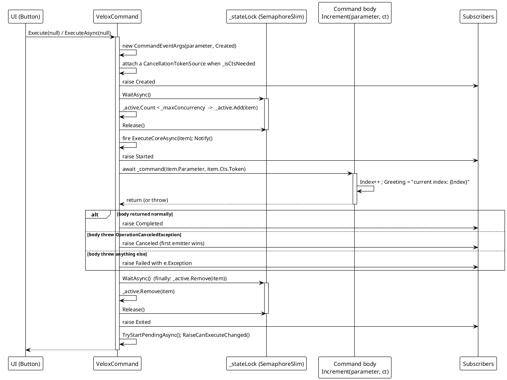
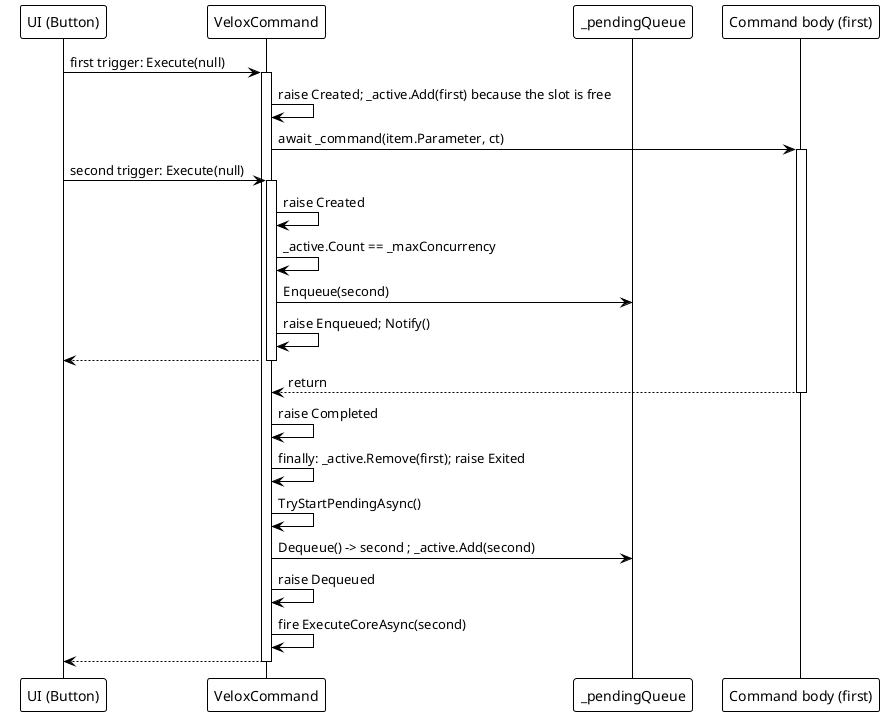
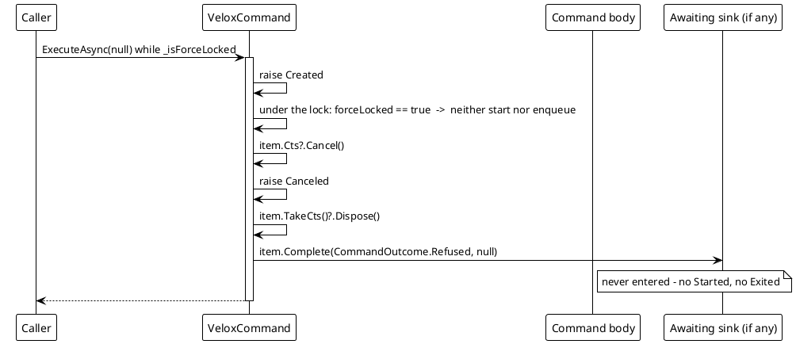
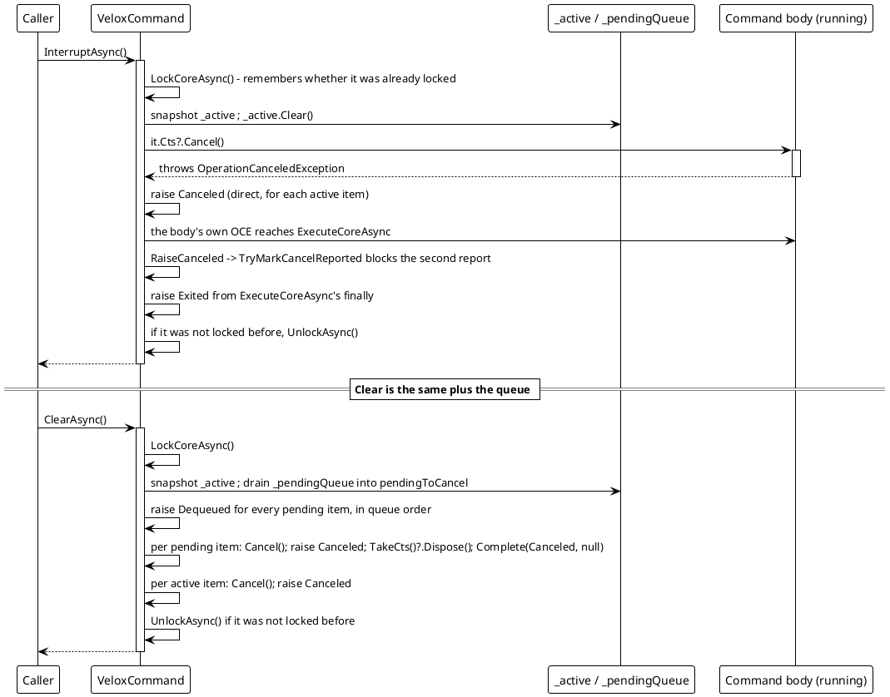
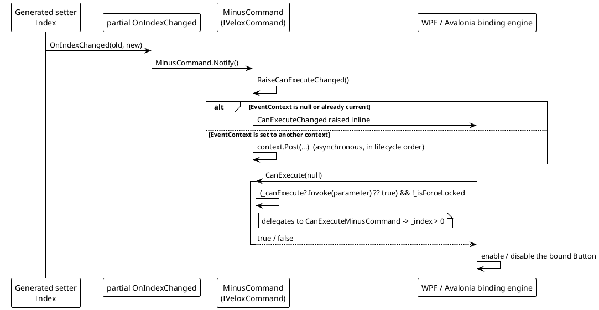

# Data Flow — Command Lifecycle

The execution pipeline in `Src/Core/VeloxDev.Core/MVVM/VeloxCommand.cs`. The invariant the whole design turns on is stated in the source itself (`VeloxCommand.cs` lines 192-194): `_stateLock` is a `SemaphoreSlim(1,1)` and therefore **not reentrant**, so no user code — no event handler, no command body — may run while it is held. Every `RaiseCommandEvent` happens after a `Release()`.

## (a) Immediate run: Created → Started → Completed → Exited



> Source: `VeloxCommand.cs` — `ExecuteCore` lines 474-531, `ExecuteCoreAsync` lines 533-580, `OnExecutionCompletedAsync` lines 582-598.

## (b) Queueing at capacity: Enqueued … Dequeued



> Source: `VeloxCommand.cs` — enqueue branch lines 503-505 and 521-524, `TryStartPendingAsync` lines 794-822 (the drain loop is lines 801-809).

## (c) Refusal under lock: Created → Canceled, and nothing else



> Source: `VeloxCommand.cs` lines 513-520. This is the only path that produces `CommandOutcome.Refused`, and the reason `CommandEventType` alone cannot express a refusal (`CommandCompletion.cs` lines 22-28).

## (d) Cancellation and clearing



> Source: `VeloxCommand.cs` — `InterruptAsync` lines 642-683, `ClearAsync` lines 686-747, `RaiseCanceled` lines 398-404, `TryMarkCancelReported` line 896.

```csharp
// Source: Src/Core/VeloxDev.Core/MVVM/VeloxCommand.cs, lines 396-404
// One execution reports at most one Canceled. Interrupt/Clear report promptly;
// the body's own OperationCanceledException arrives later and is blocked by TryMarkCancelReported.
private void RaiseCanceled(CommandEventArgs item)
{
    if (item.TryMarkCancelReported())
    {
        RaiseCommandEventAs(Canceled, item, CommandEventType.Canceled);
    }
}
```

## (e) The `canValidate` gate: property hook → Notify → CanExecuteChanged



> Source: `VeloxCommand.cs` — `Notify` line 414, `RaiseCanExecuteChanged` lines 328-339, `CanExecute` lines 407-408; the hook is `Examples/MVVM/WPF/Demo/MainWindowViewModel.cs` lines 34-38.

## Error-path summary

| Path | Behaviour |
|---|---|
| Body throws a non-cancellation exception | `outcome = Failed`, `failure = ex`, `Failed` raised with `CommandEventArgs.Exception`; `Exited` still fires from the `finally`. |
| Body throws `OperationCanceledException` | `outcome = Canceled`, `Canceled` raised — unless `Interrupt` / `Clear` already reported one for that execution. |
| Force-locked trigger | Neither started nor enqueued; `Canceled` raised and the sink completed with `Refused`. |
| `Clear` while calls are queued | `Dequeued` then `Canceled` per pending item; such an item never reaches `Started` / `Exited`. |
| A cancellation callback throws | Swallowed (`AggregateException`), because letting it escape would skip `UnlockAsync` and leave the command permanently locked (`VeloxCommand.cs` lines 669-673, 735-739). |
| `ObjectDisposedException` on `Cancel` | Swallowed: the body may already have finished and released its own source (lines 665-668). |
| A subscriber throws | Caught and reported through the static `HandlerException`; the lifecycle is unaffected. |
| `OnExecutionCompletedAsync` throws | The nested `finally` still runs `item.Complete(...)` and `TakeCts()?.Dispose()` (lines 569-578). |
