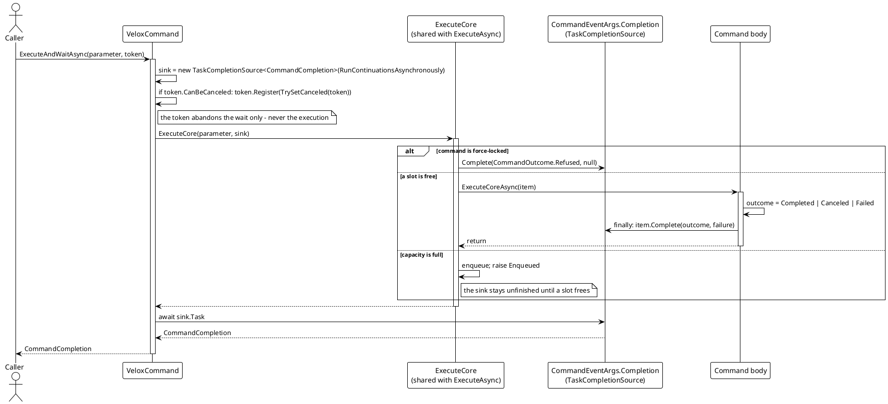
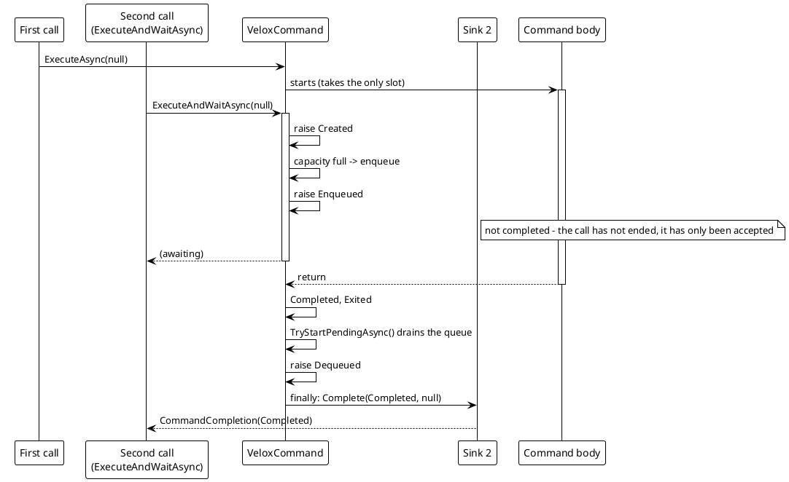
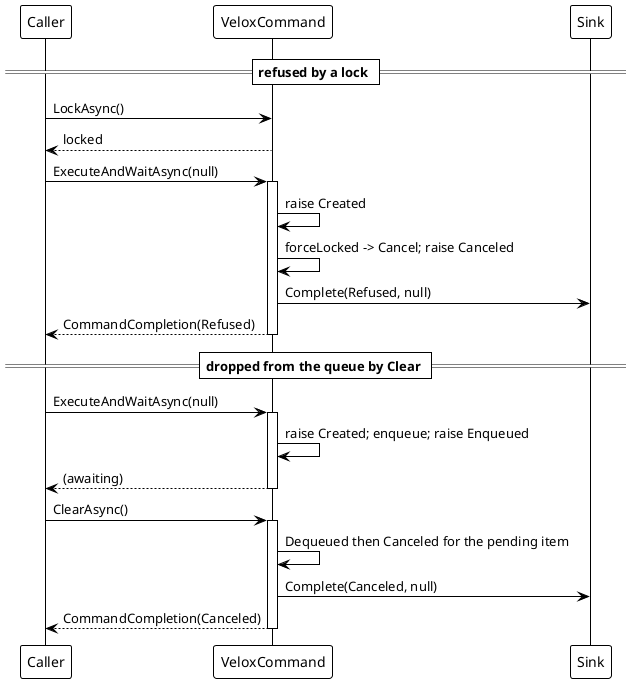

# Data Flow — `ExecuteAndWaitAsync`

`ExecuteAndWaitAsync` is `ExecuteAsync` plus a sink. The two share `ExecuteCore`; the only difference is whether a `TaskCompletionSource<CommandCompletion>` is attached, and every branch of the pipeline is responsible for finishing it exactly once.

## (a) The wait path



> Source: `Src/Core/VeloxDev.Core/MVVM/VeloxCommand.cs` — `ExecuteAndWaitAsync` lines 452-471, `ExecuteCore` lines 474-531, `CommandEventArgs.Complete` lines 899-900.

## (b) Where the outcome is decided

The outcome is **computed inside the execution**, not read back from the events:

```csharp
// Source: Src/Core/VeloxDev.Core/MVVM/VeloxCommand.cs, lines 535-580
private async Task ExecuteCoreAsync(CommandEventArgs item)
{
    RaiseCommandEventAs(Started, item, CommandEventType.Started);

    // the outcome is computed here, not read back from the events or from the item:
    // the awaiting sink must not depend on someone having subscribed to Failed
    var outcome = CommandOutcome.Completed;
    Exception? failure = null;

    try
    {
        if (_isCtsNeeded)
        {
            await _command(item.Parameter, (item.Cts ?? new()).Token).ConfigureAwait(false);
        }
        else
        {
            await _command(item.Parameter, _defct).ConfigureAwait(false);
        }
        RaiseCommandEventAs(Completed, item, CommandEventType.Completed);
    }
    catch (OperationCanceledException)
    {
        outcome = CommandOutcome.Canceled;
        RaiseCanceled(item);
    }
    catch (Exception ex)
    {
        outcome = CommandOutcome.Failed;
        failure = ex;
        RaiseCommandEventAs(Failed, item, CommandEventType.Failed, ex);
    }
    finally
    {
        try
        {
            await OnExecutionCompletedAsync(item).ConfigureAwait(false);
        }
        finally
        {
            // a nested finally: a throwing OnExecutionCompletedAsync must not skip teardown
            item.Complete(outcome, failure);
            item.TakeCts()?.Dispose();
        }
    }
}
```

This is the design point that makes the API usable: a caller that never subscribed to `Failed` still gets `CommandOutcome.Failed` with the exception.

## (c) Why a queued call's sink stays pending



> Source: `VeloxCommand.cs` — enqueue branch lines 521-524, drain in `TryStartPendingAsync` lines 794-822.

## (d) Refusal and queue-drop: the two cases a hand-rolled wait hangs on

Neither a refused call nor one dropped from the queue ever raises `Exited`, which is precisely why "subscribe to `Exited` + `Failed`" was not a usable wait.



> Source: `VeloxCommand.cs` lines 513-520 (refusal), 710-723 (pending items dropped by `ClearAsync`), `CommandCompletion.cs` lines 14-20.

## (e) Abandoning the wait

The caller's token is registered before `ExecuteCore` runs, and it cancels only the `TaskCompletionSource`:

```csharp
// Source: Src/Core/VeloxDev.Core/MVVM/VeloxCommand.cs, lines 455-471
var sink = new TaskCompletionSource<CommandCompletion>(TaskCreationOptions.RunContinuationsAsynchronously);

// this token only abandons the wait, it does not cancel the execution - cancelling the execution
// is the job of Interrupt / Clear, which empty the whole command and must not be triggered by one call
using var registration = cancellationToken.CanBeCanceled
    ? cancellationToken.Register(
        static state =>
        {
            var (source, token) = ((TaskCompletionSource<CommandCompletion>, CancellationToken))state!;
            source.TrySetCanceled(token);
        },
        (sink, cancellationToken))
    : default;

await ExecuteCore(parameter, sink).ConfigureAwait(false);
return await sink.Task.ConfigureAwait(false);
```

## Comparison with `ExecuteAsync`

| Aspect | `ExecuteAsync` | `ExecuteAndWaitAsync` |
|---|---|---|
| Sink | `sink: null` (line 442) | a `TaskCompletionSource<CommandCompletion>` |
| Completes when | the call is accepted | that call has ended, including refused and dropped calls |
| Result channel | events only | a `CommandCompletion` value |
| Refusal observable | reported as `Canceled`, indistinguishable from a cancellation | `CommandOutcome.Refused` |
| `Failed` subscriber required | yes, to observe a body failure | no |
| Token semantics | n/a | abandons the wait only |
| Continuations | n/a | `RunContinuationsAsynchronously`, so completing the sink never runs user code inline on the pipeline |

One deliberate omission completes the picture: the copies produced by `CommandEventArgs.With` do not carry the sink.

```csharp
// Source: Src/Core/VeloxDev.Core/MVVM/VeloxCommand.cs, lines 890-916
// the wait slot; only ExecuteAndWaitAsync attaches one. Copies made by With() do not carry it -
// a copy must not be able to complete the wait.
internal TaskCompletionSource<CommandCompletion>? Completion { get; set; }
```

> Source references: `Src/Core/VeloxDev.Core/MVVM/VeloxCommand.cs` (`ExecuteAndWaitAsync` 452, `ExecuteCore` 474, `ExecuteCoreAsync` 533, `Completion` 891, `Complete` 899), `Src/Core/VeloxDev.Core/MVVM/CommandCompletion.cs`, `Src/Core/VeloxDev.Core/MVVM/VeloxCommandExtensions.cs` lines 34-45, `Src/Core/VeloxDev.Core.Test/MVVM/VeloxCommandCompletionTests.cs`.
