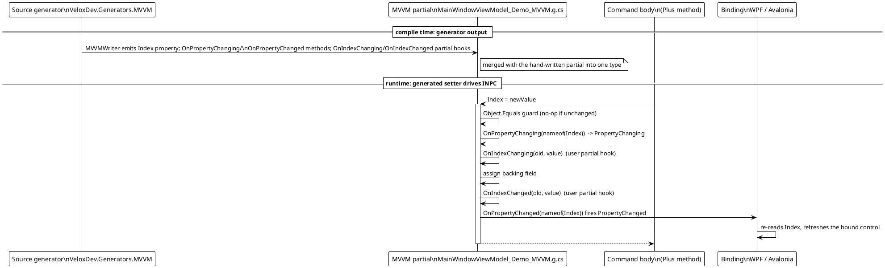
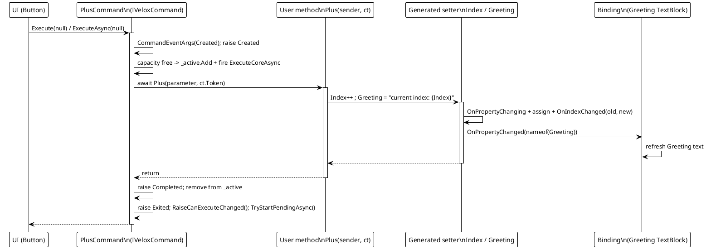
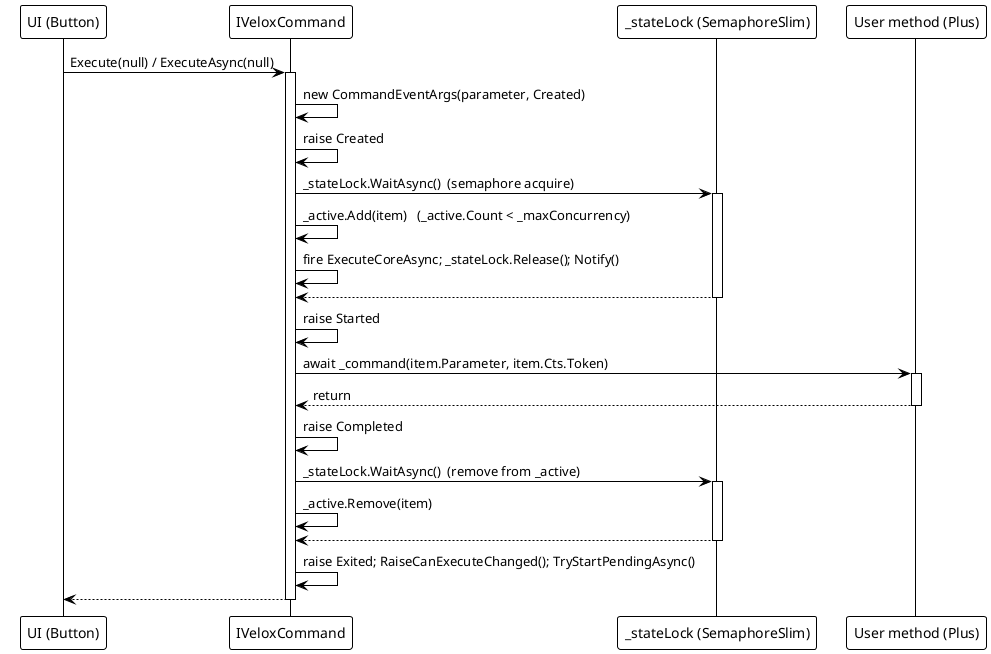
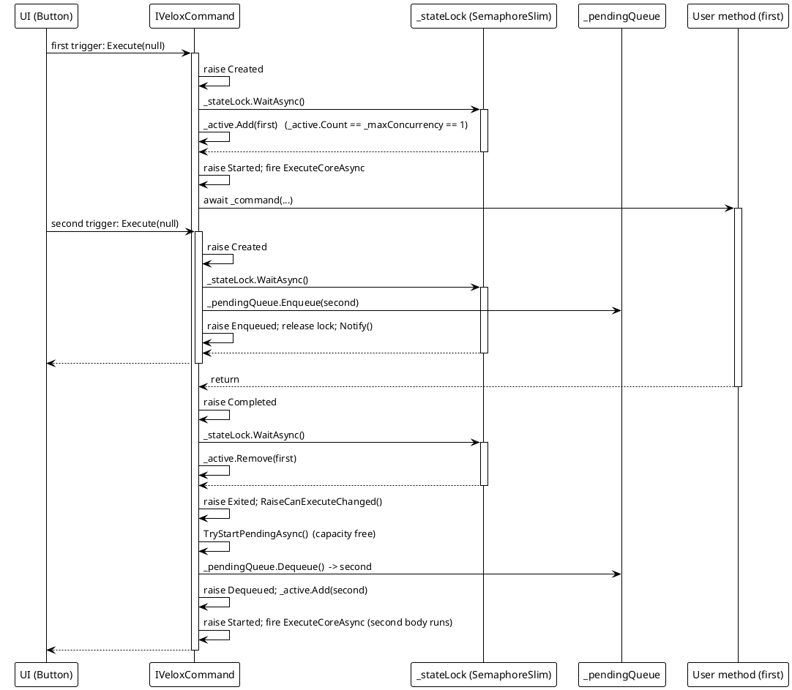
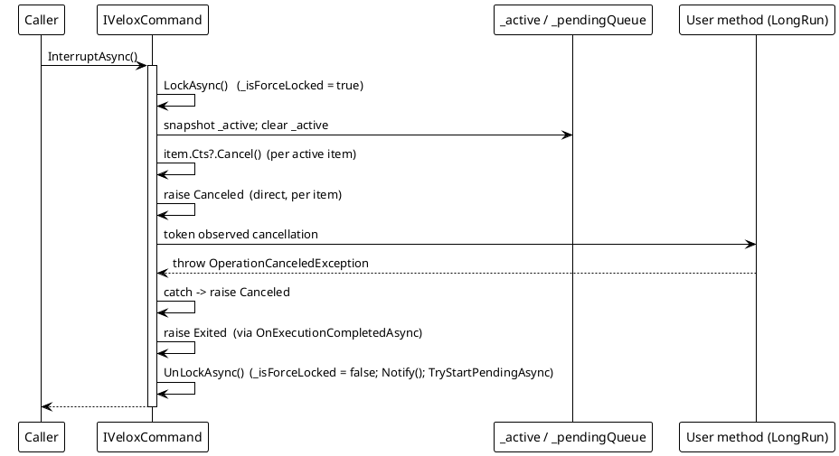
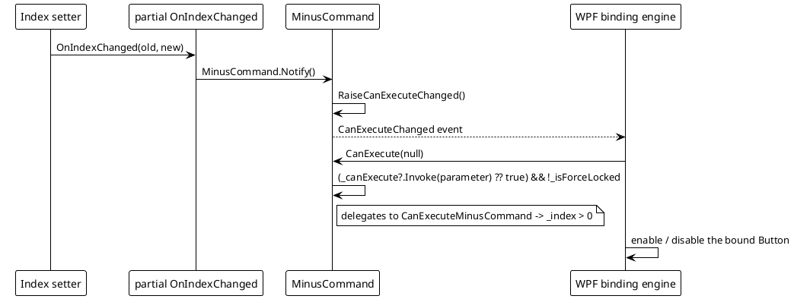

# Data Flow — MVVM

The MVVM feature has two runtime surfaces plus a compile-time step that feeds both: the source generator produces observable properties and lazy `IVeloxCommand` properties on a `partial` class, and `VeloxCommand` executes the annotated methods with a semaphore-bounded queue and lifecycle events. The diagrams below trace the generator output into the `INotifyPropertyChanged` flow and the command engine paths in `Src/Core/VeloxDev.Core/MVVM/VeloxCommand.cs` and the generated members produced by `Src/Generators/VeloxDev.Core.Generator/Base/Analizer.cs` (`MVVMPropertyFactory`).

`VeloxCommand` itself is UI-agnostic — it schedules and serializes invocations with a `SemaphoreSlim` and a queue and raises events on the calling context. When a WPF/Avalonia `Button` is bound to a generated command, the framework calls `Execute`/`ExecuteAsync` on the UI thread, so property-change notifications are raised there and the binding engine can update synchronously.

## (a) Generator output → INPC flow

## (b) Command execute → property notification

## (c) Command lifecycle: acquire -> Started -> invoke -> Completed -> release -> Exited

## (d) Queueing under `semaphore: 1`: second trigger -> Enqueued -> wait -> Dequeued

## (e) Cancellation / clear paths

Error-path behavior from the same source (VeloxCommand.cs lines 139-377):

| Path | Behavior |
|---|---|
| `InterruptAsync` / `ClearAsync` | Cancel each affected invocation's `CancellationTokenSource` and raise `Canceled`. A running method that observes the token throws `OperationCanceledException`, which `ExecuteCoreAsync` also maps to `Canceled`. |
| User method throws (non-cancellation) | `ExecuteCoreAsync` catches `Exception ex` and raises `Failed` with `CommandEventArgs.Exception`; `Exited` still fires in `finally`. |
| Force-locked trigger | `ExecuteAsync` cancels the new item's CTS and raises `Canceled`; no execution starts. |
| `ClearAsync` | Dequeues all pending items (raising `Dequeued` per item), then raises `Canceled` for pending + active. |

## (f) `canValidate` gate: property hook -> Notify -> CanExecuteChanged

> Source references: `Src/Core/VeloxDev.Core/MVVM/VeloxCommand.cs` (`ExecuteAsync`, `ExecuteCoreAsync`, `OnExecutionCompletedAsync`, `TryStartPendingAsync`, `InterruptAsync`, `ClearAsync`), `Src/Generators/VeloxDev.Core.Generator/Base/Analizer.cs` (`MVVMPropertyFactory.GetSetterBodyLines`, `GenerateCollectionMembers`), `Examples/MVVM/WPF/Demo/MainWindowViewModel.cs`.
