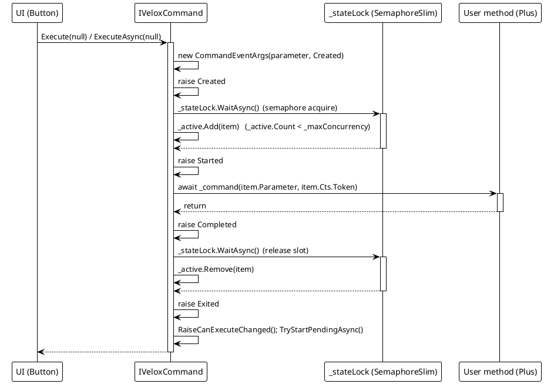
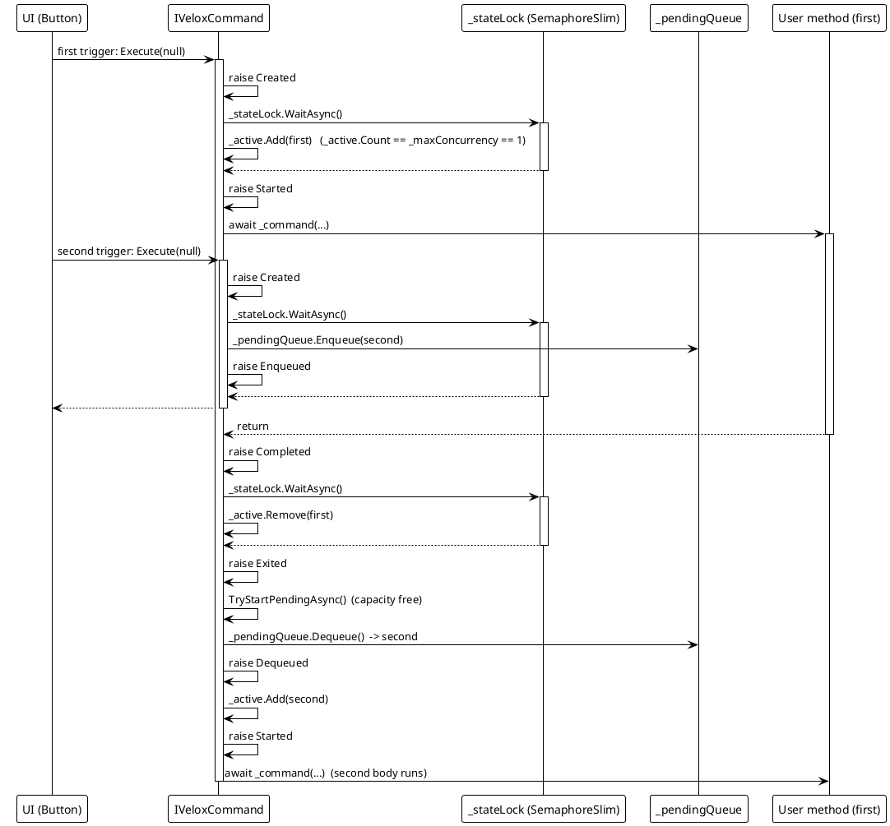
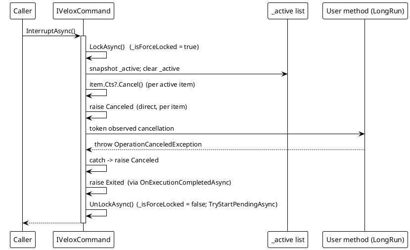
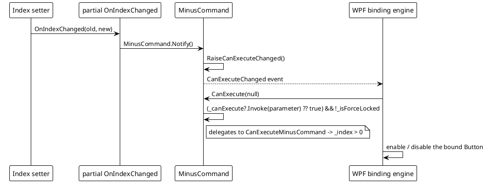

# Data Flow — MVVM

All four diagrams trace the implementation in `Src/Core/VeloxDev.Core/MVVM/VeloxCommand.cs` and the generated members in `Src/Generators/VeloxDev.Core.Generator/Base/Analizer.cs`.

## (a) Command lifecycle: semaphore acquire -> Started -> invoke -> Completed -> release -> Exited

## (b) Queueing under `semaphore: 1`: second trigger -> Enqueued -> wait -> Dequeued

## (c) Cancellation path: InterruptAsync -> Canceled / Failed

Notes on the error paths (same source, lines 176-222):

| Path | Behavior |
|---|---|
| `InterruptAsync` / `ClearAsync` | Cancel the item CTS and raise `Canceled` for each affected invocation; the running method may additionally observe the token and throw `OperationCanceledException`, which `ExecuteCoreAsync` also maps to `Canceled`. |
| User method throws (non-cancellation) | `ExecuteCoreAsync` catches `Exception ex` and raises `Failed` with `CommandEventArgs.Exception`; `Exited` still fires in `finally`. |
| Force-locked trigger | `ExecuteAsync` cancels the new item and raises `Canceled`; no execution starts. |
| `ClearAsync` | Dequeues all pending (raising `Dequeued` per item), then raises `Canceled` for pending + active. |

## (d) `canValidate` flow: CanExecute gate

> Source references: `Src/Core/VeloxDev.Core/MVVM/VeloxCommand.cs` (`ExecuteAsync`, `ExecuteCoreAsync`, `OnExecutionCompletedAsync`, `TryStartPendingAsync`, `InterruptAsync`, `ClearAsync`), `Src/Generators/VeloxDev.Core.Generator/Base/Analizer.cs` (`GetSetterBodyLines`, `GenerateCollectionMembers`), `Examples/MVVM/WPF/Demo/MainWindowViewModel.cs`.
