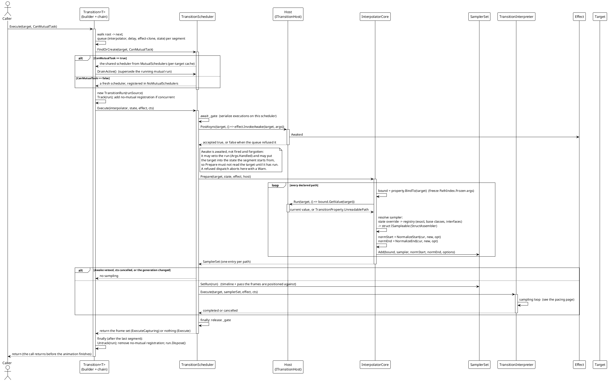
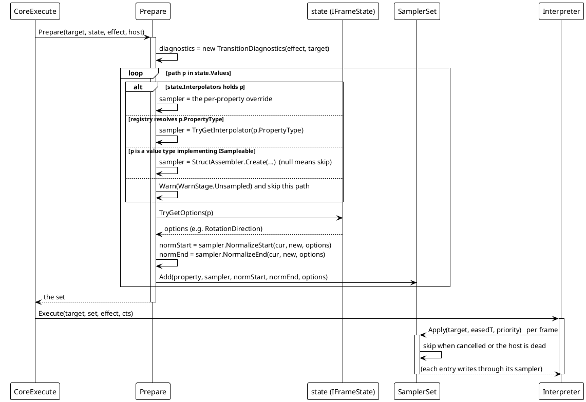
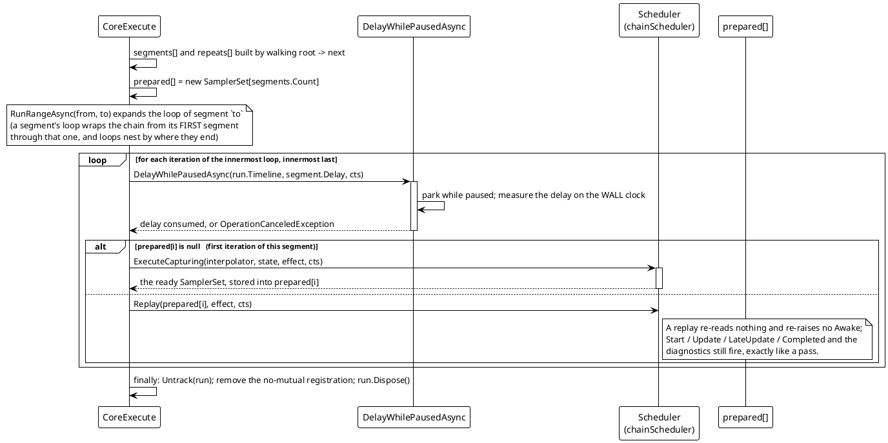

# Data Flow — Transition: Run Lifecycle

One `Execute` call, from the fluent builder to the last frame. The distinctive step is `Prepare`: the interpreter never touches the declared state, only the `SamplerSet` that `Prepare` produced, and that set is what "a state snapshot" means in this engine — one entry per declared path, each holding its sampler plus the two **normalized endpoint values**.

## (a) One run, one segment

> Source: `Src/Core/VeloxDev.Core/TransitionSystem/Effects/Transition.cs` (`CoreExecute`, `ExecuteCoreAsync`, `RunSegmentAsync`), `TransitionScheduler.cs` (`FindOrCreate`, `ExecuteCore`, gate, generation, `Track`/`Untrack`), `Interpolator.cs` (`Prepare`), `SamplerSet.cs`.

## (b) What a prepared state is

`Prepare` is the only place a target is read. Everything downstream works from the resulting `SamplerSet<TPriorityCore>`, whose entries are exactly `(property, sampler, normalizedStart, normalizedEnd, options)` plus a lazily-created `working` scratch:

> Source: `Src/Core/VeloxDev.Core/TransitionSystem/Sampling/Interpolator.cs` (`Prepare<TPriorityCore>`), `SamplerSet.cs` (`Add`, `Apply`, `CanSetValue`), `StructAssembler.cs`.

Three facts about the set that make the rest of the engine simple:

- **It is fixed for the run.** The declared values and the samplers are resolved once; a frame never re-reads the state, re-parses a path or re-resolves a type. That is why `Repeat` can *replay* the set it prepared on the first iteration and get an identical animation each time.
- **The endpoints are already normalized.** `NormalizeStart` / `NormalizeEnd` ran once with the start value, the end value and the options; the frame path only ever evaluates an eased time against them.
- **A path that cannot be prepared is skipped, not fatal.** `UnreadablePath` (the path does not match this target's runtime type) and "no sampler resolves" both produce a `Warn` and a missing entry — the rest of the set still animates. `null` from `StructAssembler` is the same outcome. The one case that *is* fatal happens earlier, synchronously in `Execute`: a declared reference-type path for which nothing resolves throws `TransitionPathUnsampleableException`.

## (c) Segment chaining and loops

> Source: `Src/Core/VeloxDev.Core/TransitionSystem/Effects/Transition.cs` (`RunSegmentAsync`, `RunBodyAsync`, `RunRangeAsync`, `DelayWhilePausedAsync`), `TransitionScheduler.cs` (`ExecuteCapturing`, `Replay`).

The delay between segments is measured on the **wall clock** (a `Stopwatch`), not on the source: a rate of zero freezes the source without pausing it (`IsPaused` stays false), and a delay measured on a frozen clock would never decrease. The sampling loop does the opposite on purpose — it uses the timeline, because there the timeline is what decides how far the animation has gone.
