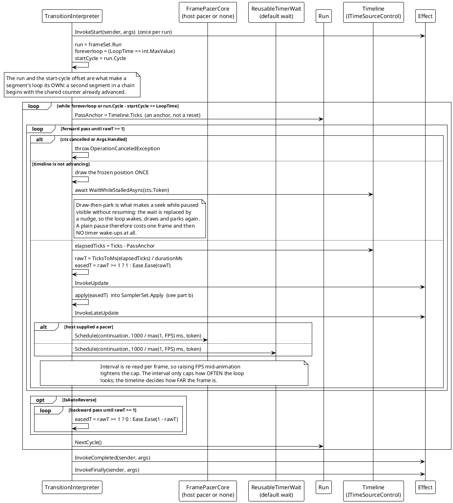
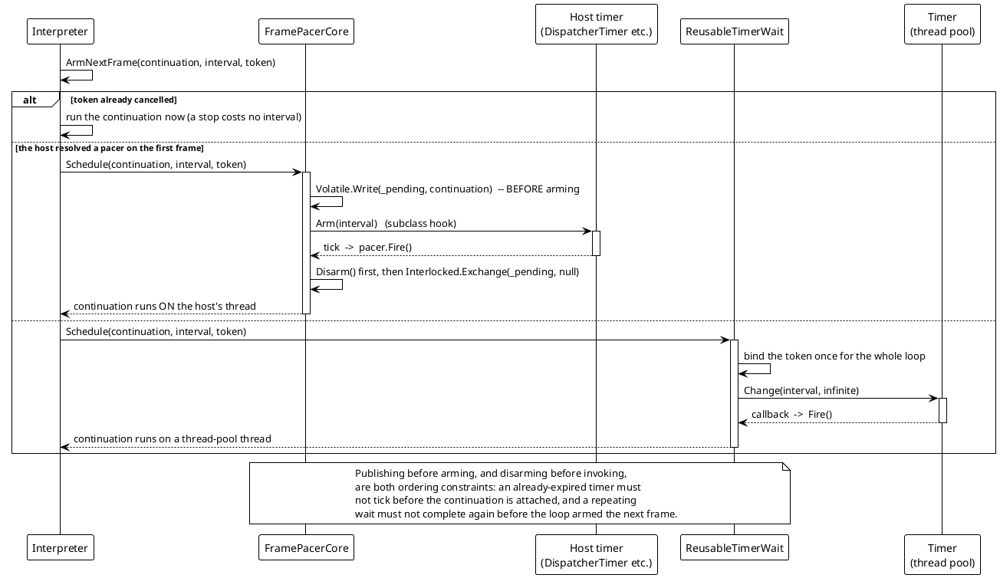
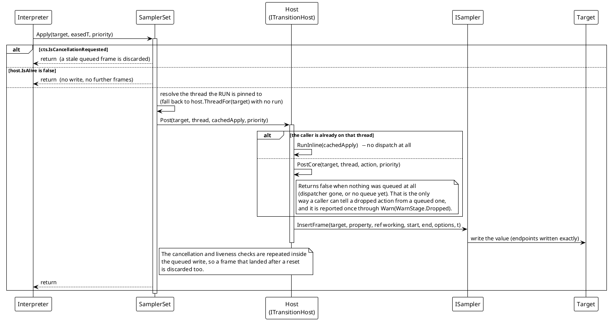

# Data Flow — Transition: Pacing & Marshaling

Two things happen per frame: the loop decides *when* to sample (pacing), and each sample's values are written on the target's own thread (marshaling). They are separate concerns with separate failure modes, which is why they are drawn separately.

## (a) One pass: timeline-driven sampling

> Source: `Src/Core/VeloxDev.Core/TransitionSystem/Runtime/TransitionInterpreter.cs` (`ExecuteSamplingLoopAsync`, `RunPassAsync`, `EmitFrame`, `ArmNextFrame`), `FramePacerCore.cs`, `ReusableTimerWait.cs`, `TransitionRun.cs`.

The load-bearing line is `Pacer.PassAnchor = Timeline.Ticks`. A pass is an **anchor** into an absolute timeline, never a reset — so several runs can share one source (each keeps its own pass and its own place), and `Transition.Seek` is nothing more than writing a different anchor. Two consequences the diagram shows: the pass ends in exactly one place (its far end), because the timeline only ever moves forwards; and the last frame of a pass is the **exact** endpoint (`easedT = 1` forward, `0` reverse), independent of whether `Ease(1)` is exactly `1`.

`FPS` is worth restating: it is a *cap*, not a grid. `ArmNextFrame` re-reads `1000 / max(1, FPS)` every frame, so tightening the cap on a running animation takes effect immediately; waking late just draws a frame further along.

## (b) The wait: host pacer, else one reused timer

> Source: `Src/Core/VeloxDev.Core/TransitionSystem/Runtime/{FramePacerCore,ReusableTimerWait,TransitionInterpreter}.cs`, `Src/Adapters/*/PlatformAdapters/TransitionInterpreter.cs`.

Why a custom awaiter is not marshalled back: `FrameWait` implements `INotifyCompletion` and deliberately **not** `ICriticalNotifyCompletion`, so the builder flows the caller's `ExecutionContext` — but restoring a `SynchronizationContext` is `Task`'s job, so a custom awaiter's continuation resumes on whatever thread completed the wait. A loop started on a UI thread therefore drifts to a pool thread after its first frame *unless the host supplied a pacer*. That is the whole reason the pacing seam exists, and why a host must derive its pacer from the same answer the write path uses: a pacer that disagrees with `Post` turns every frame into a dispatch.

## (c) The UI-thread hop

> Source: `Src/Core/VeloxDev.Core/TransitionSystem/Sampling/SamplerSet.cs` (`Apply`, `ApplyCore`, cached closure, `SetRun`), `Src/Core/VeloxDev.Core/Threading/ThreadDispatcherBase.cs`, `Src/Adapters/*/PlatformAdapters/UIThreadInspector.cs`.

Three allocation-avoidance decisions are visible in this flow:

- **The eased time travels in a field, not a closure.** `Apply` keeps one cached `Action` per target and stores `t` with `Interlocked.Exchange(ref _cachedTimeBits, BitConverter.DoubleToInt64Bits(t))`, so per-sample marshaling allocates nothing.
- **The thread is not re-derived per frame.** A run pins its `ThreadRef` once, when the scheduler starts it, because the write path runs on the sampling loop's thread and that thread carries no answer for a host whose answer depends on the caller — a Blazor circuit's renderer cannot be named from there.
- **The check is repeated inside the queued write.** `ApplyCore` re-checks the token and the liveness flag, because the write happens when the message is pumped and the animation can be cancelled in between; checking only before queueing would let an already-stale frame overwrite a reset.
