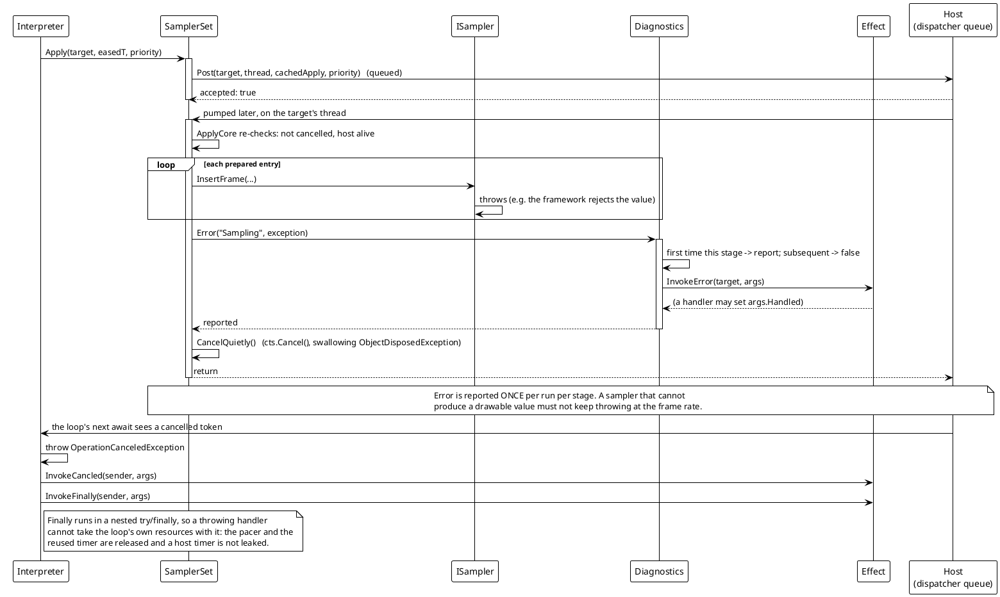
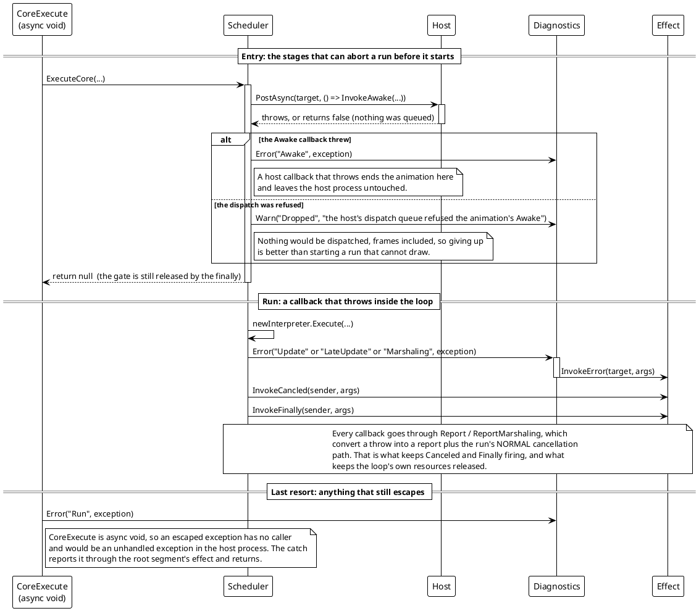

# Data Flow — Transition: Error Path

The engine's failure mode is **silence**: a sampler runs inside a dispatcher callback on the UI thread where nothing catches, and `Execute` is `async void`, so there is no caller to receive a throw. The design answer is a single internal mediator (`TransitionDiagnostics`) and one rule the loop keeps unconditionally: *an exception never leaves the loop; it becomes a report, and then the run unwinds down its normal cancellation path.*

## (a) A throwing sampler, mid-frame

> Source: `Src/Core/VeloxDev.Core/TransitionSystem/SamplerSet.cs` (`ApplyCore`, `CancelQuietly`), `TransitionDiagnostics.cs`, `TransitionInterpreter.cs` (`ExecuteSamplingLoopAsync`, `Report`, `ReleaseLoopResources`).

Two details are worth spelling out:

- **The exception does not propagate, and the token is cancelled *quietly*.** `CancelQuietly` swallows `ObjectDisposedException` because the animation or the adapter may already have disposed the token source — there is nothing left to cancel, and that is not a new failure.
- **`Error` is reported once per stage.** `TransitionDiagnostics` keeps a per-instance `HashSet<string> _reported`; a stage already reported returns `false`. That is what stops a per-frame condition from producing a per-frame log, and it is why the message names the *stage* rather than the frame.

## (b) A throwing callback, and the aborted stages at entry

> Source: `Src/Core/VeloxDev.Core/TransitionSystem/TransitionScheduler.cs` (`ExecuteCore`), `Transition.cs` (`CoreExecute`), `TransitionInterpreter.cs` (`Report`, `ReportMarshaling`, `ExecuteSamplingLoopAsync`'s catch clauses).

## (c) The diagnosis an operator actually sees

Every report carries `TransitionEventArgs.Stage`, so a log line names the failing stage without re-running anything:

| `Stage` | Raised as | Meaning |
|---|---|---|
| `Awake` | `Error` | the `Awaked` handler threw; the run aborts before preparation |
| `Prepare` | `Error` | normalization threw; the run aborts |
| `Update` / `LateUpdate` | `Error` | an effect callback threw; the pass ends |
| `Marshaling` | `Error` | the host's write path threw (`Apply`) |
| `Sampling` | `Error` | an `ISampler.InsertFrame` threw; the run is cancelled quietly |
| `Run` | `Error` | something escaped the loop's own catch — the `async void` last resort |
| `Dropped` | `Warn` | the host refused a frame, or refused the `Awake` dispatch |
| `Unreadable` | `Warn` | a declared path does not match the target's runtime type; skipped |
| `Unsampled` | `Warn` | no sampler resolves for a declared path; skipped |

The `Warn` / `Error` handlers are `WeakDelegate`-backed like the lifecycle events, and setting `Handled = true` inside one asks the run to terminate — the one place a diagnostic is allowed to *change* behavior. Without a handler the report still reaches `Debug.WriteLine`, so a run that silently degrades in a debugger is still visible.
