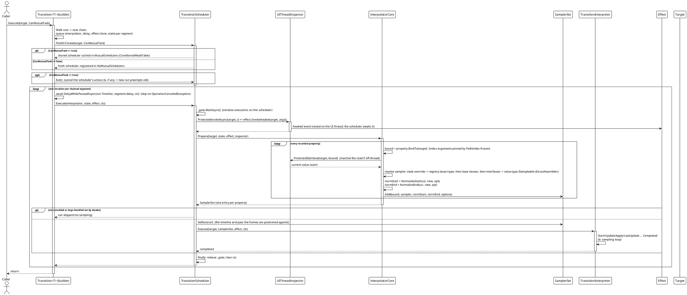
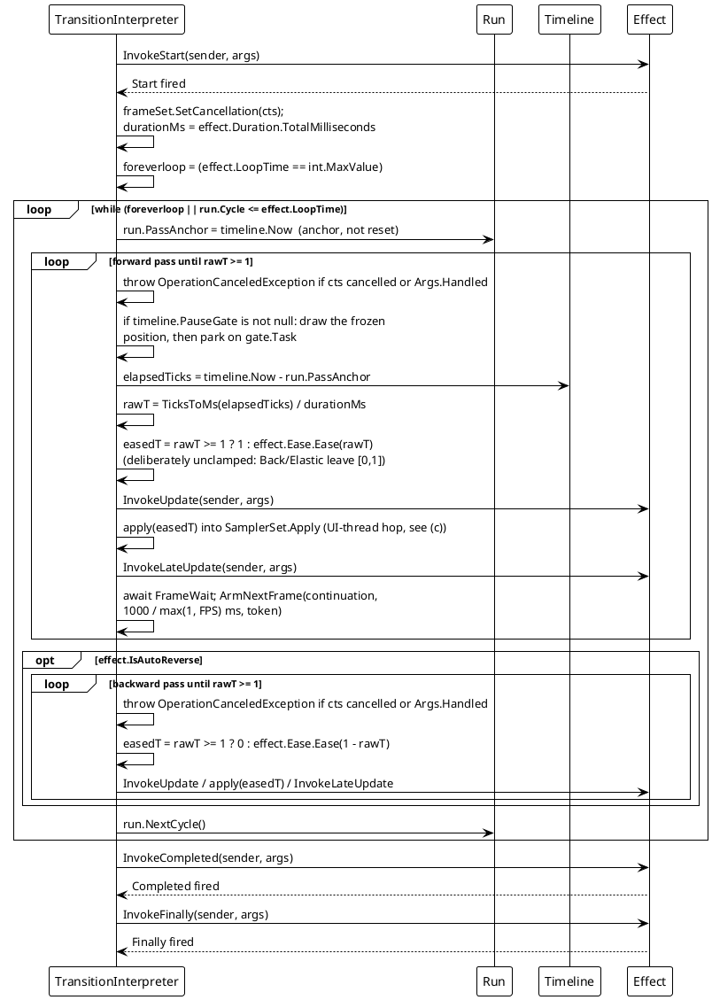
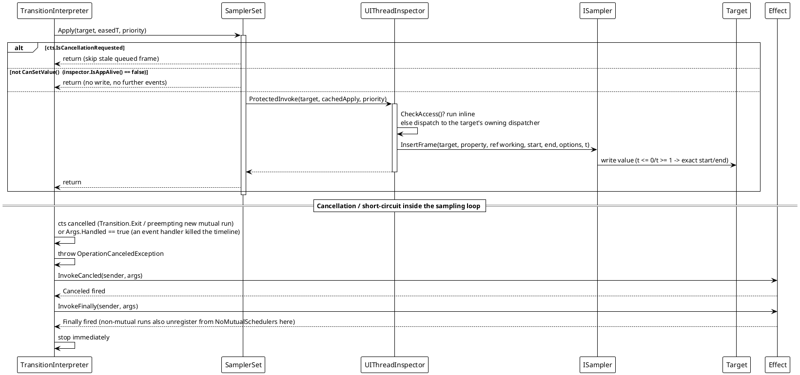
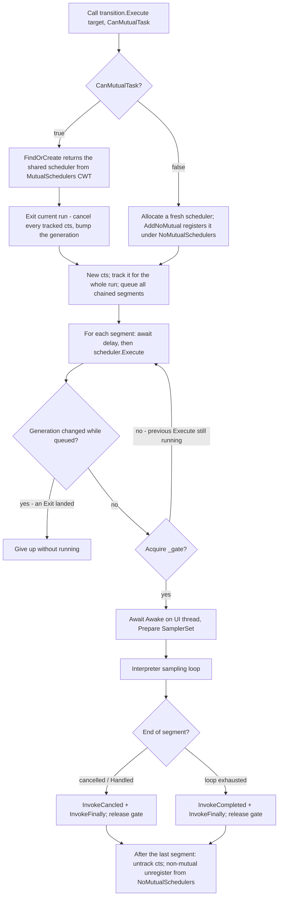

# Data Flow — Transition

The engine is executed through the same core pipeline on every platform adapter. A run is **two-phase** inside each segment: first the scheduler *prepares* a normalized `SamplerSet` (reads current values, resolves samplers, fixes endpoints), then the interpreter drives a *continuous* sampling loop, anchored to the run's timeline and marshaling each frame write to the UI thread. This page shows the run lifecycle, the effect-scheduling loop, the UI-thread hop, the scheduler fan-out/preemption rules, and how a path comes into being when it is reflected rather than declared.

## (a) Segment run lifecycle

`Execute(target)` walks the fluent builder chain (`root`…`next`), queues each segment's `(state, effect-clone, interpolator, delay)`, then plays them one at a time on a per-target scheduler. Cancellation is carried by one `CancellationTokenSource` shared across all segments of the run (registered with the scheduler for the whole run, including the `Await` gaps).

Sources: `TransitionSystem/Transition.cs` (`CoreExecute`, segment queueing and play loop), `TransitionScheduler.cs` (`FindOrCreate`, `Execute`, `_gate`, weak target reference), `Interpolator.cs` (`Prepare`, sampler resolution), `SamplerSet.cs`.

## (b) Effect scheduling and the sampling loop

Each segment's interpreter runs one continuous loop. `Duration`/`FPS` come from the segment's `Effect`; `FPS` is a **maximum sample-rate cap** — the yield interval is `1000 / FPS` ms, and it is only a cap: the run's timeline is the single timing source, so waking late draws a frame further along rather than a wrong one. A pass is an **anchor** into that timeline (`run.PassAnchor`), not a reset, which is what lets several animations share one timeline. `LoopTime = int.MaxValue` loops forever.

Each pass writes an **exact endpoint** on its last sample (`forward → easedT = 1`, `reverse → easedT = 0`) rather than relying on `Ease(1)`; each sampler maps `t <= 0` / `t >= 1` to the exact normalized start/end value. The middle frames are **not** clamped: `Back` and `Elastic` are defined by leaving `[0, 1]`, so the eased value is handed to the sampler as-is and the sampler decides — the numeric ones extrapolate, the rest pin to their endpoint.

The wait is not `Task.Delay`. `ArmNextFrame` is a `protected virtual` seam on the interpreter: the default reuses one `Timer` for the whole loop through `ReusableTimerWait` (one cancellation registration for the animation instead of one per frame), and a host whose framework can say when the next frame is — a render tick on WPF, Avalonia or WinUI — overrides it. The awaitable implements `INotifyCompletion` and deliberately not `ICriticalNotifyCompletion`, so the compiler's await path captures the caller's `SynchronizationContext`; a loop started on the UI thread therefore stays there instead of resuming on whatever thread the timer fired on. `ReusableTimerWaitTests` measures the difference.

## (c) UI-thread hop, cancellation, and app-shutdown guard

`SamplerSet.Apply` reuses one cached closure per target and hands the current eased time to the UI thread via `ProtectedInvoke`. If the target's dispatcher is the current thread the write runs inline; otherwise it is posted to the target's dispatcher. Reads during `Prepare` are marshaled the same way by `ProtectedGetValue`. A cancelled run or a dead app skips queued writes (the "stale-frame guard"), so a reset/exit result is never overwritten.

Sources: `TransitionSystem/SamplerSet.cs` (`Apply`, `SetCancellation`, `SetRun`, `CanSetValue`, cached apply closure), `TransitionInterpreter.cs` (`ExecuteSamplingLoopAsync`, `RunPassAsync`, `EmitFrame`, `ArmNextFrame`), `TransitionClock.cs` (`TransitionTimeline`, `TransitionRun`), `ReusableTimerWait.cs`, `TransitionEffect.cs` (event invocation), `Src/Adapters/*/PlatformAdapters/UIThreadInspector.cs` (per-platform marshaling).

## (d) Scheduler selection, preemption, and fan-out

One target holds **at most one** shared mutual scheduler (serialized by a `SemaphoreSlim`) but can run **many** concurrent non-mutual schedulers. A new mutual run on the same target preempts (cancels) the one currently executing.

`Transition.Exit(target, IncludeMutual, IncludeNoMutual)` cancels the target's mutual scheduler and, optionally, every running non-mutual scheduler; those schedulers then unwind through the `Canceled`/`Finally` path above. Its three siblings in the same control surface — `Pause`/`Resume`, `SetRate` and `Seek` — take a different route: they do not go through the scheduler's gate at all, they act on the `TransitionTimeline` each run is anchored to.

## (e) Path construction: declared vs reflected

A declared path (`.Property(x => x.Foo.Bar, value)`) is parsed once and held in a field for the life of the transition. The reflection-driven entry point is `TransitionProperty.FromProperty(PropertyInfo)`, which the theme system calls for every themed property of every registered target on *every* switch — and a fresh `TransitionProperty` compiles its own getter and setter on first use, so the whole set was recompiled per switch.

`FromProperty` now memoizes through a static `ConcurrentDictionary<PropertyInfo, TransitionProperty>` and returns a **shared** instance per `PropertyInfo`. Sharing is safe because a path is immutable and `BindTo` returns the instance itself when there are no index arguments to freeze — which is always the case on this route — and because the lazy compile is idempotent, so a concurrent first use can only compile twice and discard one. The measured effect is on [Complexity — Transition](../../04_complexity/03_transition/index.md).

Index arguments are the other half of the path story. By default an index argument that can change while the animation runs — a captured local, or a property of the target such as `SelectedIndex` — is re-evaluated on **every frame**, so the path follows it; but the end value was read once when the animation started, so a moving path writes an end value computed against the slot it started on. `PathIndex.Frozen(i)` pins the slot instead. It is part of the path's identity, so `Items[i]` and `Items[Frozen(i)]` are two different paths, and the pin is resolved exactly once, in `Prepare`, by `TransitionProperty.BindTo`.

## Flow Summary `Transition<T>` is `TransitionCore<T, State, TransitionEffect, Interpolator, UIThreadInspector, TransitionInterpreter, TPriorityCore>`, and `CoreExecute` resolves the scheduler internally through `TransitionSchedulerCore<UIThreadInspector, TransitionInterpreter, TPriorityCore>.FindOrCreate`. (Avalonia and WinUI additionally declare their adapter scheduler as the generic `TransitionScheduler<TTarget>`; its type parameter is unused.)

## Flow Summary

| Scenario | Behavior |
|---|---|
| Normal run | `CoreExecute` queues every chained segment, then per segment: `await delay` → scheduler `Execute` (gate) → `Awake` on UI thread → `Prepare` builds one `SamplerSet` entry per property → interpreter samples continuously (`t = eased elapsed/duration`) and applies each frame on the UI thread → `Completed` + `Finally`. |
| `IsAutoReverse` | After the forward pass the interpreter runs a backward pass (same samplers; pass end `easedT = 0`). |
| `LoopTime` / `int.MaxValue` | The whole forward (+ reverse) pair repeats while `run.Cycle <= effect.LoopTime` (`Cycle` from 0, `NextCycle` after each pair), or forever. |
| Sampling cadence | The timeline decides *when* a frame is; `1000 / max(1, FPS)` ms only caps how often the loop looks. Each wait goes through `ArmNextFrame` — by default one reused `Timer` per loop (one cancellation registration for the animation), or the host's render tick where a framework overrides it. |
| `Pause` / `Resume` / `SetRate` / `Seek` | `Transition.Pause/Resume/SetRate/Seek(target, …)` act on the run's `TransitionTimeline`, not on the scheduler. A pause freezes the clock, so the paused time is excluded rather than skipped, and the parked loop costs no timer wake-ups; a rate change rebases first, so it does not jump the position; a seek replaces `run.PassAnchor` (the `cycle` overload also sets the pass counter), and while paused draws the new position once without resuming. A zero-duration pass consumes no time at all, which is why the pass counter exists. |
| Index arguments | Re-evaluated every frame by default, so the path follows them while the end value stays where it was read. `PathIndex.Frozen(i)` pins the slot for the whole animation and is part of the path's identity. |
| Reflected paths | `TransitionProperty.FromProperty` returns a memoized shared path per `PropertyInfo`, so a theme switch stops recompiling getters and setters for every target on every switch. |
| Segment `Await` delay | A pre-delay per segment (`CoreAwait`/`CoreAwaitThen`), waited out by `DelayWhilePausedAsync` on one reused `ReusableTimerWait`; skipped on cancellation (`OperationCanceledException`), and the part of it that passes while the run is paused is not consumed. |
| New mutual run on the same target | `CoreExecute` drains and cancels the previous run's tokens first (bumping the generation); the previous run gives up at its next check, so queued frames are skipped. |
| `TransitionEventArgs.Handled = true` | An event handler throws `OperationCanceledException` → `Canceled` + `Finally`; the timeline stops. |
| `Transition.Exit(target, …)` | Cancels the target's mutual (and optionally non-mutual) schedulers; each tracked token of a run is cancelled at once, and the run unregisters itself in its own `finally`. |
| Started on a background thread | `UIThreadInspector` marshals reads (`ProtectedGetValue`) and frame writes (`ProtectedInvoke`) to the target's UI thread. The loop's own await captures the caller's `SynchronizationContext`, so a loop started on the UI thread keeps its `Start`/`Update`/`Completed` callbacks there; only `Awake` and the frame writes are always marshalled to the target. |
| Property without a sampler / invalid path | A path that does not match the target's runtime type is skipped in `Prepare` (`UnreadablePath` sentinel from the compiled getter); a declared **reference-type** path with no sampler at all is rejected by `Execute` (`TransitionPathUnsampleableException`) instead of animating nothing. Other properties keep animating. |
| App shutting down | `SamplerSet.CanSetValue()` returns false → `Apply` skips the write and fires no further events. |

> Sources: `Src/Core/VeloxDev.Core/TransitionSystem/TransitionScheduler.cs` (gate, CWT tables, weak target, generation/drain, `TransitionRun` registration), `TransitionInterpreter.cs` (`ExecuteSamplingLoopAsync`/`RunPassAsync`/`EmitFrame`/`ArmNextFrame`), `TransitionClock.cs` (`TransitionTimeline.Advance`/`Wake`/`PauseGate`, `TransitionRun.PassAnchor`/`Cycle`), `ReusableTimerWait.cs`, `SamplerSet.cs` (`Apply` + cancellation/app-alive guard, `Run`/`SetRun`), `Interpolator.cs` (`Prepare`, `TryGetInterpolator`, `CreateScheduler`), `TransitionProperty.cs` (`BindTo`, `FromProperty`), `PathIndex.cs`, `Transition.cs` (`CoreExecute`, `Pause`/`Resume`/`SetRate`/`Seek`), `Src/Core/VeloxDev.Core.Test/TransitionSystem/ReusableTimerWaitTests.cs`, `Src/Adapters/*/PlatformAdapters/UIThreadInspector.cs`.

Related analysis: [Design patterns — Transition](../../02_design-patterns/03_transition/index.md) · [Complexity — Transition](../../04_complexity/03_transition/index.md)
