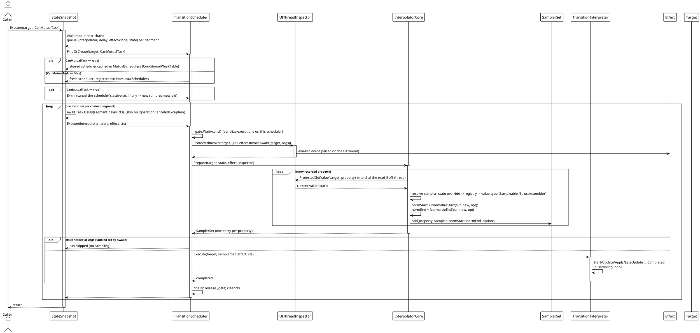
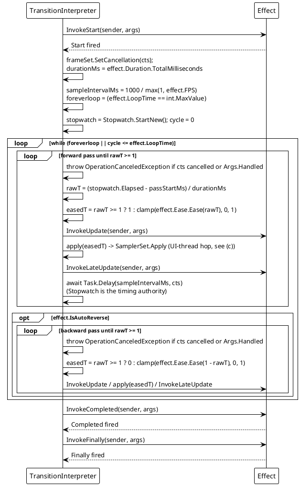
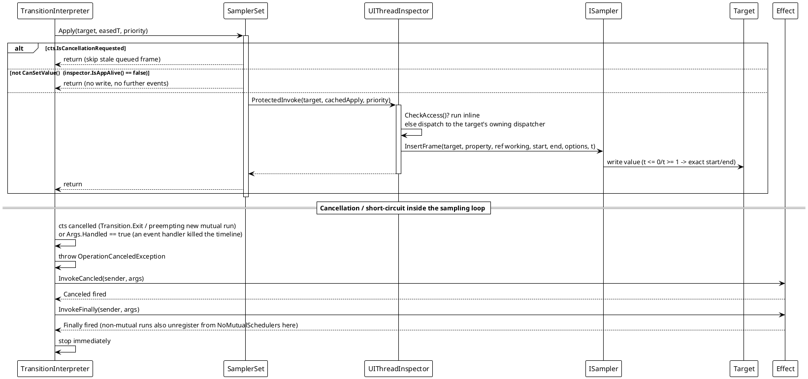
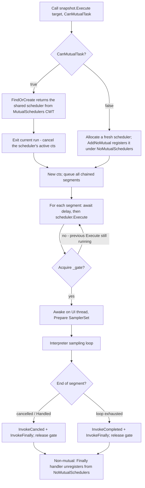

# Data Flow — Transition

The engine is executed through the same core pipeline on every platform adapter. A run is **two-phase** inside each segment: first the scheduler *prepares* a normalized `SamplerSet` (reads current values, resolves samplers, fixes endpoints), then the interpreter drives a *continuous* Stopwatch-based sampling loop that marshals each frame write to the UI thread. This page shows the run lifecycle, the effect-scheduling loop, the UI-thread hop, and the scheduler fan-out/preemption rules.

## (a) Segment run lifecycle

`Execute(target)` walks the fluent `StateSnapshot` chain (`root`…`next`), queues each segment's `(state, effect-clone, interpolator, delay)`, then plays them one at a time on a per-target scheduler. Cancellation is carried by one `CancellationTokenSource` shared across all segments of the run.

Sources: `TransitionSystem/StateSnapshot.cs` (`CoreExecute`, segment queueing and play loop), `TransitionScheduler.cs` (`FindOrCreate`, `Execute`, `_gate`, weak target reference), `Interpolator.cs` (`Prepare`, sampler resolution), `SamplerSet.cs`.

## (b) Effect scheduling and the sampling loop

Each segment's interpreter runs one continuous loop. `Duration`/`FPS` come from the segment's `Effect`; `FPS` is a **maximum sample-rate cap** — the yield interval is `1000 / FPS` ms, while the Stopwatch is the only timing source (so `Task.Delay` imprecision never skews the animation). `LoopTime = int.MaxValue` loops forever.

Each pass writes an **exact endpoint** on its last sample (`forward → easedT = 1`, `reverse → easedT = 0`) rather than relying on `Ease(1)`; each sampler maps `t <= 0` / `t >= 1` to the exact normalized start/end value.

## (c) UI-thread hop, cancellation, and app-shutdown guard

`SamplerSet.Apply` reuses one cached closure per target and hands the current eased time to the UI thread via `ProtectedInvoke`. If the target's dispatcher is the current thread the write runs inline; otherwise it is posted to the target's dispatcher. Reads during `Prepare` are marshaled the same way by `ProtectedGetValue`. A cancelled run or a dead app skips queued writes (the "stale-frame guard"), so a reset/exit result is never overwritten.

Sources: `TransitionSystem/SamplerSet.cs` (`Apply`, `SetCancellation`, `CanSetValue`, cached apply closure), `TransitionInterpreter.cs` (`ExecuteSamplingLoopAsync`, `RunPassAsync`), `TransitionEffect.cs` (event invocation), `Src/Adapters/*/PlatformAdapters/UIThreadInspector.cs` (per-platform marshaling).

## (d) Scheduler selection, preemption, and fan-out

One target holds **at most one** shared mutual scheduler (serialized by a `SemaphoreSlim`) but can run **many** concurrent non-mutual schedulers. A new mutual run on the same target preempts (cancels) the one currently executing.

`Transition.Exit(target, IncludeMutual, IncludeNoMutual)` cancels the target's mutual scheduler and, optionally, every running non-mutual scheduler; those schedulers then unwind through the `Canceled`/`Finally` path above.

## Flow Summary

| Scenario | Behavior |
|---|---|
| Normal run | `CoreExecute` queues every chained segment, then per segment: `await delay` → scheduler `Execute` (gate) → `Awake` on UI thread → `Prepare` builds one `SamplerSet` entry per property → interpreter samples continuously (`t = eased elapsed/duration`) and applies each frame on the UI thread → `Completed` + `Finally`. |
| `IsAutoReverse` | After the forward pass the interpreter runs a backward pass (same samplers; pass end `easedT = 0`). |
| `LoopTime` / `int.MaxValue` | The whole forward (+ reverse) pair repeats `LoopTime + 1` times (`cycle <= LoopTime`, `cycle` from 0), or forever. |
| Segment `Await` delay | A pre-delay per segment (`CoreAwait`/`CoreAwaitThen`); skipped on cancellation (`OperationCanceledException`). |
| New mutual run on the same target | `CoreExecute` calls `scheduler.Exit()` first; the previous scheduler cancels its current `cts`, so queued frames are skipped. |
| `TransitionEventArgs.Handled = true` | An event handler throws `OperationCanceledException` → `Canceled` + `Finally`; the timeline stops. |
| `Transition.Exit(target, …)` | Cancels the target's mutual (and optionally non-mutual) schedulers; each unregisters via `Finally`. |
| Started on a background thread | `UIThreadInspector` marshals reads (`ProtectedGetValue`) and frame writes (`ProtectedInvoke`) to the target's UI thread; lifecycle events still run on the interpreter's execution thread (only `Awake` and frame writes are always on the UI thread). |
| Property without a sampler / invalid path | Skipped in `Prepare` (`UnreadablePath` sentinel from the compiled getter, or no resolved `ISampler`); other properties keep animating. |
| App shutting down | `SamplerSet.CanSetValue()` returns false → `Apply` skips the write and fires no further events. |

> Sources: `Src/Core/VeloxDev.Core/TransitionSystem/TransitionScheduler.cs` (gate, CWT tables, weak target), `TransitionInterpreter.cs` (`ExecuteSamplingLoopAsync`/`RunPassAsync`), `SamplerSet.cs` (`Apply` + cancellation/app-alive guard), `Interpolator.cs` (`Prepare`), `StateSnapshot.cs` (`CoreExecute`), `TransitionEx.cs`, `Src/Adapters/*/PlatformAdapters/UIThreadInspector.cs`.

Related analysis: [Design patterns — Transition](../../02_design-patterns/03_transition/index.md) · [Complexity — Transition](../../04_complexity/03_transition/index.md)
