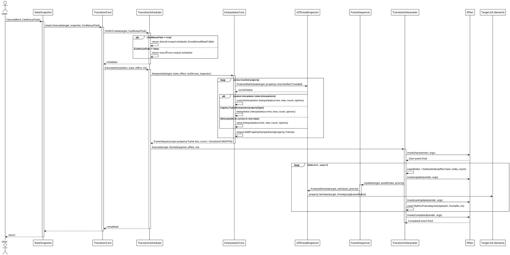
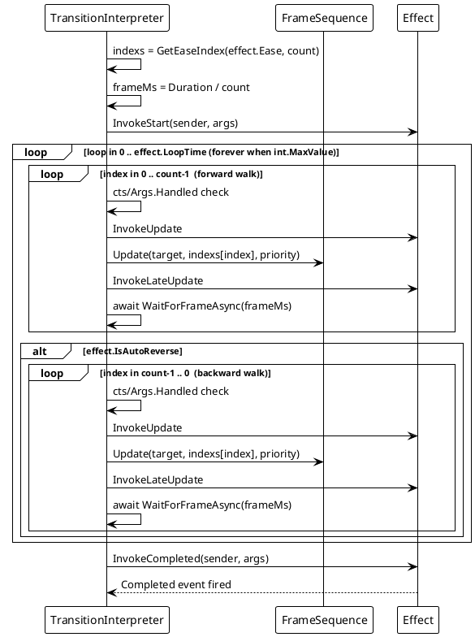
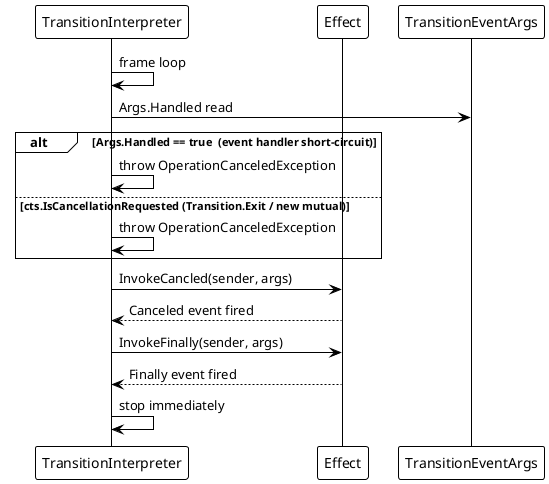
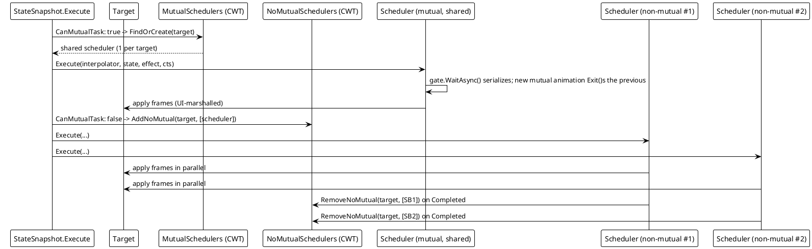

# Data Flow — Transition

## (a) Normal execution flow

The complete call chain from `snapshot.Execute(target)` to the frame pump. This flow works identically across all six platform adapters.

## (b) Auto-reverse / loop flow

When `IsAutoReverse` or `LoopTime` is set, the interpreter wraps the frame walk. `LoopTime = int.MaxValue` loops forever.

## (c) Cancellation / `TransitionEventArgs.Handled = true` short-circuit

A cancelled `cts` (from `Transition.Exit` or a new mutual animation) or a handler setting `Handled = true` throws `OperationCanceledException`; the interpreter fires `Canceled` + `Finally` and stops.

**App-shutdown path:** in `InterpolatorOutputBase.SetValues`, if `inspector.IsAppAlive() == false` (e.g. WinUI `DispatcherQueue` enqueue fails) the write is skipped; frames stop being applied without firing further events.

## (d) Mutual vs non-mutual scheduler fan-out

One target holds **at most one** shared mutual scheduler (serialized by a `SemaphoreSlim`) but **many** concurrent non-mutual schedulers.

## Flow Summary

| Scenario | Behavior |
|---|---|
| Normal execution | Frames are pre-computed per property, then applied on the UI thread via `UIThreadInspector`; `Update`/`LateUpdate` events fire per frame; `Completed` + `Finally` at the end. |
| `IsAutoReverse` | After the forward walk, the interpreter walks frames backward (same eased index list). |
| `LoopTime` / `int.MaxValue` | The whole forward (+ reverse) walk repeats `LoopTime` times, or forever. |
| New mutual animation on same target | `CoreExecute` calls `scheduler.Exit()` before the new run; the previous scheduler cancels its current `cts`. |
| `TransitionEventArgs.Handled = true` | Throws `OperationCanceledException` → `Canceled` + `Finally`; timeline stops. |
| `Transition.Exit(target)` | Cancels the target's mutual (and optionally non-mutual) schedulers. |
| Background-thread start | `UIThreadInspector.ProtectedInvoke`/`ProtectedGetValue`/`ProtectedInterpolate` marshal to the UI thread. |
| Property without interpolator | The property is skipped (`UnreadablePath` sentinel or no registered interpolator); other properties still animate. |
| App shutting down | `IsAppAlive() == false` → frame writes skipped, no further events. |

> Source references: `Src/Core/VeloxDev.Core/TransitionSystem/TransitionInterpreter.cs` (frame pump, `GetEaseIndex`, `WaitForFrameAsync`), `TransitionScheduler.cs` (`FindOrCreate`, `Execute`, gate), `Interpolator.cs` (resolution), `InterpolatorOutputCore.cs` (`Update`/`SetValues`, cancellation skip), `StateSnapshot.cs` (`CoreExecute`), `Src/Adapters/*/PlatformAdapters/UIThreadInspector.cs`.
