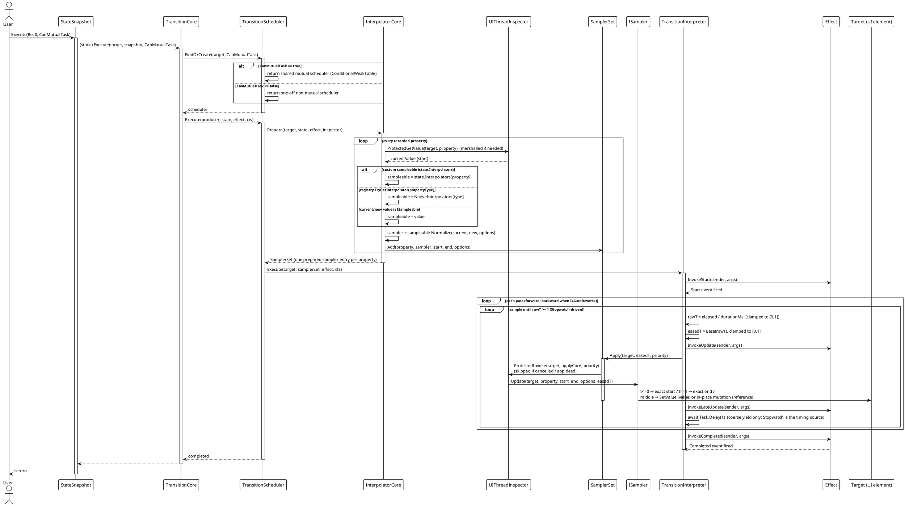
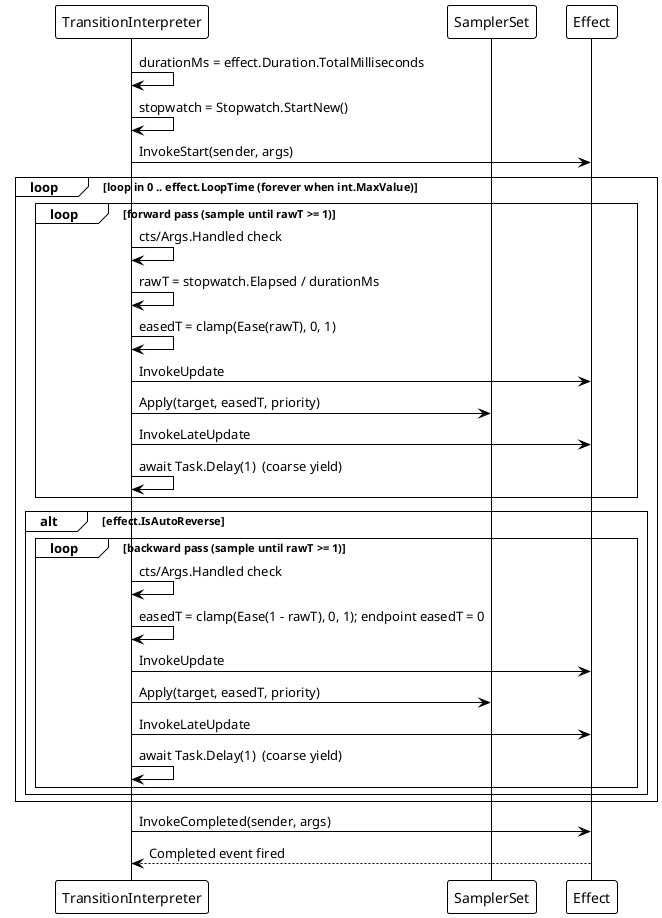
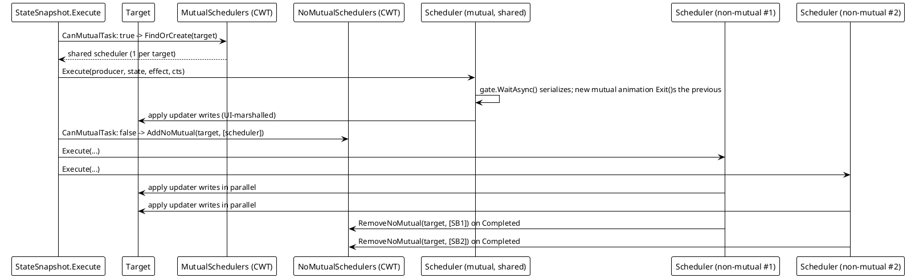

# Data Flow — Transition

## (a) Normal execution flow

The complete call chain from `snapshot.Execute(target)` to the Stopwatch-driven sampling loop. This flow works identically across all six platform adapters.

## (b) Auto-reverse / loop flow

When `IsAutoReverse` or `LoopTime` is set, the interpreter wraps the sampling passes. `LoopTime = int.MaxValue` loops forever.

## (c) Cancellation / `TransitionEventArgs.Handled = true` short-circuit

A cancelled `cts` (from `Transition.Exit` or a new mutual animation) or a handler setting `Handled = true` throws `OperationCanceledException`; the interpreter fires `Canceled` + `Finally` and stops.

**App-shutdown path:** `SamplerSet.Apply` checks `inspector.IsAppAlive()` (via `CanSetValue`); when it is `false` (e.g. WinUI `DispatcherQueue` enqueue fails) the write is skipped. The same guard inside `ApplyCore` stops mid-pass, so samples stop being applied without firing further events. Cancelled animations (`cts.IsCancellationRequested`) skip their queued writes the same way — the former `ICancellableFrameSequence` stale-frame guard.

## (d) Mutual vs non-mutual scheduler fan-out

One target holds **at most one** shared mutual scheduler (serialized by a `SemaphoreSlim`) but **many** concurrent non-mutual schedulers.

## Flow Summary

| Scenario | Behavior |
|---|---|
| Normal execution | `InterpolatorCore.Prepare` resolves one per-property `ISampleable` and calls `Normalize` (reads current=start, target=end), storing a per-property `(property, sampler, start, end, options)` entry; the interpreter samples continuously with a Stopwatch (`t = elapsed/duration`, eased + clamped) and applies via `SamplerSet.Apply`, marshalled to the UI thread; `Update`/`LateUpdate` events fire per sample; `Completed` + `Finally` at the end. |
| `IsAutoReverse` | After the forward pass, the interpreter runs a backward pass (same samplers; the endpoint `easedT` is forced to 0). |
| `LoopTime` / `int.MaxValue` | The whole forward (+ reverse) pass repeats `LoopTime` times, or forever. |
| New mutual animation on same target | `CoreExecute` calls `scheduler.Exit()` before the new run; the previous scheduler cancels its current `cts`. |
| `TransitionEventArgs.Handled = true` | Throws `OperationCanceledException` → `Canceled` + `Finally`; timeline stops. |
| `Transition.Exit(target)` | Cancels the target's mutual (and optionally non-mutual) schedulers. |
| Background-thread start | `UIThreadInspector.ProtectedInvoke`/`ProtectedGetValue` marshal reads and writes to the UI thread. |
| Property without a sampler | The property is skipped in `Prepare` (`UnreadablePath` sentinel or no resolved `ISampleable`); other properties still animate. |
| App shutting down | `SamplerSet.CanSetValue()` checks `IsAppAlive()` → writes skipped, no further events. |

> Source references: `Src/Core/VeloxDev.Core/TransitionSystem/TransitionInterpreter.cs` (Stopwatch-driven sampling loop, `ExecuteSamplingLoopAsync`), `TransitionScheduler.cs` (`FindOrCreate`, `Execute`, gate), `Interpolator.cs` (`Prepare`, sampler resolution), `SamplerSet.cs` (`Apply`, cancellation/app-alive skip), `StateSnapshot.cs` (`CoreExecute`), `Src/Adapters/*/PlatformAdapters/UIThreadInspector.cs`.
