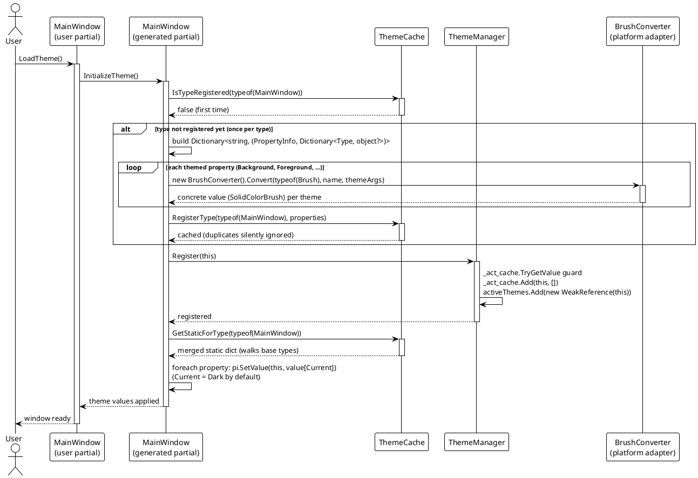
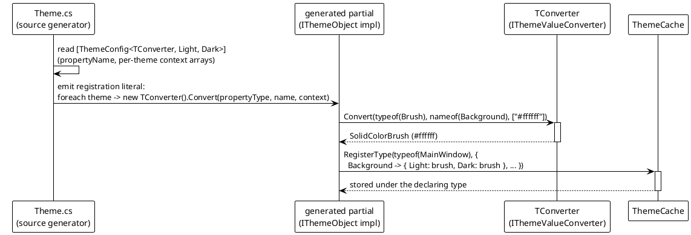

# Data Flow — Registration & Converter Pipeline

A theme-aware view (e.g. the WPF `MainWindow`) is a `partial class` carrying `[ThemeConfig<TConverter, TTheme...>]` attributes. `VeloxDev.Generators.Theme` emits a sibling partial that implements `IThemeObject`; its `InitializeTheme()` does all registration. The demo calls `InitializeTheme()` once after `InitializeComponent()`.

## Registration Flow (`InitializeTheme`)

Registration is split into three stores:

- `ThemeCache` (static, keyed by declaring type) holds the **default per-theme values**. `RegisterType` is guarded by `IsTypeRegistered`, so it runs once per type regardless of how many instances call `InitializeTheme`.
- `ThemeManager._act_cache` is a `ConditionalWeakTable<IThemeObject, ...>` used only as a **membership guard** (each registered object maps to an empty dictionary), and `activeThemes` keeps a `WeakReference<IThemeObject>` per instance for enumeration.
- The **current theme is applied** by reflecting over the merged static cache and calling `pi.SetValue(this, value)` for each property.

## Converter Pipeline

`ThemeCache` never sees raw attribute strings. While `Theme.cs` emits the registration literal, each theme argument array is converted at first `InitializeTheme` by instantiating the attribute's converter type (`TConverter`) and calling its `Convert`:

The value per theme is computed once, at the first `InitializeTheme` of the type (inside the `IsTypeRegistered == false` branch), and stored as a `Dictionary<Type, object?>` per property. The `ThemeCache.RegisterConverter`/`GetConverter` registry exists for reuse, but the current generator instantiates converters inline (`Activator.CreateInstance`) instead of consulting it — `Src/Generators/VeloxDev.Core.Generator/Theme.cs`, lines 231-257.

Arity coverage: the generator discovers decorated classes through `ForAttributeWithMetadataName` metadata names for generic arities 3–7 (a converter plus two to six theme markers; `Theme.cs`, lines 32-55). The attribute family additionally defines the seven-theme variant (generic arity 8), which the generator would only process when it coexists on a class that also carries a discovered arity. The demos and tests exercise the two-theme arity-3 form (`ThemeConfigAttribute<BrushConverter, Light, Dark>`).

> Source: `Src/Generators/VeloxDev.Core.Generator/Theme.cs` (attribute scanning lines 32-83; emitted `InitializeTheme` lines 388-414), `Src/Core/VeloxDev.Core/DynamicTheme/ThemeCache.cs` (`IsTypeRegistered` lines 41-47, `RegisterType` lines 54-68, `GetStaticForType` lines 98-103), `Src/Core/VeloxDev.Core/DynamicTheme/ThemeManager.cs` (`Register` lines 58-66), `Examples/Theme/WPF/Demo/MainWindow.xaml.cs` (attribute lines 36-37, `LoadTheme` lines 40-53).
