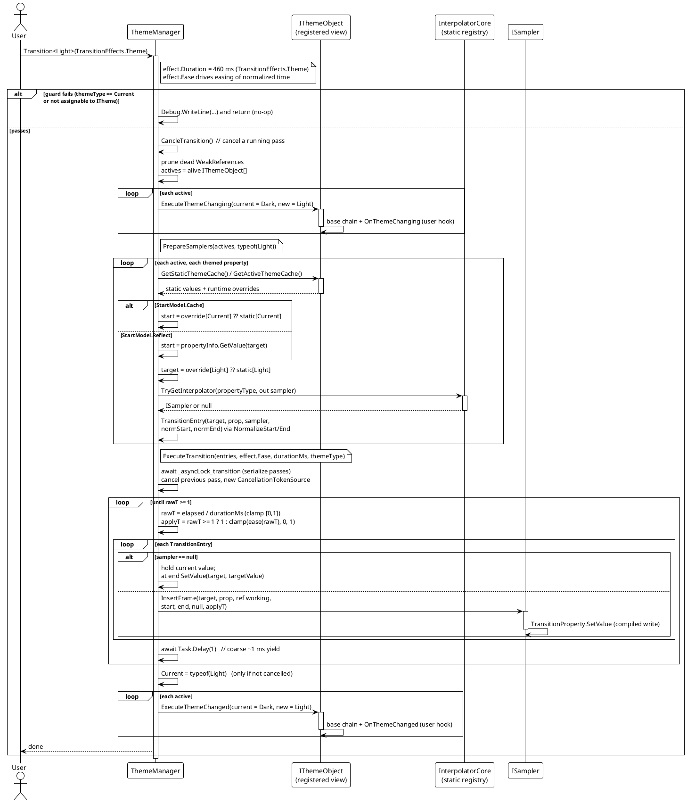
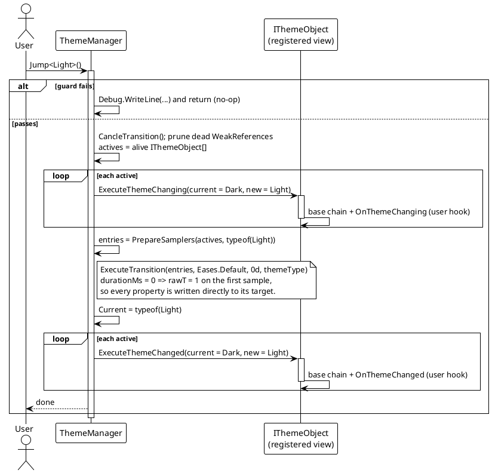

# Data Flow — Theme Switching

Both `Transition<T>` (animated) and `Jump<T>` (instant) follow the same pipeline: guard the target theme, notify `ExecuteThemeChanging`, prepare one sampler entry per property, run `ExecuteTransition`, update `Current`, then notify `ExecuteThemeChanged`. The only difference is the animation duration — `Jump` passes `durationMs = 0`.

## Animated Switch (`Transition<T>`)

Notes:

- The entry list is prepared up front and holds one `TransitionEntry` per property: target, the compiled `TransitionProperty`, the resolved `ISampler` (or null), and the normalized start/end values.
- No frame list is built — sampling is Stopwatch-driven; each loop iteration yields via `Task.Delay(1)`, and the pass ends when `elapsed >= durationMs`. `FPS` on the effect is not consulted by this loop.
- If a second `Transition`/`Jump` starts while one is running, the earlier pass is cancelled through a `CancellationTokenSource` (`CancleTransition`), and only the winning pass updates `Current`. `ExecuteTransition` awaits a static `SemaphoreSlim` first, so passes never overlap.

## Instant Switch (`Jump<T>`)

`Eases.Default` is the linear ease (`Ease(t) => t`), but it is never observed because the zero duration forces `applyT = 1` on the first sample.

## Guard Conditions & Edge Paths

| Scenario | Behavior |
|---|---|
| `themeType == Current` | Guard returns early with the debug message `[ThemeManager] Invalid theme type, jumping to current theme.` (no-op — it does not re-apply). |
| `themeType` not assignable to `ITheme` | Same guard, same no-op return. |
| Property type has a registered sampler | Endpoints are produced by `NormalizeStart`/`NormalizeEnd`; middle frames written by `ISampler.InsertFrame`. |
| Property type has no sampler | Simple switch: current value is held for the whole pass, target value is written on the final sample. |
| No value found for the property (start or target) | `PrepareSamplers` logs `... skipping` and omits that property from the pass. |
| New switch while one is running | Previous pass cancelled (`CancleTransition`); sampling serialized by the static `SemaphoreSlim`. |
| Zero-duration effect / `Jump` | `rawT = 1` on the first sample → every property set directly to its target value. |
| Dead registered object | Pruned at the start of the pass (weak references), then ignored. |

> Source: `Src/Core/VeloxDev.Core/DynamicTheme/ThemeManager.cs` — `Transition` lines 83-112, `Jump` lines 118-146, `PrepareSamplers` lines 148-303, `ExecuteTransition` lines 332-400.
