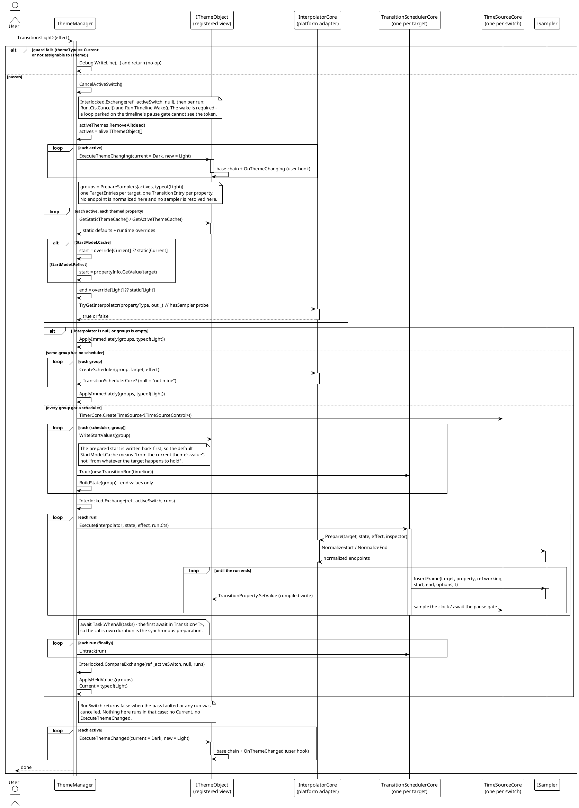
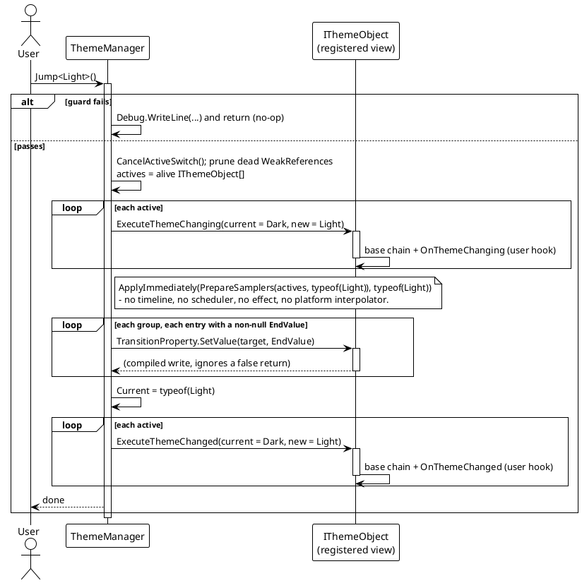

# Data Flow — Theme Switching

`Transition<T>` and `Jump<T>` no longer share a pipeline. An animated switch prepares a grouped entry set and then hands it to one platform `TransitionSchedulerCore` per target, all anchored to a single `ITimeSourceControl`, so the transition system owns the clock, the frame pacing and the effect's own flags. An instant switch never touches the transition system: `Jump` writes every end value and advances `Current` directly through `ApplyImmediately`, which is why it neither needs `SetPlatformInterpolator` nor is constrained by the platform's `ITransitionEffect<TPriority>`.

Both entry points share the same prologue — guard, cancel, prune, notify `ExecuteThemeChanging` — and both finish by notifying `ExecuteThemeChanged`, but only a switch that actually landed gets there.

## Animated Switch (`Transition<T>`)

Notes:

- `PrepareSamplers` produces `TargetEntries` (private, one per target) holding `TransitionEntry` (private, one per property). An entry carries `Target`, `PropertyInfo`, the compiled `TransitionProperty`, `StartValue`, `EndValue` and `HasSampler`. A target that contributes no usable property gets no group at all — an empty animation and an empty sampler set are both meaningless.
- Only the **end** values are declared to the scheduler (`BuildState`), and only for entries whose `EndValue` is not null; a null end value means "this theme leaves the property alone". The start is read back off the target by `InterpolatorCore.Prepare`, so normalizing an endpoint in `PrepareSamplers` would normalize it twice.
- One timeline for the whole switch. Every target is anchored to it, which is why `Transition.Pause` / `Resume` / `Seek` / `SetRate` / `Exit` on **any single** target act on all of them, and why the switch's wall time does not grow with the element count. The frame pacing and the effect's `FPS`, `IsAutoReverse` and `LoopTime` are the transition system's (`ThemeTransitionTests.Switch_HonoursAutoReverseAndLoopTime`).
- Platform seams are resolved **before** anything is scheduled: if `_interpolator` is null, if no group has a movable property, or if any group's `CreateScheduler` returns null, the whole switch degrades to `ApplyImmediately` rather than animating a subset. `CreateScheduler` is only asked once per target per switch.
- `Track` must precede `Execute`: it is how the scheduler finds the run — and therefore the token — for the frame set it is about to build.
- `RunSwitch` is a private `async Task<bool>`: it returns `false` for a cancelled or superseded switch, and `Transition` is `async void`, so its caller cannot catch an exception — every `await` around the scheduler is wrapped and logged instead.

## Instant Switch (`Jump<T>`)

`Jump` performs no normalization and consults no sampler: `TransitionProperty.SetValue` writes the declared value verbatim, and a property with a registered sampler is written the same way as one without. Note the asymmetry that follows — `Jump` cancels an in-flight animated switch first (`CancelActiveSwitch`), but an in-flight `Jump` cannot be cancelled, because it contains no await point at all.

## Guard Conditions & Edge Paths

| Scenario | Behavior |
|---|---|
| `themeType == Current` | Guard returns early with the debug message `[ThemeManager] Invalid theme type, jumping to current theme.` (no-op — it does not re-apply). |
| `themeType` not assignable to `ITheme` | Same guard, same no-op return. |
| No platform interpolator (`_interpolator is null`) | `RunSwitch` degrades to `ApplyImmediately`: every end value is written at once and `Current` advances — no animation, and `ExecuteThemeChanged` still fires. |
| Some target's scheduler is null | The whole switch degrades to `ApplyImmediately`, not just that target. |
| An exception escapes `RunSwitch` | Logged by `Transition`'s catch (the caller of an `async void` cannot catch it) and the switch ends without advancing `Current` and without `ExecuteThemeChanged`. |
| A second switch starts while one runs | `CancelActiveSwitch` cancels each run's token and wakes its timeline; the superseded switch returns `false`, so it advances nothing and announces nothing. |
| Property type has a registered sampler | `InterpolatorCore.Prepare` resolves it and normalizes the endpoints; middle frames come from `ISampler.InsertFrame`. |
| Property type has no sampler | Held at its prepared start for the whole pass; `ApplyHeldValues` writes the end value after `Task.WhenAll`. |
| A property's `EndValue` is null | Skipped by `BuildState` (not sampled) and by `ApplyHeldValues` (not written) — the theme leaves it alone. |
| No value found for the property (start or target) | `PrepareSamplers` logs `... skipping` and omits that property from the switch. |
| Effect with a zero duration / `Jump` | `Jump` writes the end values synchronously; a zero-duration `Transition` completes its one pass on the next frame. |
| Dead registered object | Pruned at the start of the switch (weak references), then ignored. |

> Source: `Src/Core/VeloxDev.Core/DynamicTheme/ThemeManager.cs` — `Transition` (lines 109-146), `Transition<T>` (152-155), `Jump` (161-185), `Jump<T>` (190-193), `RunSwitch` (199-291), `WasCancelled` (297-307), `CancelActiveSwitch` (312-332), `WriteStartValues` (334-347), `BuildState` (353-376), `ApplyHeldValues` (381-399), `ApplyImmediately` (404-425), `PrepareSamplers` (427-577), and the private nested `TargetEntries` (584-588), `TransitionEntry` (590-610), `SwitchTarget` (613-618). Behaviour verified by `Src/Core/VeloxDev.Core.Test/DynamicTheme/ThemeTransitionTests.cs`.
