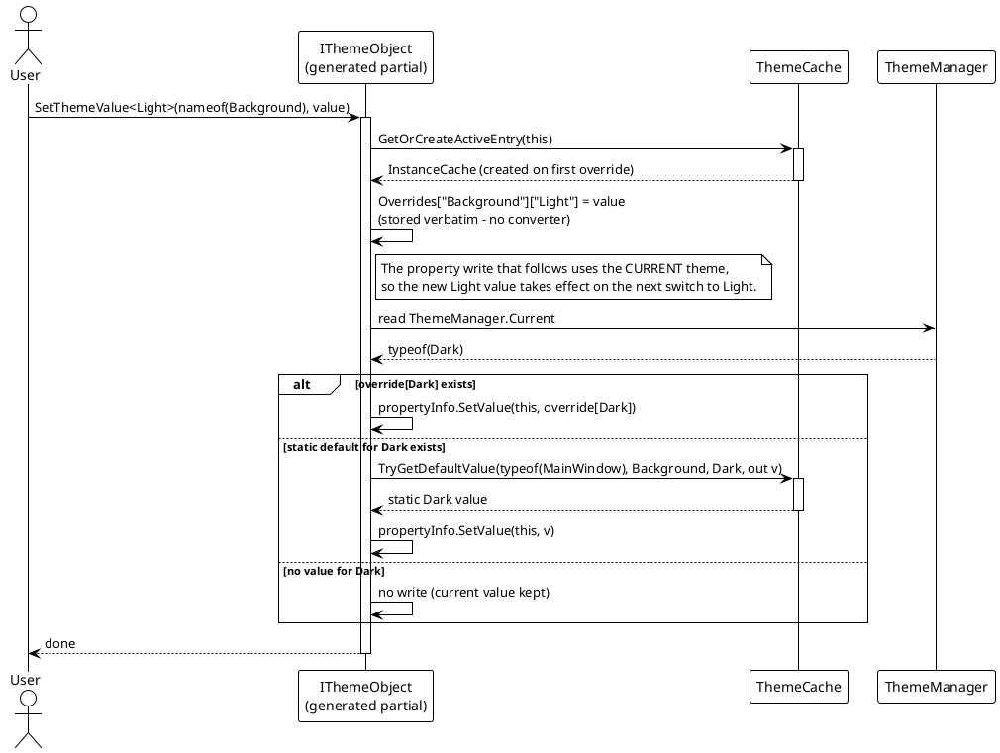
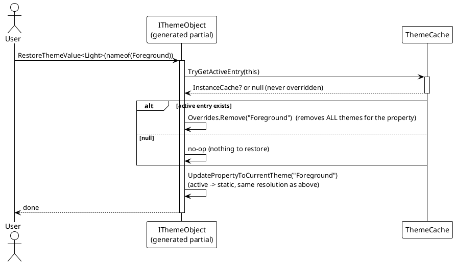

# Data Flow — Runtime Overrides

Static `[ThemeConfig]` values are fixed at registration. To edit a theme value at runtime, the generated `IThemeObject` exposes `SetThemeValue<T>` / `RestoreThemeValue<T>`, which write into a per-instance **active cache** in `ThemeCache`. During a switch the active value shadows the static one.

## Override / Restore Flow





Notes:

- The override store is a `ConditionalWeakTable<IThemeObject, InstanceCache>` inside `ThemeCache` — weak-keyed, so overrides are collected with the instance and never leak (`Src/Core/VeloxDev.Core/DynamicTheme/ThemeCache.cs`, lines 18, 131-143).
- `RestoreThemeValue<T>` is theme-agnostic: it drops the whole property entry (all themes) from `Overrides`, then re-applies the current theme.
- `GetStaticThemeCache()` / `GetActiveThemeCache()` (generated) expose the merged static dictionary and the runtime overrides for inspection — `Src/Generators/VeloxDev.Core.Generator/Theme.cs`, lines 331-341.

## Resolution Order on a Switch

During `PrepareSamplers`, for **both** the start value (current theme) and the target value (destination theme) the generated cache lookups consult the active cache first and fall back to static defaults only when the property has no override for that theme:

```csharp
// Src/Core/VeloxDev.Core/DynamicTheme/ThemeManager.cs — PrepareSamplers: the current value
// (StartModel.Cache branch, lines 497-509); the target lookup below repeats the same
// active-first order for targetThemeType (lines 529-539)
if (activeCache.TryGetValue(propEntry.Key, out var activePropCache) &&
    activePropCache.TryGetValue(propertyInfo, out var activeTypeCache) &&
    activeTypeCache.TryGetValue(Current, out currentValue))
{
    hasCurrentValue = true;
}
else if (typeValues.TryGetValue(Current, out currentValue))
{
    hasCurrentValue = true;
}
// ... the same active-first / static-second order for the target theme
```

So a runtime override (from `SetThemeValue<T>`) beats a static `[ThemeConfig]` value whenever the destination theme matches `T`.

Both demos wire this from a button: the scale demo through `OnEditThemeValue` / `OnRestoreThemeValue` (`Examples/Theme/WPF/Demo/MainWindow.xaml.cs`), the trimmed demo through `ThemeValueEx` (`Examples/Theme/WPF Trimmed/Demo/MainWindow.xaml.cs`), which also reads both caches back with `GetStaticThemeCache()` / `GetActiveThemeCache()`.

> Source: `Src/Core/VeloxDev.Core/DynamicTheme/ThemeCache.cs` (`GetOrCreateActiveEntry` lines 131-134, `TryGetActiveEntry` lines 139-143), `Src/Core/VeloxDev.Core/DynamicTheme/ThemeManager.cs` (`PrepareSamplers` current/target lookup lines 474-549), generated members in `Src/Generators/VeloxDev.Core.Generator/Theme.cs` (`SetThemeValue` lines 302-318, `RestoreThemeValue` lines 322-327, `UpdatePropertyToCurrentTheme` lines 345-373).
