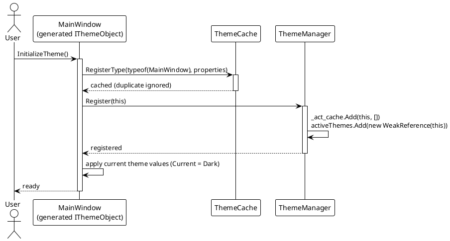
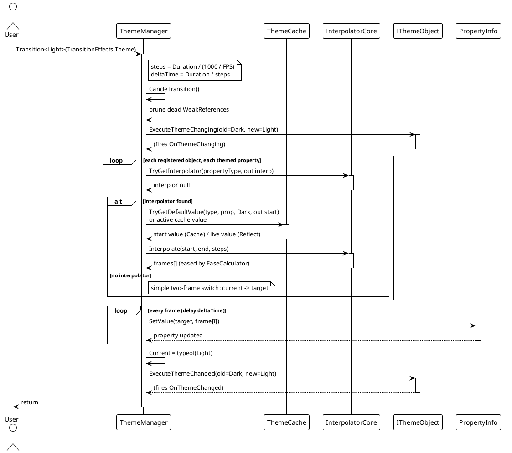
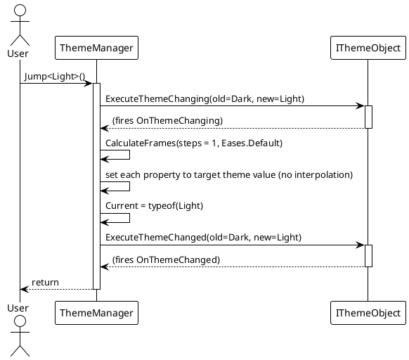
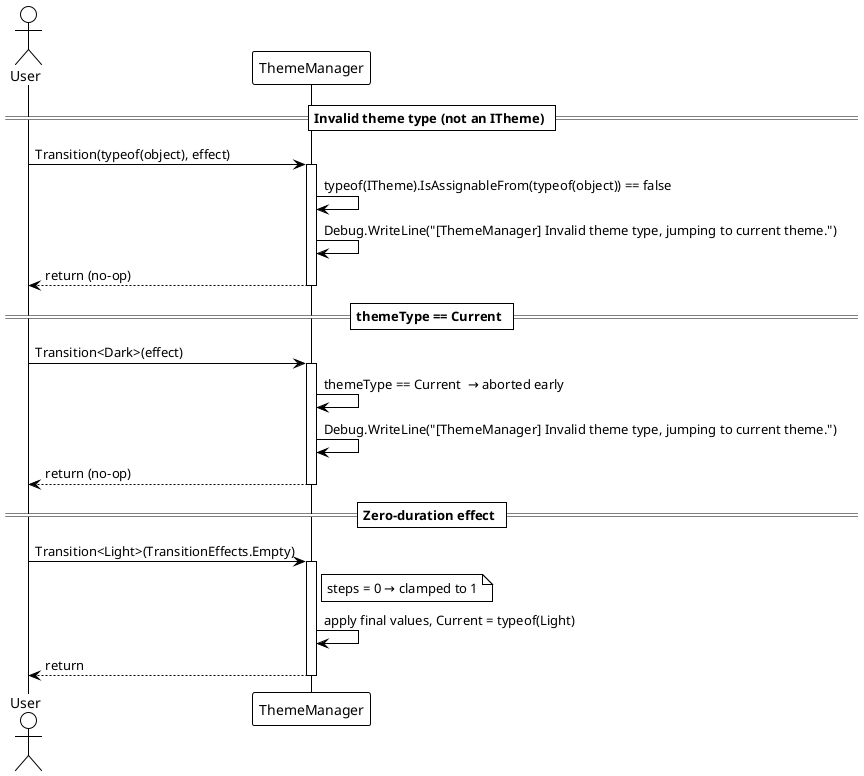

# Data Flow — Dynamic Theme

## Registration Flow (`InitializeTheme`)

The source-generated `InitializeTheme()` registers the type's theme properties in `ThemeCache`, registers the instance with `ThemeManager`, and applies the current theme's values.

> Source: generated code shape from `VeloxDev.Generators.Theme`; registration backing code in `Src/Core/VeloxDev.Core/DynamicTheme/ThemeManager.cs` (`Register`) and `Src/Core/VeloxDev.Core/DynamicTheme/ThemeCache.cs` (`RegisterType`).

## Animated Theme Switch (`Transition<T>`)

`ThemeManager.Transition` validates the target theme, cancels any running transition, prunes dead `WeakReference`s, pre-computes all interpolation frames, then applies them frame by frame on a timer.

> Source: `Src/Core/VeloxDev.Core/DynamicTheme/ThemeManager.cs` — `Transition` (lines 83–106), `CalculateFrames` (153–407), `ExecuteTransition` (414–452). Interpolation via `InterpolatorCore.TryGetInterpolator` and `IValueInterpolator.Interpolate`.

## Instant Theme Switch (`Jump<T>`)

`Jump` reuses the same frame pipeline with `steps = 1` and `deltaTime = 0`, so every property is set directly to the target value.

> Source: `Src/Core/VeloxDev.Core/DynamicTheme/ThemeManager.cs` — `Jump(Type)` (lines 121–143).

## Error / Edge Paths

## Normal vs. Edge Path Summary

| Scenario | Behavior |
|---|---|
| Normal animated switch | Interpolate each registered object's themed properties over `Duration`, then set `Current` and fire `OnThemeChanged`. |
| `themeType == Current` | Aborted early — debug message "Invalid theme type, jumping to current theme." |
| `themeType` not assignable to `ITheme` | Aborted early with the same debug message. |
| Property without an interpolator | Falls back to a simple two-frame switch (`current` for every frame but the last, `target` for the last); `Jump`/`SetThemeValue` still set the final value. |
| Target theme has no configured value for a property | `CalculateFrames` logs "No target value found" and skips that property for the transition. |
| `steps <= 0` (zero-duration effect) | Clamped to `steps = 1`, so the theme still applies. |

> Source references: `Src/Core/VeloxDev.Core/DynamicTheme/ThemeManager.cs` (lines 83–106 `Transition`, 121–143 `Jump`, 153–407 `CalculateFrames`, 414–452 `ExecuteTransition`), `Src/Core/VeloxDev.Core/DynamicTheme/ThemeCache.cs`.
