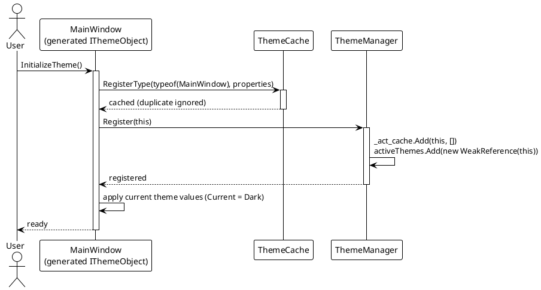
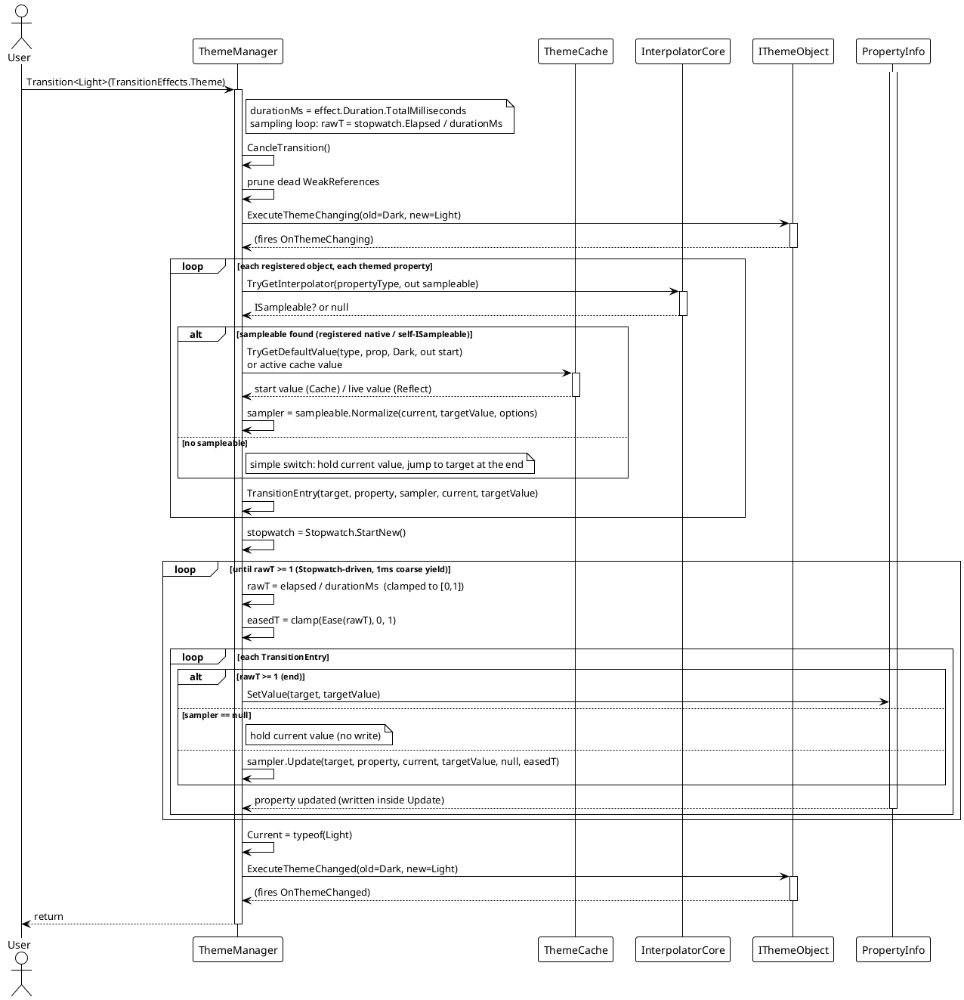
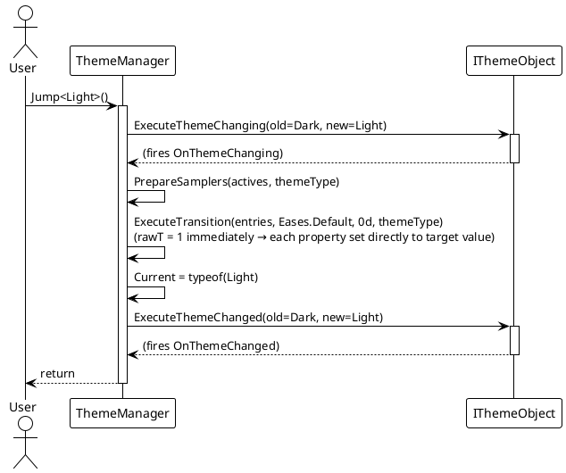
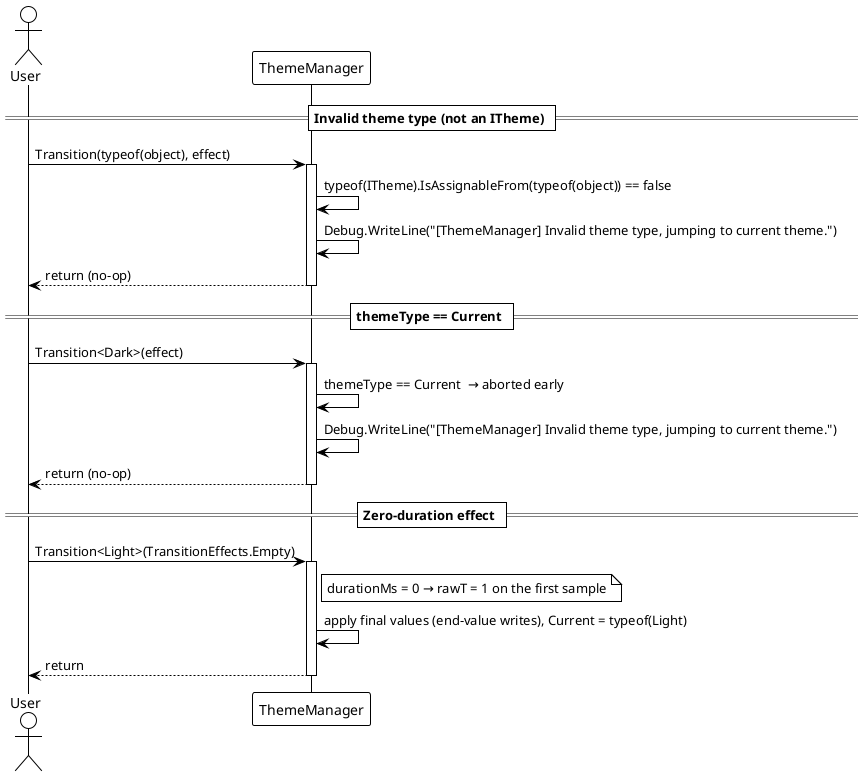

# Data Flow — Dynamic Theme

## Registration Flow (`InitializeTheme`)

The source-generated `InitializeTheme()` registers the type's theme properties in `ThemeCache`, registers the instance with `ThemeManager`, and applies the current theme's values.

> Source: generated code shape from `VeloxDev.Generators.Theme`; registration backing code in `Src/Core/VeloxDev.Core/DynamicTheme/ThemeManager.cs` (`Register`) and `Src/Core/VeloxDev.Core/DynamicTheme/ThemeCache.cs` (`RegisterType`).

## Animated Theme Switch (`Transition<T>`)

`ThemeManager.Transition` validates the target theme, cancels any running transition, prunes dead `WeakReference`s, prepares per-property samplers, then samples them in a Stopwatch-driven loop over the effect's duration.

> Source: `Src/Core/VeloxDev.Core/DynamicTheme/ThemeManager.cs` — `Transition`, `PrepareSamplers`, `ExecuteTransition`. Sampler resolution via `InterpolatorCore.TryGetInterpolator`; `Normalize` in `PrepareSamplers`; per-sample writes via `ISampler.Update`.

## Instant Theme Switch (`Jump<T>`)

`Jump` runs the same sampler pipeline with a zero duration (`durationMs = 0`), so the first sample has `rawT = 1` and every property is set directly to the target value.

> Source: `Src/Core/VeloxDev.Core/DynamicTheme/ThemeManager.cs` — `Jump(Type)`.

## Error / Edge Paths

## Normal vs. Edge Path Summary

| Scenario | Behavior |
|---|---|
| Normal animated switch | Prepare per-property samplers (`Normalize`), then drive each registered object's themed properties over `Duration` (Stopwatch-driven, eased + clamped) via `ISampler.Update`, then set `Current` and fire `OnThemeChanged`. |
| `themeType == Current` | Aborted early — debug message "Invalid theme type, jumping to current theme." |
| `themeType` not assignable to `ITheme` | Aborted early with the same debug message. |
| Property without a sampleable | Falls back to a simple switch (the current value is held for the whole pass, the target value is written on the final sample); `Jump`/`SetThemeValue` still set the final value. |
| Target theme has no configured value for a property | `PrepareSamplers` logs "No target value found" and skips that property for the transition. |
| Zero-duration effect (`durationMs = 0`) | `rawT = 1` on the first sample, so every property is written directly to its target value; the theme still applies. |

> Source references: `Src/Core/VeloxDev.Core/DynamicTheme/ThemeManager.cs` (`Transition`, `Jump`, `PrepareSamplers`, `ExecuteTransition`), `Src/Core/VeloxDev.Core/DynamicTheme/ThemeCache.cs`.
