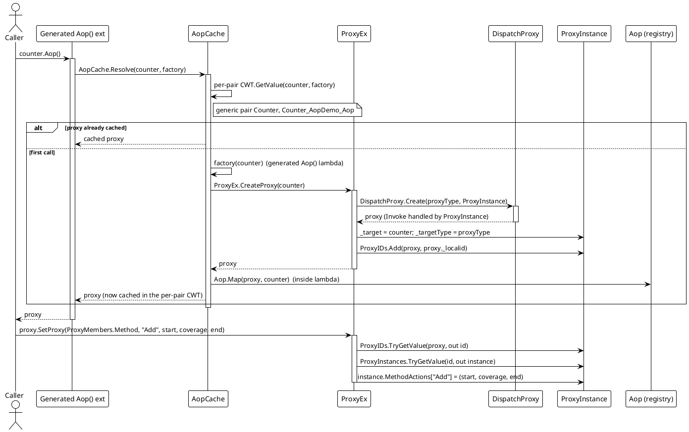
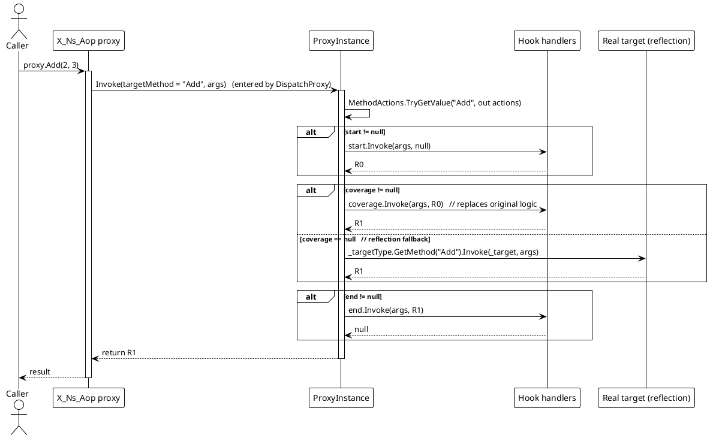
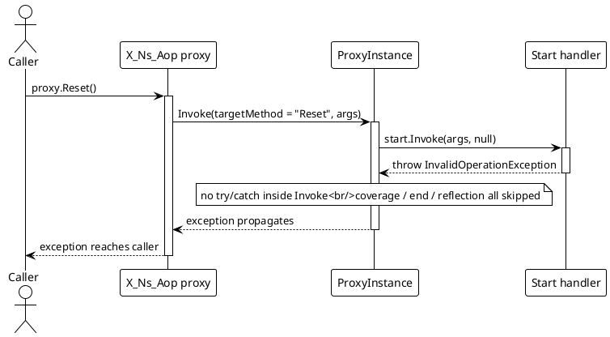
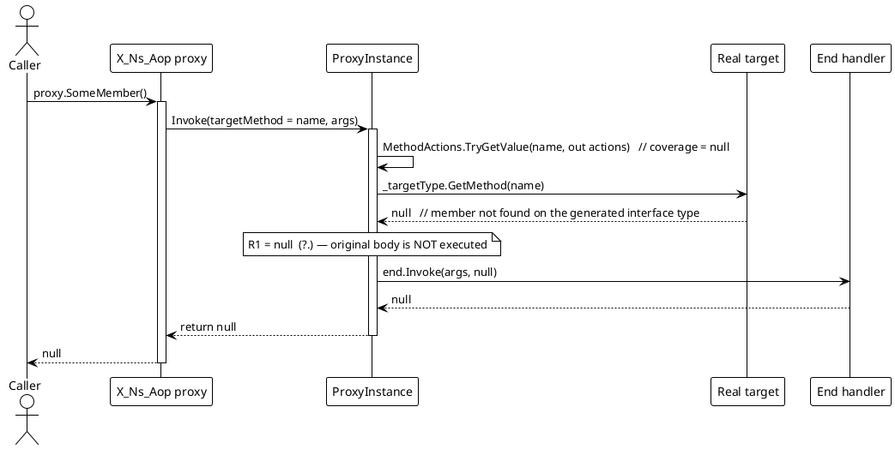

# Data Flow — AOP

## 1. Proxy creation + hook registration (`Aop()` → `SetProxy`)

Notes: `Aop()` is a one-time-per-target cache hit after the first call; `SetProxy` resolves the `ProxyInstance` through `ProxyIDs` → `ProxyInstances` and overwrites the whole `(start, coverage, end)` triple when the member key already exists (`ProxyEx.cs` lines 26-41, `SetMethod` lines 83-101).

## 2. Intercepted invocation (`proxy.Method()`)

The same shape applies to property accessors: a name starting with `get_` routes to `GetterActions`, `set_*` to `SetterActions`, everything else to `MethodActions` (`ProxyInstance.cs` lines 23-53). The hook order is always `start` → (`coverage`, or reflection) → `end`.

## 3. Error paths

### 3a. A hook throws → propagation

`ProxyInstance.Invoke` contains no try/catch, so any handler exception flows straight out to the caller, skipping the remaining stages and any reflection call:

### 3b. `coverage == null` reflection fallback

With a `null` coverage, the proxy reflects into the real target. If the member cannot be resolved on the interface type, `GetMethod` returns `null` and the `?.` short-circuits, so the call silently returns `null` without executing the original body:

If `GetMethod` does find the member but the reflection `Invoke` throws (e.g. the target throws, or argument mismatch), the exception is wrapped by `MethodInfo.Invoke` as a `TargetInvocationException` and propagates to the caller; any `end` hook is skipped.

## Flow summary

| Path | Trigger | Result |
|---|---|---|
| Proxy creation | `instance.Aop()` first call | `DispatchProxy` created, `_target`/`_targetType` set, registered in `ProxyIDs`, mapped via `Aop.Map`, cached in per-pair CWT |
| Hook registration | `proxy.SetProxy(memberType, name, s, c, e)` | `(s, c, e)` written into `GetterActions` / `SetterActions` / `MethodActions` |
| Normal call | `proxy.Member(...)` | `start` → `coverage` (or reflection fallback) → `end` → return `R1` |
| Hook throws | any non-null hook | Exception propagates to caller; remaining stages skipped |
| Reflection fallback | `coverage == null` | `_targetType.GetMethod(Name)?.Invoke(_target, args)`; `null` if not found |
| Reflection throws | `coverage == null`, member found | `TargetInvocationException` propagates to caller; `end` skipped |

> Source references: `Src/Core/VeloxDev.Core/AspectOriented/ProxyInstance.cs`, `ProxyEx.cs`, `AopCache.cs`, `Aop.cs`, `Src/Generators/VeloxDev.Core.Generator/Writers/AopWriter.cs`.
