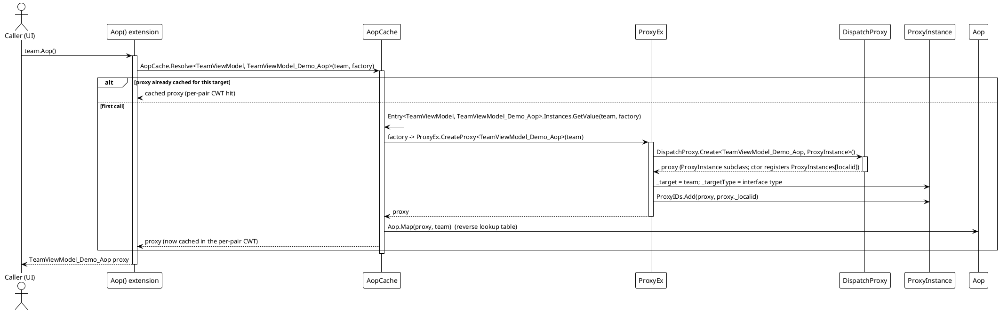
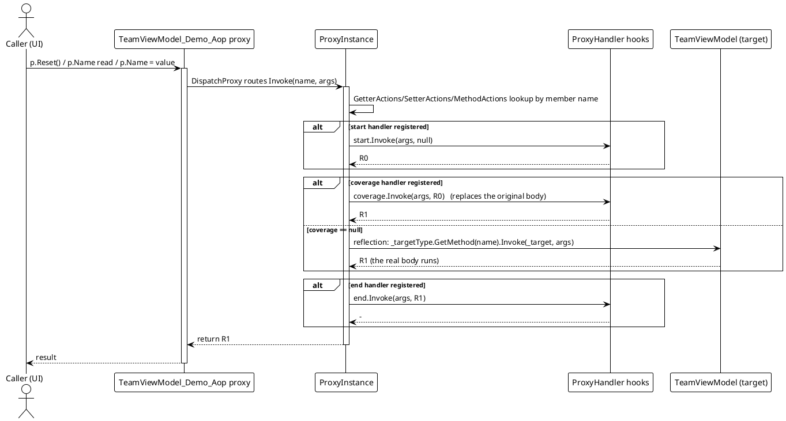

# Data Flow — AOP

The AOP runtime flow has three stages: **proxy acquisition**, **hook registration**, and **intercepted invocation**. The examples below use the WPF demo (`Examples/AOP/WPF/Demo`), where a `Demo.TeamViewModel` is the target and `TeamViewModel_Demo_Aop` is its generated proxy interface.

## 1. Proxy acquisition & hook registration

The generated `Aop()` extension (`AopWriter.cs`, `Src/Generators/VeloxDev.Core.Generator/Writers/AopWriter.cs`) is the single entry point. Its factory runs only on the first call per target; later calls are cache hits in the per-pair `ConditionalWeakTable`:



`SetProxy` then classifies the member with `ProxyMembers` and resolves the live `ProxyInstance` through `ProxyIDs` → `ProxyInstances` (both static in `ProxyEx.cs`). When the key already exists the whole `(start, coverage, end)` triple is overwritten:

| Member kind (`ProxyMembers`) | Dictionary written | Accessor key |
|---|---|---|
| `Getter` | `ProxyInstance.GetterActions` | `"get_" + memberName` |
| `Setter` | `ProxyInstance.SetterActions` | `"set_" + memberName` |
| `Method` | `ProxyInstance.MethodActions` | `memberName` (verbatim) |

For example, `p.SetProxy(ProxyMembers.Setter, nameof(TeamViewModel.Name), null, null, endHook)` stores the triple under `"set_Name"` in `SetterActions` (`ProxyEx.cs` `SetPropertySetter`, lines 63-82). The dictionaries, `ProxyInstance` registrations and hooks all belong to a **single proxy instance**, so `SetProxy` must be called on the object returned by `Aop()`, not on the raw target.

## 2. Intercepted invocation

Every member call on the proxy funnels into `ProxyInstance.Invoke` (`ProxyInstance.cs`, lines 23-53). The member name picks a dictionary: `get_*` → `GetterActions`, `set_*` → `SetterActions`, anything else → `MethodActions`. The hook order is always `start` → (`coverage`, or a reflection fallback into the real target) → `end`:



Applied to the demo hooks (`MainWindow.xaml.cs`, lines 45-95):

- `p.Name` read: only a `start` hook is registered, so the read logs the access and the value itself comes from the reflection fallback.
- `p.Name = "..."`: only an `end` hook is registered; the reflection fallback performs the write, then the `end` hook observes `args[0]` (the new value).
- `p.Reset()`: only a `coverage` hook is registered, so the built-in reset body **never runs** — the hook return value `R1 = null` replaces it.

### Event-driven extension (collection change → self `Aop()`)

The demo also shows aspect behavior reached through an event, not a direct proxy call. `TeamViewModel`'s constructor subscribes its own private handlers to the real `Members` collection (`TeamViewModel.cs`, lines 10-14):

```csharp
// Examples/AOP/WPF/Demo/TeamViewModel.cs (lines 35-38)
private void OnMemberAdded(object? sender, NotifyCollectionChangedEventArgs e)
{
    this.Aop().AOP_OnMemberAdded(sender, e);
}
```

Adding a member through the proxy (`p.Members.Add(...)`) reflects to the target's real collection, whose `CollectionChanged` fires `OnMemberAdded`. That handler routes back through the **same cached proxy** — `this.Aop()` — and calls the `[AspectOriented]` `AOP_OnMemberAdded`, whose `end` hook reports each added member. The intercepted method still runs its own body through the reflection fallback, so the aspect layers on top of the original logic.

## 3. Error & boundary paths

`ProxyInstance.Invoke` contains **no try/catch** — none of the hook stages are protected:

- A throwing `start` / `coverage` / `end` handler propagates its exception straight to the caller; the remaining stages and any reflection call are skipped.
- When `coverage == null` and the reflection `MethodInfo.Invoke` throws (the real method throws, or arguments mismatch), reflection wraps it as `TargetInvocationException` and it propagates out; an `end` hook is skipped.
- When `coverage == null` and `_targetType.GetMethod(name)` returns `null` (member not resolvable on the proxy interface), the `?.` short-circuits: `Invoke` returns `null` and the real body is **not** executed.
- A member with no registered hooks is not special-cased — the `actions == null` path still takes the reflection fallback, so unhooked members transparently reach the real target.
- `SetProxy` on an object that is not a registered proxy (for example, the raw target rather than the `Aop()` result) silently does nothing: the `ProxyIDs` lookup in `ProxyEx.cs` fails and the helper returns the source unchanged.

## Flow summary

| Path | Trigger | Result |
|---|---|---|
| Proxy acquisition | first `instance.Aop()` | `DispatchProxy` created, `_target`/`_targetType` set, registered in `ProxyIDs`, mapped via `Aop.Map`, cached in the per-pair CWT |
| Hook registration | `proxy.SetProxy(kind, name, s, c, e)` | `(s, c, e)` written under `get_*`/`set_*`/verbatim key in `GetterActions`/`SetterActions`/`MethodActions` |
| Normal call | `proxy.Member(...)` | `start` → `coverage` (or reflection fallback) → `end` → return `R1` |
| Hook throws | any non-null hook | Exception propagates to the caller; remaining stages and reflection skipped |
| Reflection throws | `coverage == null`, member found | `TargetInvocationException` propagates; `end` skipped |
| Reflection misses | `coverage == null`, member not found | `GetMethod(...)?` returns `null`; call returns `null`, real body not run |
| Event extension | target collection `CollectionChanged` | private handler calls `this.Aop().AOP_OnMemberAdded(...)` through the cached proxy |

> Source references: `Src/Core/VeloxDev.Core/AspectOriented/{ProxyInstance,ProxyEx,AopCache,Aop}.cs`, `Src/Generators/VeloxDev.Core.Generator/Writers/AopWriter.cs`, `Examples/AOP/WPF/Demo/{TeamViewModel.cs,MainWindow.xaml.cs}`.
