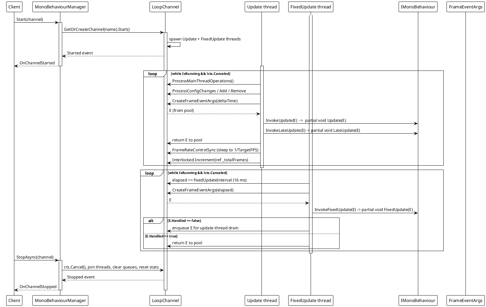
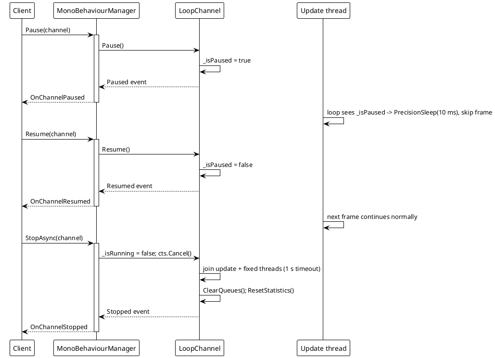
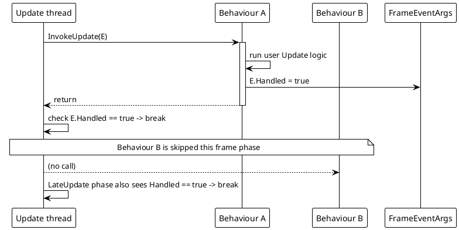
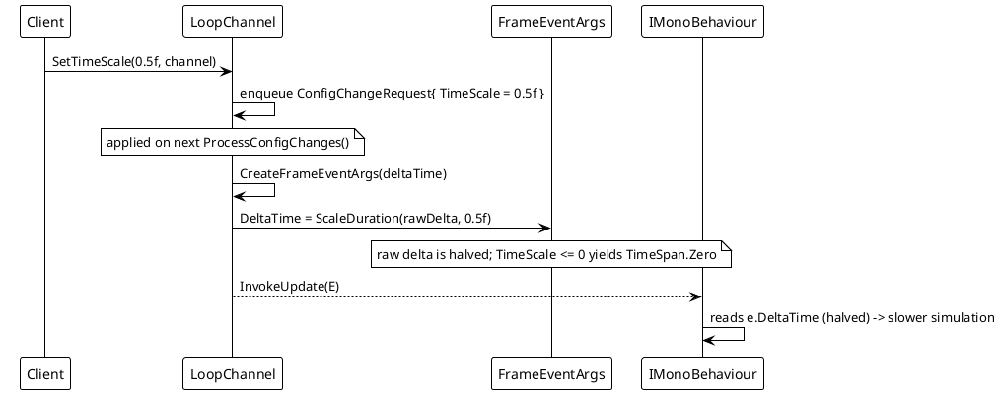

# Data Flow — MonoBehaviour

The frame loop is driven by one Update thread and one FixedUpdate thread per channel (or two async tasks when `UseAsyncLoop` is `true`). Config, registration and main-thread actions are exchanged through concurrent queues drained at the start of each frame.

## 1. Channel start and per-frame dispatch

Key source: `MonoBehaviourManager.cs` lines 394-441 (`FixedUpdateLoop`), 443-488 (`UpdateLoop`), 610-656 (`ExecuteBehaviorsUpdateSync` / `LateUpdate` / `FixedUpdate`), 245-291 (`Start`), 293-336 (`StopAsync`).

## 2. Pause / Resume / Stop

## 3. `Handled = true` short-circuit

Source: `MonoBehaviourManager.cs` lines 611-624 (`ExecuteBehaviorsUpdateSync` checks `if (frameArgs.Handled || token.IsCancellationRequested) break;`). Runtime probe, 2026-08-17: with a `HaltBehavior` that sets `Handled = true` first, a later `BehaviorB.UpdateCount` stayed at `0`.

## 4. Time scale

Source: `MonoBehaviourManager.cs` lines 202-210 (`SetTimeScale`), 744-754 (`CreateFrameEventArgs`), 861-867 (`ScaleDuration`). Runtime probe, 2026-08-17: `SetTimeScale(0.5f)` produced a delta-time ratio of ≈ `0.49` vs the unscaled base.
