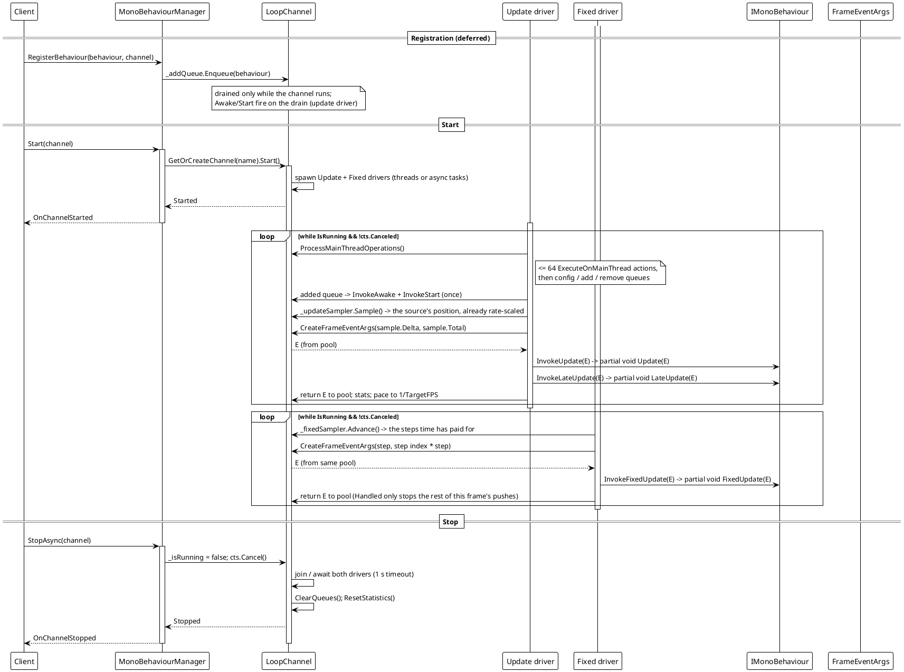
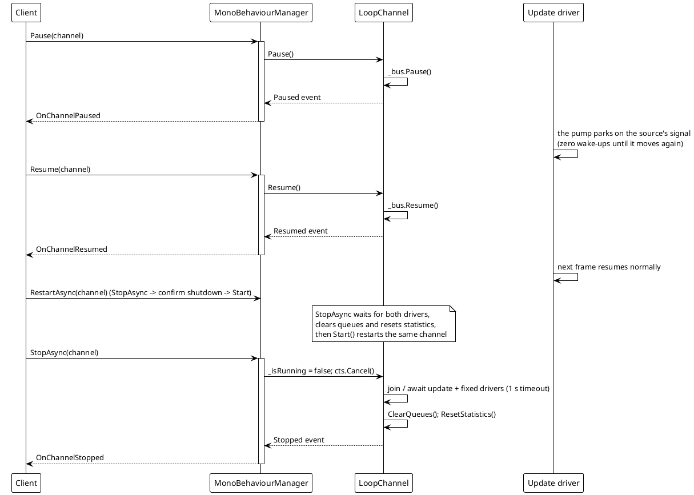
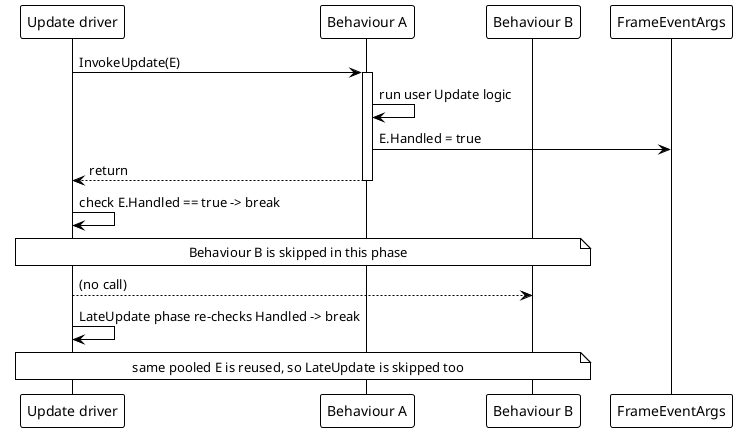
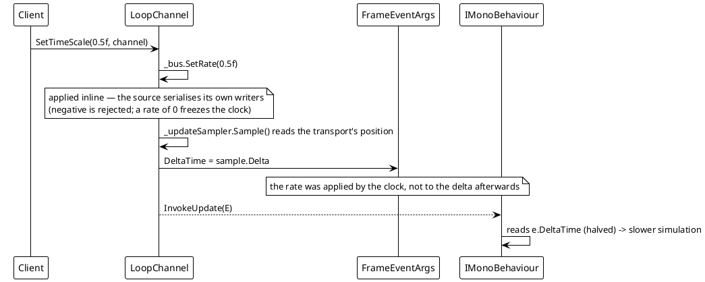
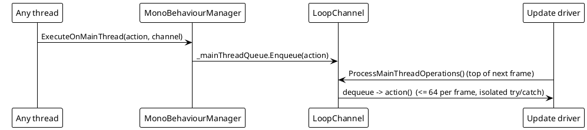
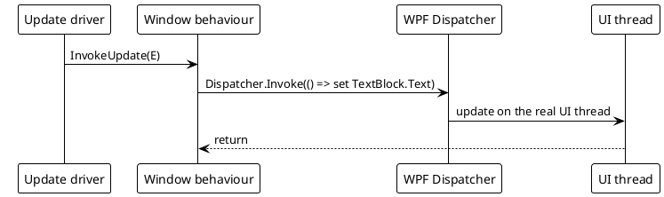

# Data Flow — MonoBehaviour

Each channel is driven by two concurrent frame pumps: the **update driver** (registration, config, `Update` / `LateUpdate`) and the **fixed driver** (`FixedUpdate` at a fixed interval). By default they are two background `Thread`s; when async-loop mode is enabled they run as two `Task`s (`UpdateLoopAsync` / `FixedUpdateLoopAsync`). Cross-thread communication — registration, removal, config changes, marshalled actions — flows through concurrent queues drained by the update driver at the top of each frame; a fixed push's event args do not, because they are returned to their own pool as soon as the push is done.

## 1. Registration → channel start → per-frame tick → stop

The two drivers can be `Thread`s or async `Task`s depending on the loop mode: on desktop with a `net5.0+` build of `VeloxDev.Core`, `UseAsyncLoop` defaults to `OperatingSystem.IsBrowser() || OperatingSystem.IsIOS()` (false on desktop, so native threads named `VeloxDev.Update[name]` / `VeloxDev.FixedUpdate[name]`, `Priority = AboveNormal`); on the pre-`net5.0` targets the constant expression makes it `true`, and it can be forced per channel with `SetUseAsyncLoop(bool, channel)` before `Start` (it throws `InvalidOperationException` while the channel is running). The async twins run the same skeleton with `Task.Delay` in place of the chunked `Thread.Sleep`. Only the driver mechanism differs — queue exchange, pools and event args are shared.

Key source: `MonoBehaviourManager.cs` `Start` (275-328), `UpdateLoop` (510-556), `FixedUpdateLoop` (447-508), `UpdateLoopAsync`/`FixedUpdateLoopAsync` (558-688), `StopAsync` (330-375), `ProcessMainThreadOperations` (754-767).

## 2. Pause / Resume / Restart / Stop

`Pause` / `Resume` act on the channel's time source, which is also what an animation anchored to that source observes; `Stop` flips a volatile flag. Each raises the matching `LoopChannel` event immediately, and the static manager forwards it to `OnChannelPaused` / `OnChannelResumed` / `OnChannelStopped` with the channel name. `RestartAsync` (405-439) is `StopAsync` followed by a shutdown-confirmation wait, a `ForceCleanup()` fallback when the drivers do not stop in time, a wait for the queues to empty, and a fresh `Start()`.

## 3. `Handled = true` short-circuit

`ExecuteBehaviorsUpdateSync` / `ExecuteBehaviorsLateUpdateSync` / `ExecuteBehaviorsFixedUpdateSync` all break as soon as `frameArgs.Handled` is set (`MonoBehaviourManager.cs` lines 690-738). Because the same `FrameEventArgs` instance flows through the `Update` then `LateUpdate` phases of a frame, a `Handled = true` set during `Update` also suppresses `LateUpdate` that frame. A `FixedUpdate` that sets `Handled = true` stops the rest of that frame's pushes; its args return to the pool either way, with no queue in between.

## 4. Time scale

`SetTimeScale` writes the rate straight to the channel's time source (`Timing/TimeSourceCore.cs` lines 209-231), which serialises its own writers — so there is no config hop, and no clamping: a negative rate is rejected rather than ignored, and a rate of `0` freezes the clock without pausing it. The rate is applied by the clock itself, so `CreateFrameEventArgs` (lines 825-836) hands `DeltaTime` and `TotalTime` out of one `TimeSample` and does no scaling of its own. The fixed pump draws from the same method: its `DeltaTime` is the fixed step, and the rate changes how many steps arrive per second rather than the size of a step.

## 5. Marshalling onto the update driver — `ExecuteOnMainThread` and UI hops

`ExecuteOnMainThread` marshals a delegate from any thread (a `FixedUpdate`, an external event handler, a worker callback) onto the channel's **update driver** — the timeline's "main" thread — so it is serialized with `Update`/`LateUpdate` and can safely touch state those hooks share. It does **not** post to the OS/UI thread: the update driver is a background loop. In the WPF demo the behaviours run off the UI thread, so pushing results to the window is done with `Dispatcher.Invoke` from inside the hooks (`Examples/MonoBehaviour/WPF/Demo/MainWindow.xaml.cs`, `UpdatePerformanceDisplay`/`UpdateComponentStatistics`, lines 143-190).

Key source: `ExecuteOnMainThread` enqueue (line 241, static wrapper 1086), drain inside `ProcessMainThreadOperations` (754-767), WPF hop in `MainWindow.xaml.cs`.
