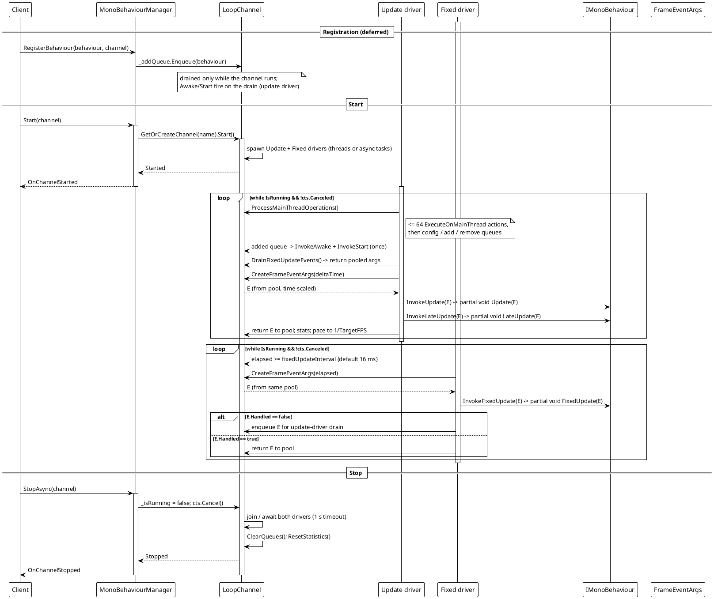
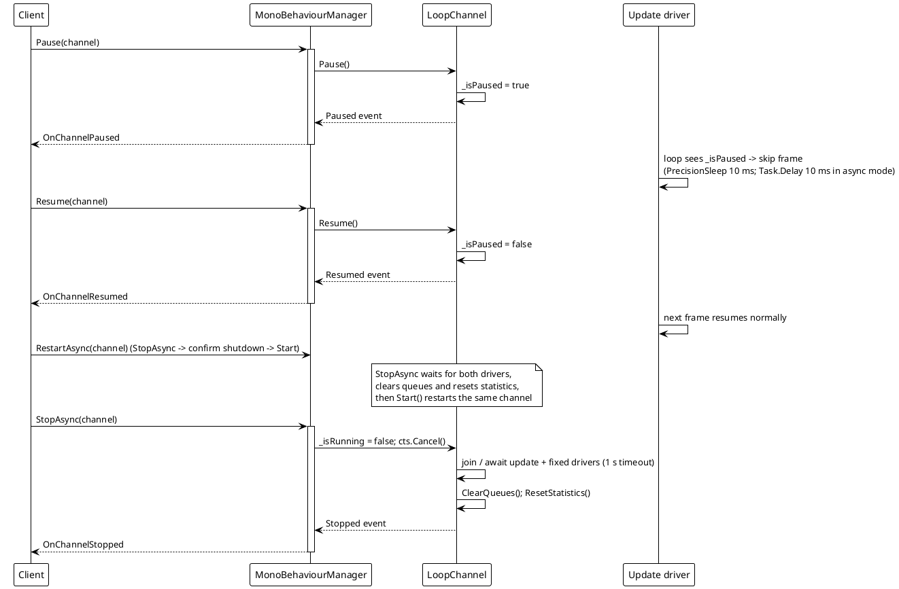
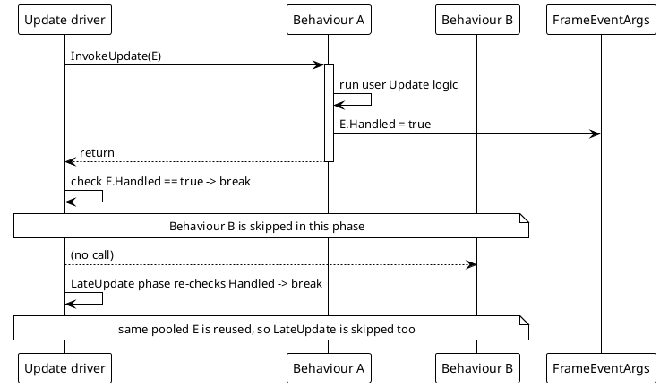
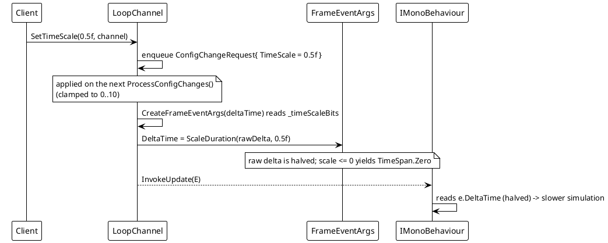
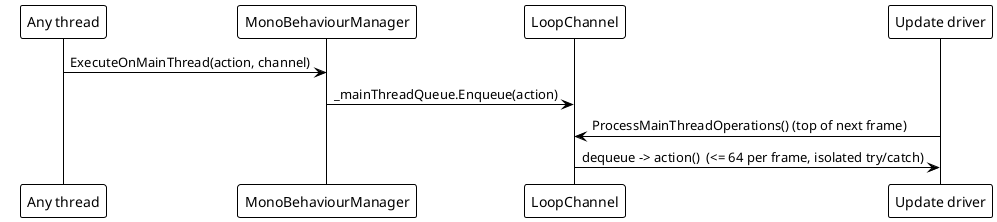
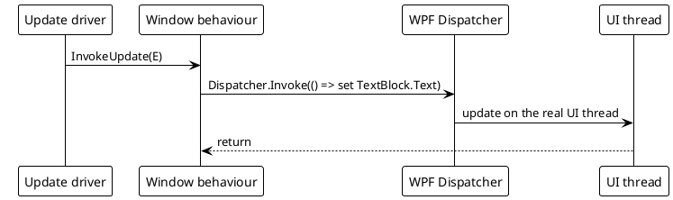

# Data Flow — MonoBehaviour

Each channel is driven by two concurrent frame drivers: the **update driver** (registration, config, `Update` / `LateUpdate`) and the **fixed driver** (`FixedUpdate` at a fixed interval). By default they are two background `Thread`s; when async-loop mode is enabled they run as two `Task`s (`UpdateLoopAsync` / `FixedUpdateLoopAsync`). All cross-thread communication — registration, removal, config changes, marshalled actions, fixed events — flows through concurrent queues drained by the update driver at the top of each frame.

## 1. Registration → channel start → per-frame tick → stop

The two drivers can be `Thread`s or async `Task`s depending on the loop mode: on desktop with a `net5.0+` build of `VeloxDev.Core`, `UseAsyncLoop` defaults to `OperatingSystem.IsBrowser() || OperatingSystem.IsIOS()` (false on desktop, so native threads named `VeloxDev.Update[name]` / `VeloxDev.FixedUpdate[name]`, `Priority = AboveNormal`); on the pre-`net5.0` targets the constant expression makes it `true`, and it can be forced per channel with `SetUseAsyncLoop(bool, channel)` before `Start` (it throws `InvalidOperationException` while the channel is running). The async twins run the same skeleton with `Task.Delay` in place of `PrecisionSleep`. Only the driver mechanism differs — queue exchange, pools and event args are shared.

Key source: `MonoBehaviourManager.cs` `Start` (246-292), `UpdateLoop` (444-489), `FixedUpdateLoop` (395-442), `UpdateLoopAsync`/`FixedUpdateLoopAsync` (492-605), `StopAsync` (294-337), `ProcessMainThreadOperations` (675-688).

## 2. Pause / Resume / Restart / Stop

`Pause` / `Resume` / `Stop` flip volatile state and raise the matching `LoopChannel` event immediately; the static manager forwards it to `OnChannelPaused` / `OnChannelResumed` / `OnChannelStopped` with the channel name. `RestartAsync` (353-377) is `StopAsync` followed by a shutdown-confirmation wait, a `ForceCleanup()` fallback when the drivers do not stop in time, a wait for the queues to empty, and a fresh `Start()`.

## 3. `Handled = true` short-circuit

`ExecuteBehaviorsUpdateSync` / `ExecuteBehaviorsLateUpdateSync` / `ExecuteBehaviorsFixedUpdateSync` all break as soon as `frameArgs.Handled` is set (`MonoBehaviourManager.cs` lines 611-657). Because the same `FrameEventArgs` instance flows through the `Update` then `LateUpdate` phases of a frame, a `Handled = true` set during `Update` also suppresses `LateUpdate` that frame. A `FixedUpdate` that sets `Handled = true` returns its (pooled) args immediately instead of enqueuing them for drain.

## 4. Time scale

`SetTimeScale` enqueues a pooled `ConfigChangeRequest`; the update driver applies it (`ProcessConfigChanges`, lines 690-709) and clamps to `0..10`. Because `CreateFrameEventArgs` (745-755) is shared by both drivers, the scale affects `Update`, `LateUpdate` **and** `FixedUpdate` delta times equally; `ScaleDuration` (862-868) returns `TimeSpan.Zero` for `scale <= 0`.

## 5. Marshalling onto the update driver — `ExecuteOnMainThread` and UI hops

`ExecuteOnMainThread` marshals a delegate from any thread (a `FixedUpdate`, an external event handler, a worker callback) onto the channel's **update driver** — the timeline's "main" thread — so it is serialized with `Update`/`LateUpdate` and can safely touch state those hooks share. It does **not** post to the OS/UI thread: the update driver is a background loop. In the WPF demo the behaviours run off the UI thread, so pushing results to the window is done with `Dispatcher.Invoke` from inside the hooks (`Examples/MonoBehaviour/WPF/Demo/MainWindow.xaml.cs`, `UpdatePerformanceDisplay`/`UpdateComponentStatistics`, lines 143-190).

Key source: `ExecuteOnMainThread` enqueue (line 212, static wrapper 1049-1050), drain inside `ProcessMainThreadOperations` (675-688), WPF hop in `MainWindow.xaml.cs`.
