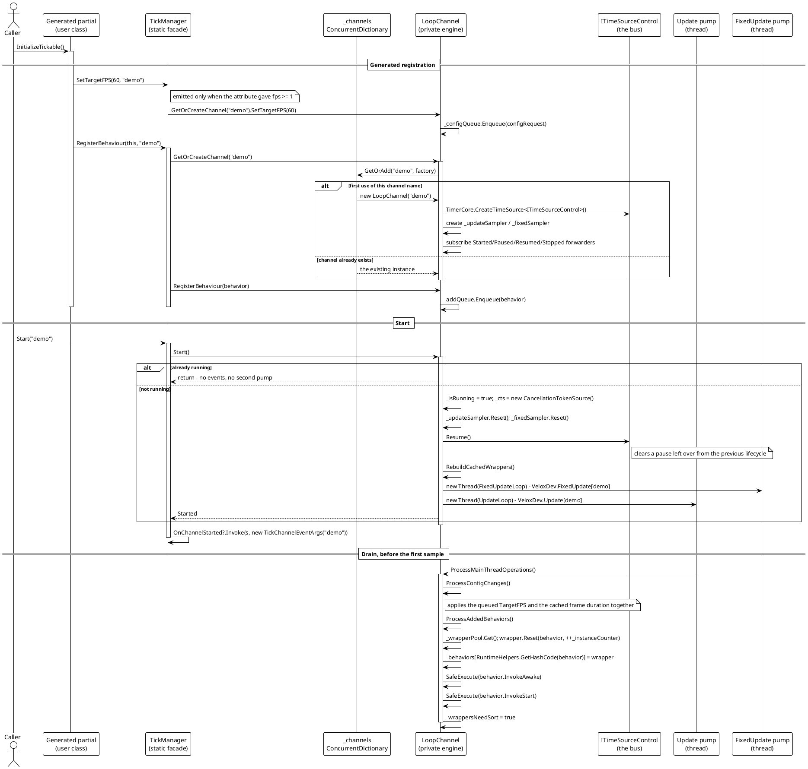

# Start and Registration

The flow that turns `[Tickable]` on a class into "this object's `Awake` runs before the first frame". Two things make it non-obvious: the registration is **queued** rather than applied, and the drain happens **before** the frame is sampled.



> Source: `Src/Core/VeloxDev.Core/TimeLine/TickManager.cs` lines 274-327 (Start), 430-438 (RegisterBehaviour), 753-801 (the drain), 1017-1030 (GetOrCreateChannel), 1066-1067 (the static forward); `Src/Generators/VeloxDev.Core.Generator/Writers/TickWriter.cs` lines 76-90.

## The ordering claim, stated precisely

The invariant is: **`Awake` and `Start` run before the first frame of that channel.**

The mechanism is not "register before start". It is that `ProcessMainThreadOperations` — which includes `ProcessAddedBehaviors` — is called at the top of the update loop body, *before* `_updateSampler.Sample()`:

```csharp
// Src/Core/VeloxDev.Core/TimeLine/TickManager.cs (lines 526-537)
var frameStartTime = GetTimestamp();
ProcessMainThreadOperations();

// 无偿采样：总线没前进就没有帧可推。
var sample = _updateSampler.Sample();
if (sample.Delta == TimeSpan.Zero)
{
    Sleep(TimeSpan.FromMilliseconds(MIN_SLEEP_MS), token);
    continue;
}

var frameArgs = CreateFrameEventArgs(sample.Delta, sample.Total);
```

So both orderings hold:

| Caller order | What happens |
|---|---|
| `InitializeTickable()` then `Start(name)` | The queue is drained on the first iteration, before the first sample. `Awake` → `Start` → first `Update`. |
| `Start(name)` then `InitializeTickable()` | The queue is drained on the next iteration, before that frame's sample. Still `Awake` → `Start` → `Update`. |

The WPF demo relies on and measures this: `MainWindow.xaml.cs` registers, sets the frame rate, then starts (lines 57-61), and `SimState.AwakeAtUpdateCount` records the `Update` counter at the moment `Awake` ran — it is zero, which is the evidence rather than the claim.

## `Awake` / `Start` versus stopping and restarting

The table that catches people out, with the mechanism behind each row:

| Action | Lifecycle re-runs? | Why |
|---|---|---|
| `StopAsync` + `Start` | No | `StopAsync` clears the queues (`ClearQueues`, line 954) and `Start` only restarts the pumps. The registration is gone, but nothing re-enqueues it. |
| `RestartAsync` | No | Same — it is `StopAsync` + waits + `Start`. |
| `CloseTickable()` + `InitializeTickable()` | **Yes** | A fresh wrapper is drawn from `_wrapperPool` and `InvokeAwake` / `InvokeStart` run on it. |

Note the asymmetry: stopping a channel *drops* the registration without telling the behaviour (there is no "closed" hook on `ITickable`), and re-registering an instance that is still registered replaces the wrapper and re-runs both hooks. `MainWindow.xaml.cs` lines 111-135 exposes both buttons so the pair is visible rather than asserted.

## Failure and edge paths

- **`null` behaviour.** `RegisterBehaviour` filters it (`if (behavior != null)`, line 432), so the queue never sees one. A `null` that somehow arrives is skipped again by the drain (`if (behavior == null) continue;`, line 790).
- **Duplicate registration.** `_behaviors` is keyed by `RuntimeHelpers.GetHashCode(behavior)`, so the second registration overwrites the first wrapper. `Awake` and `Start` still run again — on the new wrapper.
- **`Start` on a running channel.** Returns at line 276: no new threads, no second `OnChannelStarted`.
- **Registering on a channel that was never started.** The entry sits in `_addQueue` until someone calls `Start`. It is not lost, and it is not started.
- **A throwing `Awake` / `Start`.** `SafeExecute` catches it and writes to `Debug.WriteLine`; `InvokeStart` still runs, and the drain still sets `_wrappersNeedSort`.
- **Registering during `StopAsync`.** The queue is cleared in the `finally` block, so a registration that arrives mid-stop is dropped. Re-register after the stop completes.
