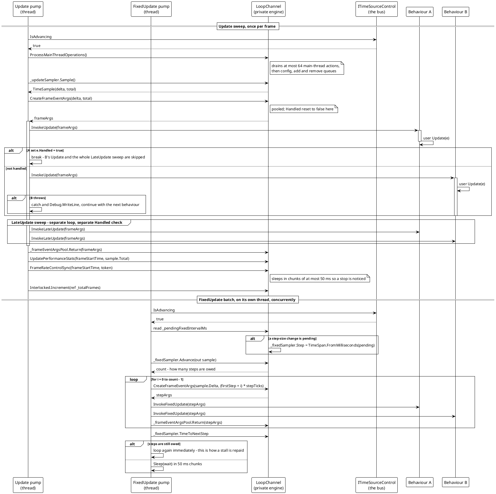

# Frame Delivery

The steady state. One `Update` sweep followed by one `LateUpdate` sweep on the update thread; an independent fixed-step batch on the fixed-update thread. The two are concurrent, and the exception path is per behaviour.



> Source: `Src/Core/VeloxDev.Core/TimeLine/TickManager.cs` lines 509-554 (UpdateLoop), 446-507 (FixedUpdateLoop), 689-734 (the three dispatch loops), 824-833 (CreateFrameEventArgs), 836-870 (pacing and Sleep), 914-926 (stats).

## The three dispatch loops

All three share a shape: read the cached array, walk it by index, check `Handled` and the token before each behaviour, and isolate exceptions per behaviour.

```csharp
// Src/Core/VeloxDev.Core/TimeLine/TickManager.cs (lines 704-718)
private void ExecuteBehaviorsLateUpdateSync(FrameEventArgs frameArgs, CancellationToken token)
{
    var wrappers = GetCachedWrappers();
    for (int i = 0; i < wrappers.Length; i++)
    {
        if (frameArgs.Handled || token.IsCancellationRequested) break;
        var w = wrappers[i];
        if (w is { IsActive: true, Behavior: not null })
        {
            try { w.Behavior.InvokeLateUpdate(frameArgs); }
            catch (Exception ex) { Debug.WriteLine($"[{Name}] LateUpdate error: {ex.Message}"); }
        }
    }
}
```

| Loop | Order | Shares `frameArgs` with | Break condition |
|---|---|---|---|
| `ExecuteBehaviorsUpdateSync` | Registration order | `LateUpdate` | `Handled` \|\| cancelled |
| `ExecuteBehaviorsLateUpdateSync` | Registration order | `Update` (same object) | `Handled` \|\| cancelled |
| `ExecuteBehaviorsFixedUpdateSync` | Registration order | nothing — one object per step | `Handled` \|\| cancelled |

The consequence worth stating plainly: **`Handled` is shared between `Update` and `LateUpdate`, and not shared with `FixedUpdate`.** `Update` and `LateUpdate` receive the same pooled `FrameEventArgs` object, so a flag raised in `Update` is visible to the `LateUpdate` loop microseconds later. A `FixedUpdate` step builds its own arguments inside the fixed loop, so it never sees that flag. The WPF demo demonstrates both halves at once: the two balls keep moving under every fixed step while the `LateUpdate`-positioned follower ring freezes (`MainWindow.xaml.cs` lines 230-245).

## The stall path, on both pumps

Each loop checks the bus before doing anything:

```csharp
// Src/Core/VeloxDev.Core/TimeLine/TickManager.cs (lines 468-472, the fixed pump; 520-524 is identical in shape)
if (!_bus.IsAdvancing)
{
    _bus.WaitWhileStalledAsync(token).GetAwaiter().GetResult();
    continue;
}
```

The thread-based pumps cannot `await`, so they block on the awaitable synchronously. The cost is one blocked thread per pump per channel; the benefit is zero wake-ups while stalled, where the previous design woke every 10 ms to re-read a flag. The async pumps (`UpdateLoopAsync` / `FixedUpdateLoopAsync`, lines 622-682 / 557-620) do the same thing with `await`, so they hold no thread at all while parked — which is the entire reason that path exists.

`Thread.Sleep` is never called for a full interval. `Sleep` chunks the wait at `MAX_SLEEP_CHUNK_MS` (50) and re-checks the token between chunks (lines 862-870), so a stop is noticed within 50 ms even when the target frame rate is 2 fps and the frame budget is half a second.

## The compensation difference

This is the part of the flow that the demo exists to show.

| Pump | Sampler | Contract |
|---|---|---|
| Update | `IUncompensatedTimeSampler` | Reports what elapsed. Nothing is owed. A hook that sleeps for 300 ms is not repaid — the sample was already taken, so the sleep lands as one large `DeltaTime` on the **next** frame. |
| FixedUpdate | `ICompensatingTimeSampler` | `Advance` returns how many whole steps are owed, including steps missed while stalled, and `TimeToNextStep` is zero while a debt remains — which is why the loop immediately re-runs and delivers a batch. |

The demo gives each pump its own stall button and its own thing to watch. `MainWindow.xaml.cs` lines 97-101 and `MainWindow.Hooks.cs` lines 76-90, 144-160 implement them; the readouts distinguish the two cases with `HookNote.Slept` (this call slept) and `HookNote.AfterSleep` (this call carries the consequence).

## What a `FixedUpdate` wake-up actually delivers

One iteration of `FixedUpdateLoop` can deliver many steps, and each gets the total time of its own step ordinal rather than a repeated reading:

```csharp
// Src/Core/VeloxDev.Core/TimeLine/TickManager.cs (lines 476-494)
var count = _fixedSampler.Advance(out var sample);
if (count > 0)
{
    // 每一步的 Total 是自己的步序号乘步长，而不是把最后一次的读数重复 N 遍。
    var stepTicks = _fixedSampler.Step.Ticks;
    var firstStep = sample.Step - count + 1;

    for (var i = 0; i < count; i++)
    {
        var fixedFrameArgs = CreateFrameEventArgs(
            sample.Delta,
            TimeSpan.FromTicks((firstStep + i) * stepTicks));
        ExecuteBehaviorsFixedUpdateSync(fixedFrameArgs, token);

        _frameEventArgsPool.Return(fixedFrameArgs);
    }
}
```

`TickableBusTests.FixedUpdatePushesTrackTheVirtualClockNotTheWakeCadence` is the executable statement of the property this buys: at a 4× rate the pushes must track the virtual clock (`rate * elapsed / step`), not the wake cadence. The old implementation pushed at most one step per wake-up, so no rate could ever make it push faster than one step per 16 ms of real time.
