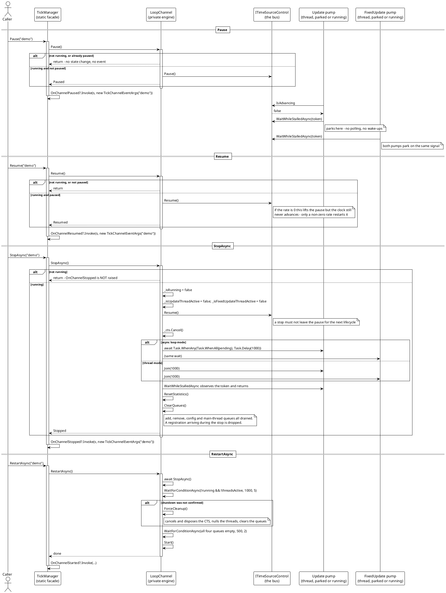

# Pause, Resume and Stop

These are the transitions that stop and restart delivery without tearing the channel down. They are short flows with a lot of state in them: the pause lives on the shared clock, the stop has to reach a pump that is parked, and a restart has to re-anchor the clocks.

> Source: `Src/Core/VeloxDev.Core/TimeLine/TickManager.cs` lines 329-374 (StopAsync), 384-402 (Pause/Resume), 404-428 (RestartAsync), 440 (TogglePause), 954-993 (ClearQueues, ForceCleanup, WaitForConditionAsync), 1051-1064 (static forwards).

## Why a parked pump can still be stopped

This is the failure mode the design had to solve, and the test that pins it is `TickableBusTests.StoppingWhilePausedEndsTheChannel`:

> 停摆中的循环 park 在一个对令牌一无所知的等待上。不在这个等待里观察令牌的话，`StopAsync` 会一直等下去，然后 `ForceCleanup` 释放掉那个令牌源，异常从线程体里逃出去。

Translated: a parked loop waits on something. If that wait did not observe the cancellation token, `StopAsync` would wait its full timeout, fall back to `ForceCleanup`, dispose the token source under a thread that is still holding it, and let an exception escape the thread body. The contract that prevents this is on `WaitWhileStalledAsync` — it takes the token, so cancelling propagates *into* the park. The test asserts the task wins against a 5-second timeout.

## What each transition resets, and what it does not

| | `Pause` | `Resume` | `StopAsync` | `RestartAsync` |
|---|---|---|---|---|
| `_isRunning` | unchanged | unchanged | `false` | `false` then `true` |
| Bus paused flag | `true` | `false` | `false` (cleared) | cleared then unchanged |
| Bus rate | unchanged | unchanged | **not** cleared | **not** cleared |
| `TotalFrames` / `TotalTime` / `CurrentFPS` | unchanged | unchanged | reset to 0 | reset, then re-accumulate |
| Behaviour registrations | unchanged | unchanged | **dropped** (queues cleared) | **dropped** |
| `Awake` / `Start` re-run | no | no | no | **no** |
| Samplers | unchanged | unchanged | unchanged | **re-anchored** |
| Event raised | `OnChannelPaused` | `OnChannelResumed` | `OnChannelStopped` | `OnChannelStopped` + `OnChannelStarted` |

Three entries in that table are the ones that cause trouble when missed:

- **A rate of `0` is not the bus's paused flag, and neither `Resume` nor `StopAsync` clears it.** `SetTimeScale(0)` freezes the clock; `StopAsync`'s `_bus.Resume()` only lifts the *pause*. A channel stopped at rate 0 restarts and immediately parks again. The demo prints `IsAdvancing` beside `SystemStatus` so the two states are distinguishable on screen (`MainWindow.xaml.cs` lines 307-324).
- **`StopAsync` drops the registrations** but does not notify the behaviours — the stop path calls no `CloseTickable` hook on `ITickable`. (The `CloseTickable()` member does exist; it is what *performs* unregistration, but `StopAsync` never invokes it.) A host that stops a channel and expects its behaviours to be re-registered on the next `Start` will find them gone.
- **`RestartAsync` does not re-run `Awake` / `Start`** either. The only path that does is `CloseTickable()` + `InitializeTickable()`.

## The guard placement makes events honest

Every handler is emitted *after* the guard, never before. So an event means "the state actually changed", and the guards define which transitions are silent:

| Call | Suppressed when | Fires |
|---|---|---|
| `Pause` | not running, or already paused | `OnChannelPaused` |
| `Resume` | not running, or not paused | `OnChannelResumed` |
| `TogglePause` | not running | exactly one of the two above |
| `StopAsync` | not running | `OnChannelStopped` |
| `Start` | already running | `OnChannelStarted` |

`TogglePause` cannot raise both, because it is literally `if (_bus.IsPaused) Resume(); else Pause();` (line 440) and those two methods are the only raisers.

## Failure and edge paths

- **Stop while paused.** Covered above and by the test; it completes normally.
- **Stop while the fixed pump is mid-batch.** The token is checked at the top of each behaviour in the dispatch loop (`token.IsCancellationRequested` in the break condition), so a long batch aborts within one behaviour.
- **Stop with the queue non-empty.** `ClearQueues` drains all four in the `finally` block, so registrations that never got applied are discarded rather than left to leak into the next lifecycle.
- **Restart after a shutdown that did not confirm.** `ForceCleanup` is the fallback: cancel and dispose the token source, null the thread and task fields, clear the queues. It is the only path where a pump might still be running when the next `Start` creates new ones, which is why it writes a warning to `Debug.WriteLine`.
- **`RestartAsync` drain wait is best-effort.** Its `WaitForConditionAsync` result is ignored; if the queues are still non-empty after 500 ms, `Start` proceeds anyway (`TickManager.cs` lines 420-425).
- **`StopAsync` never faults.** The pump join is inside `try { … } catch (Exception) { }` with cleanup in `finally`, so the returned task completes successfully even if a pump misbehaved.
