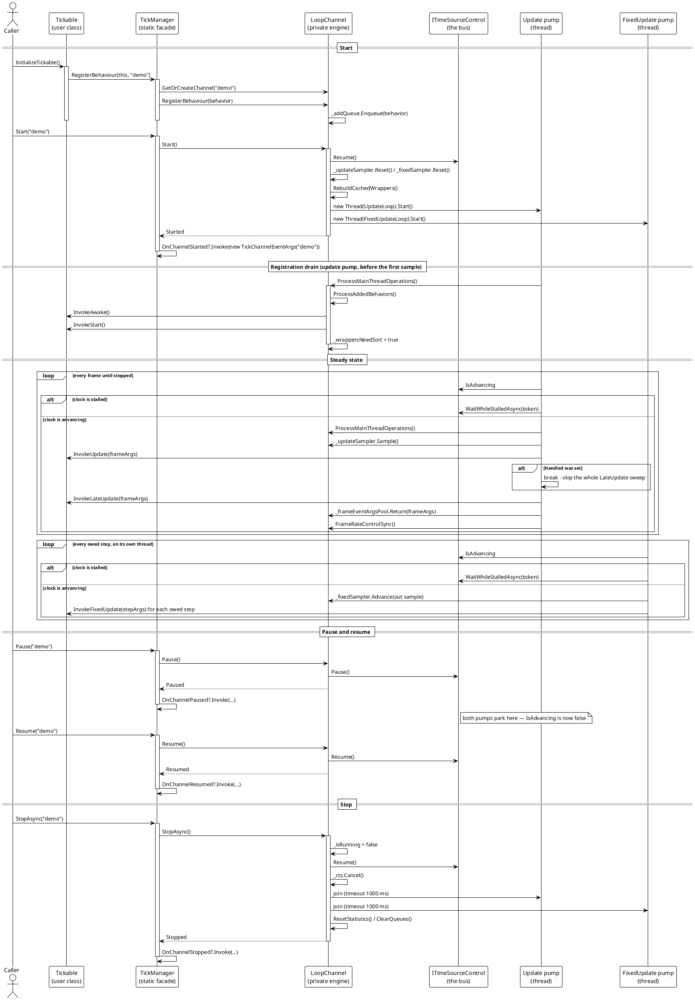

# Data Flow — Tickable

The tickable feature has one call chain with three phases, and they are worth reading in order because each one changes the state the next one depends on:

1. **Start and registration** — the caller starts a channel and enqueues a behaviour; the update pump drains the queue before sampling, so `Awake` and `Start` land before the first `Update`.
2. **Frame delivery** — the steady state: one `Update` sweep, one `LateUpdate` sweep, and an independent `FixedUpdate` batch on the other thread.
3. **Pause, resume and stop** — the transitions that stop and restart delivery without tearing down the channel.

## The whole lifecycle in one picture

> Source: `Src/Core/VeloxDev.Core/TimeLine/TickManager.cs` lines 274-327 (Start), 329-374 (StopAsync), 384-402 (Pause/Resume), 430-438 (registration), 509-554 (UpdateLoop), 446-507 (FixedUpdateLoop), 753-801 (drain), 1017-1030 (GetOrCreateChannel), 1048-1064 (static forwards).

## Flows by phase

| Sub-page | Flow | Diagram |
|---|---|---|
| [Start and registration](00_start-and-registration/index.md) | `InitializeTickable()` → `RegisterBehaviour` → `GetOrCreateChannel` → `Start` → drain → `InvokeAwake`/`InvokeStart` | PlantUML |
| [Frame delivery](01_frame-delivery/index.md) | Per-frame `InvokeUpdate` → `InvokeLateUpdate`, the `Handled` short-circuit, the concurrent `InvokeFixedUpdate` batch, and the exception path | PlantUML |
| [Pause, resume and stop](02_pause-resume-and-stop/index.md) | `Pause` / `Resume` / `TogglePause` / `StopAsync` / `RestartAsync`, including the parked-pump and stop-while-paused paths | PlantUML |

## What crosses which boundary

The flow above is only meaningful if the thread boundaries are explicit. Every arrow in it crosses one of four boundaries:

| From → To | Mechanism | Consequence |
|---|---|---|
| Caller → `LoopChannel` | `ConcurrentQueue<T>` (add, remove, config) or a `volatile` field | Lock-free; applied later, not at the call |
| Update pump → behaviour | direct method call | Synchronous; a slow hook delays the frame |
| FixedUpdate pump → behaviour | direct method call, on its own thread | Concurrent with Update; shared state needs its own lock |
| Pump → bus | `ITimeSourceControl` | The pause and the rate are observed by both pumps and by any animation on the same clock |

The one thing that is **not** in this chain is any marshalling to a UI thread. `ExecuteOnMainThread` targets the update pump, and a hook that blocks on a `Dispatcher.Invoke` would be caught by the per-hook exception guard.
