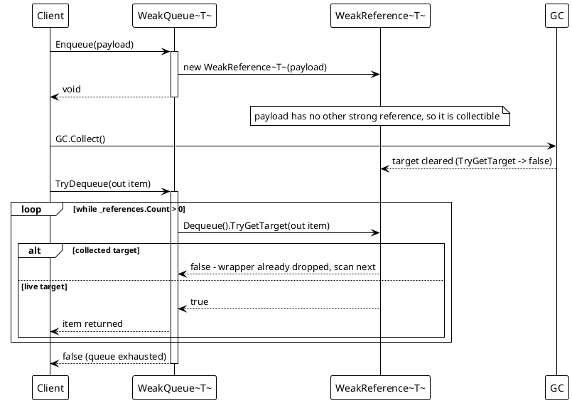
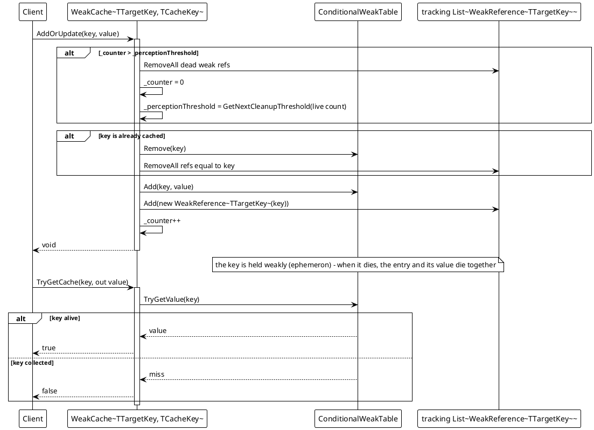
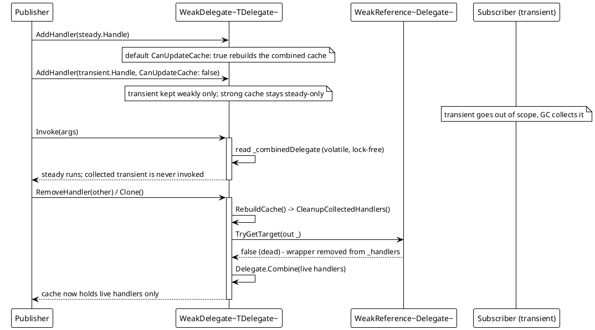

# Data Flow — Weak Types

All four types are guarded by a per-instance `lock`, and dead references are skipped or pruned on access. The three diagrams trace the representative flows: a weak queue, the ephemeron cache sweep, and the weak multicast. Generic constraints make the payload a reference type: `WeakQueue<T>` / `WeakStack<T>` are `where T : class`, so `TryDequeue` / `TryPop` / `TryPeek` surface a `T?` whose null/`false` also means "no live item".

## 1. WeakQueue — enqueue, collect, dequeue skips dead refs

`Enqueue` only wraps the item (`WeakQueue.cs`, lines 34-42). `TryDequeue` pops the front and calls `TryGetTarget`; a collected payload means the wrapper has already been dropped and the loop continues (lines 63-78). `TryPeek` behaves the same but keeps the live front in place, dropping only dead entries (lines 80-96). `Count` and `GetEnumerator` first run `Prune()` over the whole backing queue (lines 10-21, 107-120, 124-135), so the reported count and the yielded items are always live; a dead payload is never returned.

## 2. WeakCache — AddOrUpdate, periodic sweep, ephemeron eviction

The table (`_caches`) is the source of truth for lookup. `AddOrUpdate` first checks the sweep counter, then, because `ConditionalWeakTable.Add` throws when the key already exists, explicitly `Remove`s a prior entry before adding the new one; it also refreshes the tracking list so `_targets` holds one weak reference per live key (lines 44-63). `TryGetCache` is a plain table read (lines 31-43): when the key has been collected the ephemeron entry is gone, so the value — which is only ever referenced through the table while the key lives — is gone too, and no manual eviction is needed. `ForeachCache` (lines 14-30) prunes dead tracking refs first and then walks the surviving keys through the table. Note the sweep threshold grows geometrically from the live count (`GetNextCleanupThreshold`, lines 75-79), which keeps the periodic cleanup amortized O(1) per insert.

## 3. WeakDelegate — weak multicast and pruning on rebuild

`AddHandler` appends a `WeakReference<Delegate>` and, when `CanUpdateCache` is true, immediately rebuilds the combined delegate (lines 10-18); `RemoveHandler` scans from the tail and removes matching entries (lines 20-33). Invocation never walks the weak list on the hot path: `GetInvocationList` returns the cached `_combinedDelegate` through a lock-free `volatile` read, and only locks-and-rebuilds when the cache is null (lines 40-51). `Invoke(object?[] objects)` DynamicInvokes that cached delegate (lines 58-61) — callers that know the signature invoke it typed instead, which is what `TransitionEffectCore` does per frame (`TransitionEffect.cs`, lines 87-90). The cached delegate is a strong reference, so pruning only removes the wrapper entries of collected handlers: `RebuildCache` calls `CleanupCollectedHandlers` (lines 63-77, 79-88), and `Clone` copies only the live handlers into a fresh instance (lines 90-105). The one leak-shaped corner is therefore a handler added with the default cache update that never unsubscribes — it stays rooted by the strong cache until some later add/remove/clone rebuilds around it.

Source: `Src/Core/VeloxDev.Core/WeakTypes/{WeakQueue,WeakStack,WeakDelegate,WeakCache}.cs`; usage in `Src/Core/VeloxDev.Core/TransitionSystem/TransitionEffect.cs`; behavior covered by `Src/Core/VeloxDev.Core.Test/WeakTypes/*.cs` (FIFO/LIFO ordering, peek, range ops, cache overwrite/remove/cleanup).
