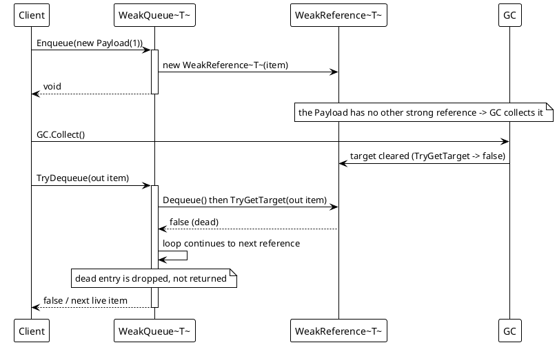
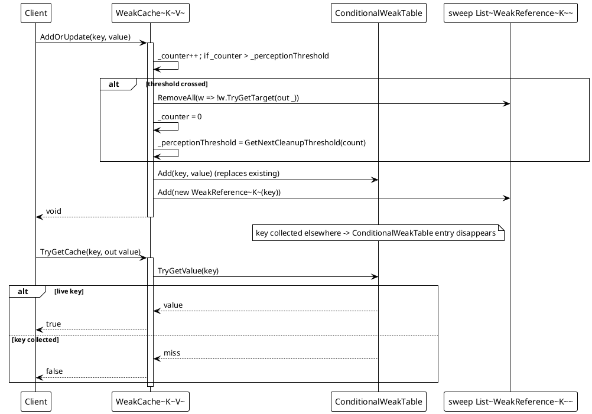
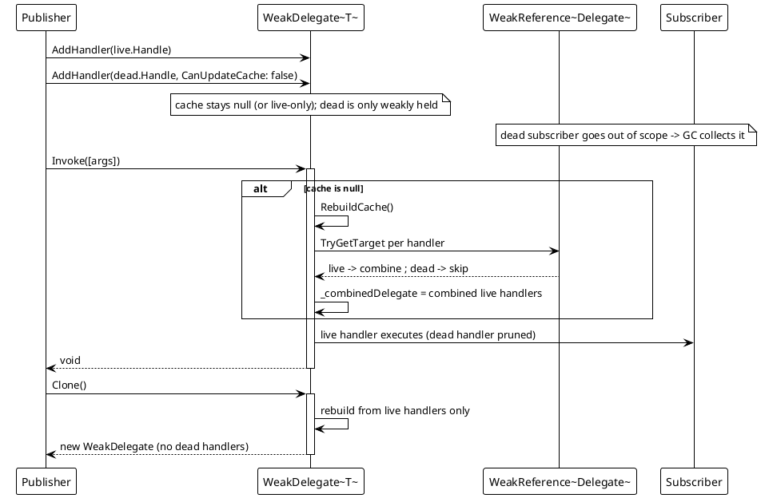

# Data Flow — Weak Types

All four types are lock-guarded; dead references are skipped or pruned on access. The diagrams below trace the three representative flows.

## 1. WeakQueue — enqueue, collect, dequeue skips dead refs

Runtime probe, 2026-08-17: after `GC.Collect()` the queue reported `Count: 1` and `TryDequeue` returned only the still-alive item.

## 2. WeakCache — AddOrUpdate and periodic sweep

Source: `WeakCache.cs` lines 44-63 (`AddOrUpdate`), 31-43 (`TryGetCache`), 75-79 (`GetNextCleanupThreshold`).

## 3. WeakDelegate — pruning collected handlers on invoke/clone

Source: `WeakDelegate.cs` lines 10-19 (`AddHandler`), 40-51 (`GetInvocationList`), 62-76 (`RebuildCache`), 78-87 (`CleanupCollectedHandlers`), 89-104 (`Clone`). Runtime probe, 2026-08-17: after GC, invoking the original ran only the live handler (counter `1`), and invoking a `Clone` also ran only the live handler (counter `2`).
