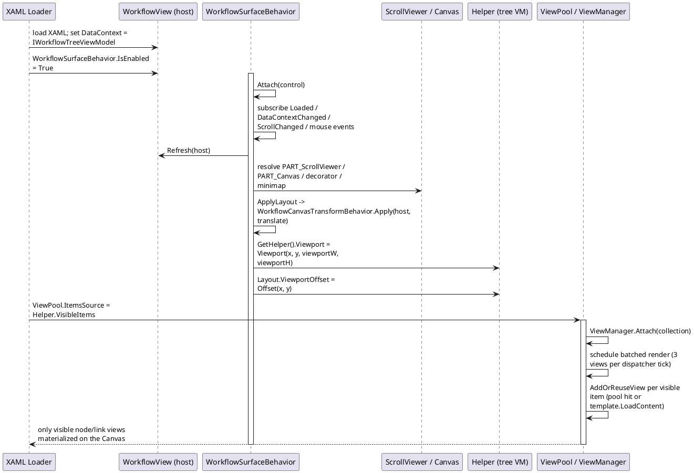
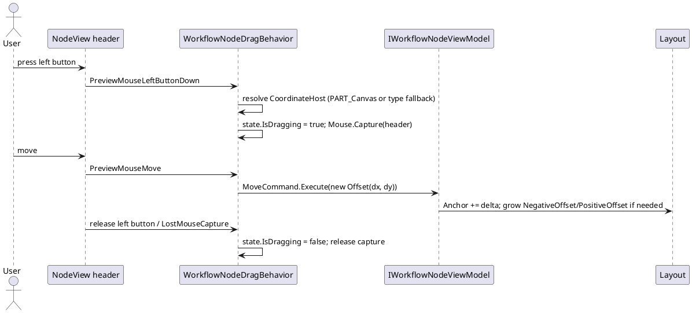
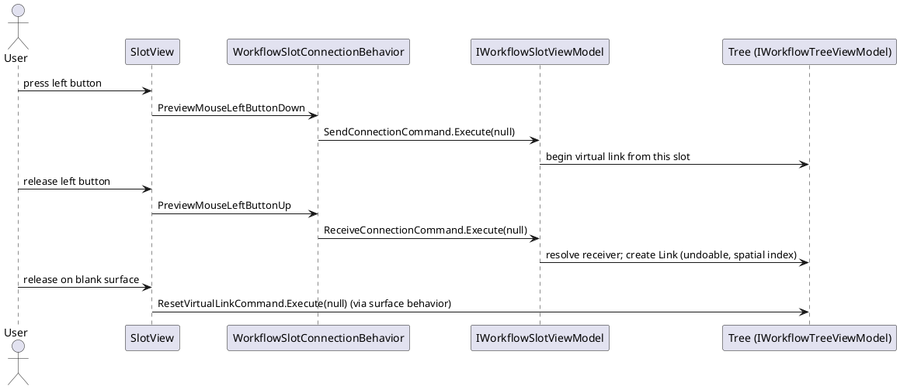
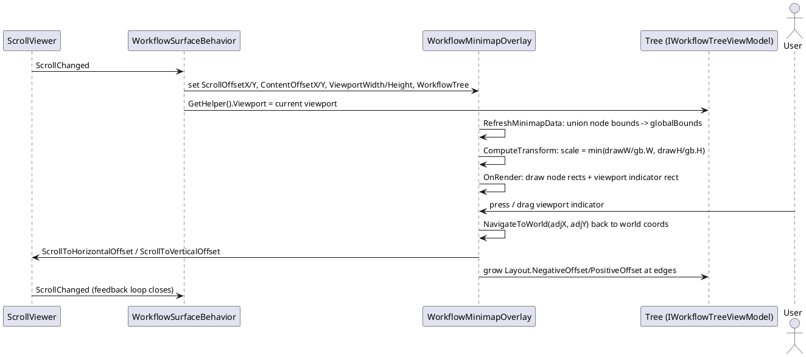
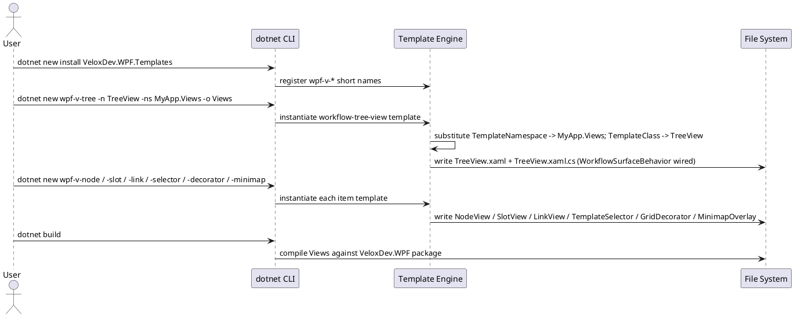

# 08 · Platform Adapters — Data Flow

The sequence diagrams below trace the five core flows of the platform-adapter layer. They are derived from the WPF adapter source and the WPF/Avalonia/Blazor demos; per-platform details not exercised by a demo are `*inferred*` from source.

## (a) Attached-behavior wiring: XAML loads → behavior attaches → viewport → `ViewPool` virtualizes

## (b) Drag-to-move: `WorkflowNodeDragBehavior` → `MoveCommand`

## (c) Slot connect: `WorkflowSlotConnectionBehavior` → `SendConnectionCommand` / `ReceiveConnectionCommand`

## (d) Minimap projection flow

## (e) Template-scaffold flow: `dotnet new` → generated files

