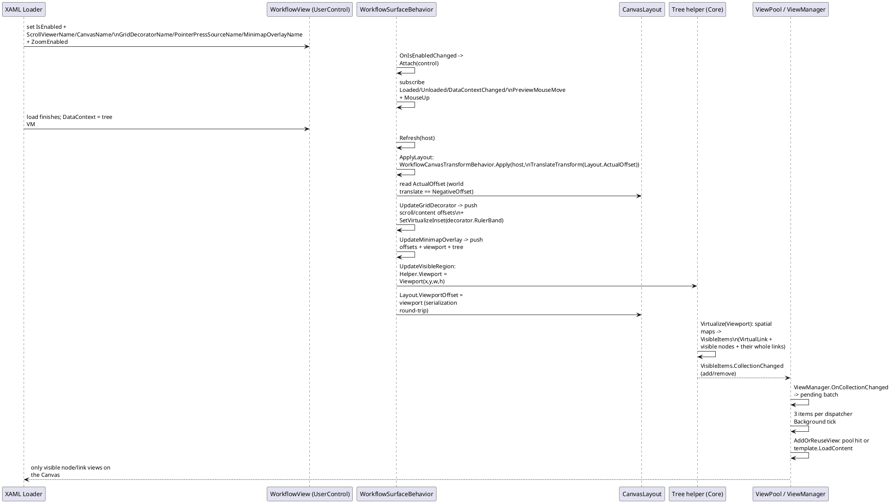
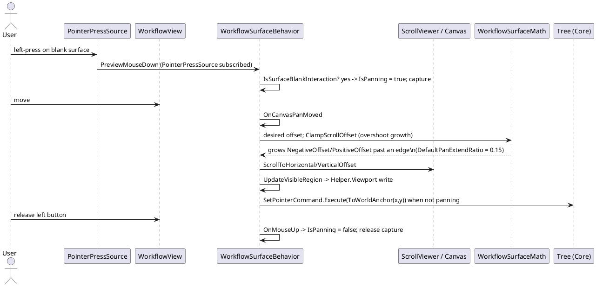
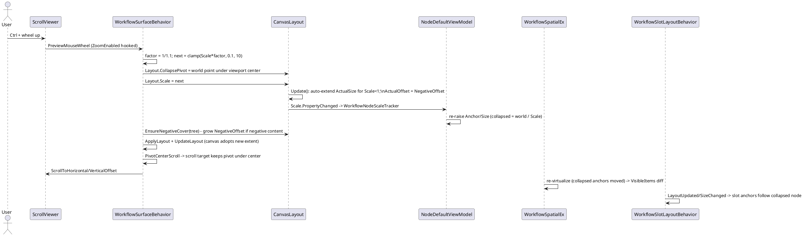
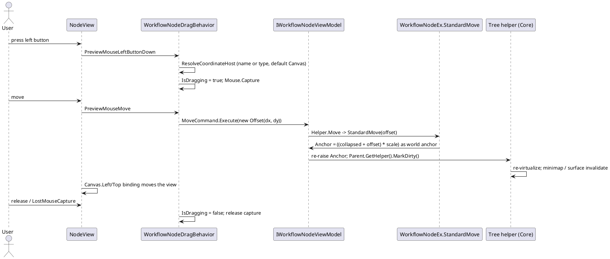
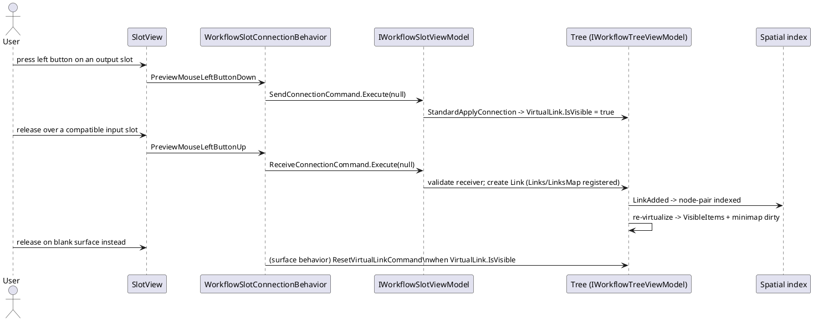
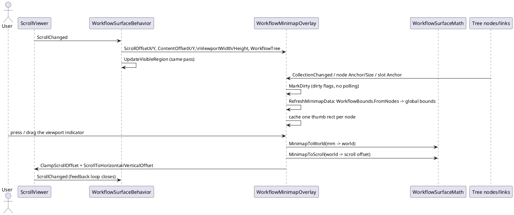

# 08 · Platform Adapters — Data Flow

The sequence diagrams below trace the core data flows of the platform-adapter layer. They are derived from the WPF adapter source, the Core model (`VeloxDev.WorkflowSystem`), and the WPF/Avalonia/WinUI/MAUI demos; per-platform detail not exercised by a demo is `*inferred*` from source. A recurring step is the visible-region feed: the surface writes `Helper.Viewport`, the spatial index re-computes `Helper.VisibleItems`, and `ViewPool` materializes only those views. The WPF/Avalonia/WinUI demos bind `ViewPool` to `Helper.VisibleItems` and the MAUI demo binds a node-only wrapper of it; the WinForms and Blazor demos instead bind the full node collection and rely on the surface for visible-region bookkeeping.

## (a) Attach & layout wiring → virtualize → pooled materialization

## (b) Pan & pointer tracking (blank surface)

Panning starts only on "blank" surface presses (never over a node/slot visual or the scroll bar); every non-panning move still feeds `SetPointerCommand`.

## (c) Zoom (Ctrl + mouse wheel)

Zoom is a *collapse* factor: the surface divides `Layout.Scale` by $1/1.1$ on wheel-up. Node `Anchor`/`Size` getters collapse toward the world origin by that scale, so zooming moves the model geometry, not a single canvas transform.

## (d) Node drag → `MoveCommand` → world anchor update

The drag behavior converts the delta in the coordinate host's space into an `Offset`; `StandardMove` maps the view-space delta back to a world anchor by the current scale, so the node follows the pointer even while zoomed.

## (e) Slot connection gesture → virtual link lifecycle

Connecting is two commands on the slot plus a cancel path on the surface. When a valid receiver is reached the tree registers a link; the spatial index and the visible set are updated from the `LinkAdded` event.

## (f) Minimap projection & drag navigation

The minimap is an overlay element implementing `IWorkflowMinimapOverlay` (WPF `FrameworkElement`, Avalonia `Control`, WinUI `Canvas`, MAUI `GraphicsView`, Jalium `FrameworkElement`, Razor SVG component). The surface pushes scroll/content offsets, the viewport size and the tree into it; it marks itself dirty from model events (never polls) and renders a whole-graph thumbnail plus a viewport indicator.

