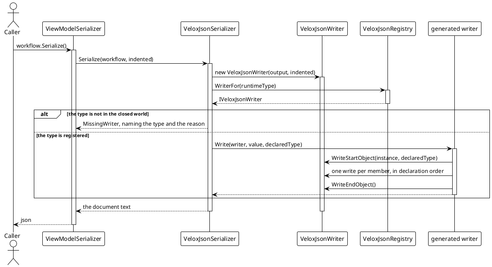
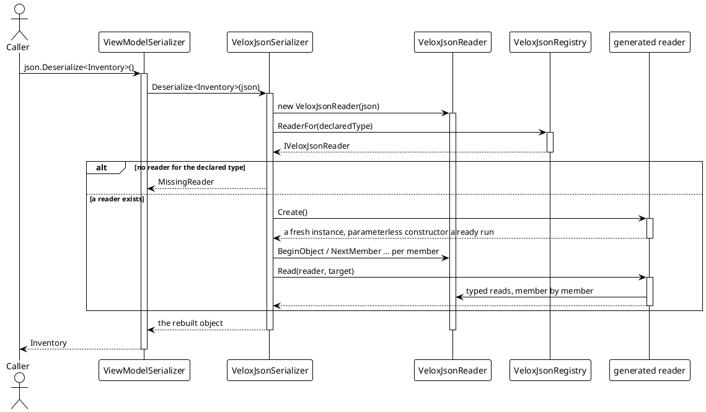

# Data Flow — Serialization

The archive path has three stages: **resolve the type**, **pick the writer or reader**, and **walk the members**. Nothing is discovered at run time — the registry was filled by `[ModuleInitializer]`s when the assembly loaded.

## 1. Writing a document

`WriteStartObject` is where the format's identity lives: the first sighting of an instance writes its id and — **only when the runtime type differs from the declared type** — a type tag; a second sighting writes a reference instead of the object (`Src/Core/VeloxDev.Core/Serialization/VeloxJsonWriter.cs:122-142`). That one branch is what keeps a graph with `Parent` back-references from expanding, and it is why no `PreserveReferencesHandling`-style setting exists.

## 2. Reading a document

Three properties of the read side:

- **The document's member order does not matter.** `NextMember()` advances and `MemberNameEquals(name)` compares in place; a reader asks for the members it knows and skips the rest. That is also why a member the document does not contain simply keeps whatever the constructor left — there is no "restore defaults" pass.
- **The constructor runs first, then the members are written onto the instance.** Anything the constructor set that the document does not mention survives the load.
- **The type tag resolves through the same registry.** `TypeOf(name) ?? declaredType` — and when it falls back to the declared type, polymorphism is silently lost for a concrete class and a `MissingReader` is thrown for an interface or an abstract type.

## 3. Where the two chains part

Read and write each exist **twice** — a synchronous chain and an asynchronous one — and they are separate hand-written code paths rather than one path with `await`s. The reason is that the in-memory path never performs I/O, so paying for async state machines there would be pure cost.

The price is that the two must agree, and nothing structurally forces them to: `ShapeRoundTripTests.TheTwoChains_SpellEveryScalarTheSameWay` and `ElementScalarRoundTripTests` are what hold them together. Both chains have drifted before — the sync writer missed `byte[]`, and the async reader missed both `byte[]` and `DateTimeKind.RoundtripKind`.

The generator emits both halves for every type (`IVeloxJsonWriter` / `IVeloxJsonReader` each declare a sync and an async method), so a type is never half-supported.
