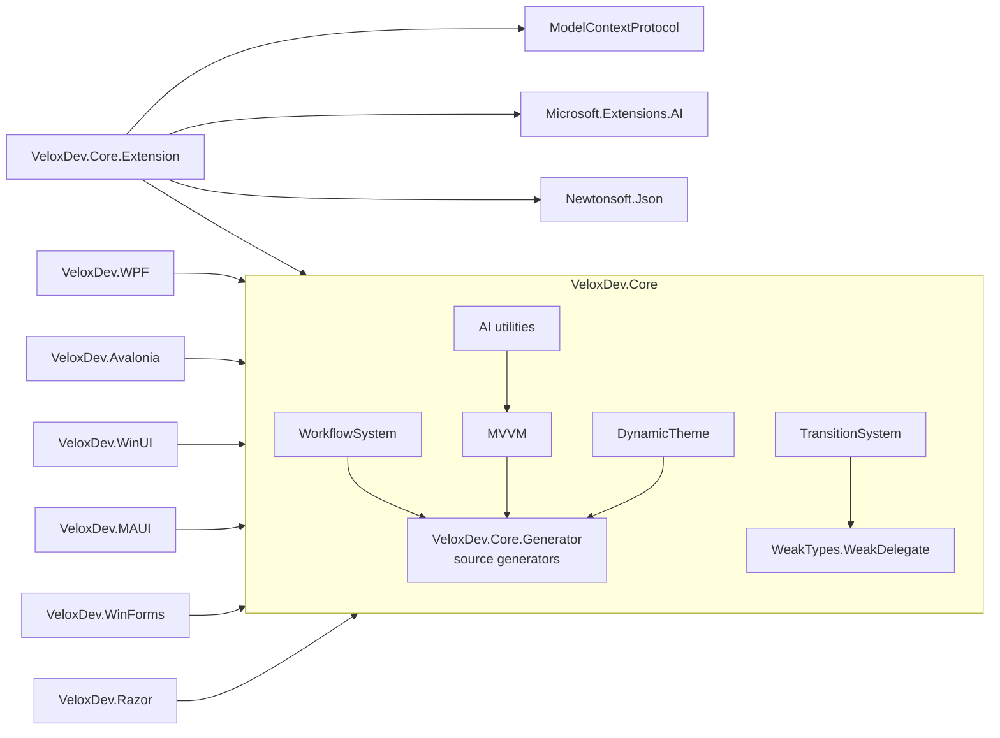

# File Structure

## Repository Layout

```
VeloxDev/
├── Src/
│   ├── Core/
│   │   ├── VeloxDev.Core/                 ← Core engine (multi-target)
│   │   │   ├── WorkflowSystem/            ← Workflow editor: Templates, StandardEx, Compilation, SelectorEx
│   │   │   ├── TransitionSystem/          ← Animation engine + NativeInterpolators/
│   │   │   ├── DynamicTheme/              ← Theme switching (ThemeManager, ThemeCache)
│   │   │   ├── MVVM/                      ← VeloxProperty/VeloxCommand runtime + IVeloxCommand
│   │   │   ├── AspectOriented/            ← AOP proxies (#if NET)
│   │   │   ├── AI/                        ← Agent attributes + reflection utilities
│   │   │   ├── TimeLine/                  ← MonoBehaviour frame loop (MonoBehaviourManager)
│   │   │   ├── WeakTypes/                 ← WeakQueue/WeakStack/WeakCache/WeakDelegate
│   │   │   └── Interfaces/                ← Public API contracts (WorkflowSystem, TransitionSystem, ...)
│   │   ├── VeloxDev.Core.Extension/       ← Workflow Agent (AI.Workflow), MCP, ComponentModelEx serialization
│   │   ├── VeloxDev.Core.Test/            ← MSTest unit tests
│   │   └── VeloxDev.Core.Extension.Test/  ← Extension unit tests
│   ├── Adapters/                          ← Per-GUI adapters
│   │   ├── VeloxDev.WPF/                  ← WPF (Attached/Workflow behaviors, PlatformAdapters)
│   │   ├── VeloxDev.Avalonia/             ← Avalonia
│   │   ├── VeloxDev.WinUI/                ← WinUI 3
│   │   ├── VeloxDev.MAUI/                 ← .NET MAUI
│   │   ├── VeloxDev.WinForms/             ← Windows Forms
│   │   └── VeloxDev.Razor/                ← Razor / Blazor
│   ├── Generators/
│   │   └── VeloxDev.Core.Generator/       ← Roslyn source generators (WorkflowBuilder, MVVM, Command, AOP, Theme, MonoBehaviour)
│   └── Templates/                         ← dotnet new item templates (WPF/Avalonia/MAUI/WinUI)
├── Examples/                              ← Demos (primary evidence)
│   ├── Workflow/   WPF · Avalonia · WinUI · MAUI · WinForms · Blazor + Common/Lib
│   ├── Transition/ WPF · Avalonia · WinUI · WinForms · MAUI · Blazor
│   ├── Theme/      WPF · Avalonia
│   ├── MVVM/       WPF · Avalonia
│   ├── AOP/        WPF · Avalonia
│   └── MonoBehaviour/ WPF
├── Docs/
│   └── VeloxDev.Docs/                     ← CloudGlyph Wiki repository (content, skills, app)
├── Assets/                                ← Shared assets
├── TestResults/                           ← Test output
└── VeloxDev.slnx
```

## Project-to-Folder Mapping

| Project | Path | Role |
|---|---|---|
| `VeloxDev.Core` | `Src/Core/VeloxDev.Core` | All feature cores; multi-targets `netstandard2.0; netframework4.6.1; net5.0; netcoreapp3.0` |
| `VeloxDev.Core.Extension` | `Src/Core/VeloxDev.Core.Extension` | Workflow Agent (AI tools), MCP scope, JSON serialization (`netstandard2.0`) |
| `VeloxDev.Core.Generator` | `Src/Generators/VeloxDev.Core.Generator` | Roslyn incremental generators (analyzer package, `netstandard2.0`) |
| `VeloxDev.WPF` | `Src/Adapters/VeloxDev.WPF` | WPF adapter (`UseWPF`) |
| `VeloxDev.Avalonia` | `Src/Adapters/VeloxDev.Avalonia` | Avalonia adapter |
| `VeloxDev.WinUI` | `Src/Adapters/VeloxDev.WinUI` | WinUI 3 adapter (`UseWinUI`) |
| `VeloxDev.MAUI` | `Src/Adapters/VeloxDev.MAUI` | .NET MAUI adapter (`UseMaui`) |
| `VeloxDev.WinForms` | `Src/Adapters/VeloxDev.WinForms` | Windows Forms adapter (`UseWindowsForms`) |
| `VeloxDev.Razor` | `Src/Adapters/VeloxDev.Razor` | Razor/Blazor adapter (Razor SDK) |
| `VeloxDev.*.Templates` | `Src/Templates` | `dotnet new` item templates |

## Adapter Internal Layout (`VeloxDev.Avalonia` example)

```
VeloxDev.Avalonia/
├── Attached/Workflow/               ← XAML attached behaviors (namespace VeloxDev.WorkflowSystem.AttachedBehaviors)
│   ├── WorkflowSurfaceBehavior.cs   ← surface host, panning, viewport → Helper.Viewport
│   ├── WorkflowNodeDragBehavior.cs  ← drag → MoveCommand
│   ├── WorkflowSlotConnectionBehavior.cs ← pointer down/up → Send/ReceiveConnectionCommand
│   ├── WorkflowSlotLayoutBehavior.cs ← recompute slot anchors after layout
│   ├── WorkflowCanvasTransformBehavior.cs
│   ├── ViewPool.cs / ViewManager.cs ← pooled virtualized ItemsSource
│   ├── WorkflowMinimapOverlay.cs
│   └── IWorkflowGridDecorator.cs / IWorkflowMinimapOverlay.cs
├── PlatformAdapters/                ← Transition/Theme platform wiring
│   ├── Interpolator.cs / InterpolatorOutput.cs
│   ├── Interpolators/               ← per-type interpolators (IBrush, ITransform, BoxShadows, ...)
│   ├── Transition.cs / TransitionScheduler.cs / TransitionInterpreter.cs
│   ├── TransitionEffect.cs / TransitionEffects.cs / State.cs
│   ├── ThemeValueConverters.cs
│   └── UIThreadInspector.cs
└── GlobalUsings.cs
```

## Core Engine Dependencies


