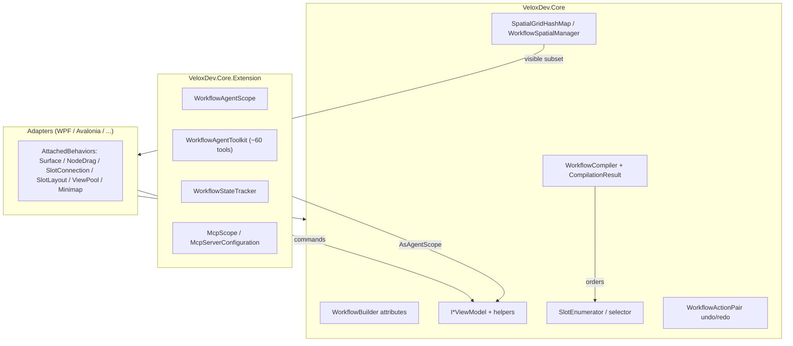

# Feature Map — WorkflowSystem

## Responsibility Boundaries

The WorkflowSystem feature is split into three layers:

1. **Core (`VeloxDev.Core`)** — owns the component model (Tree / Node / Slot / Link), the source generator attributes, undo/redo, spatial indexing, the selector system and the compilation pipeline. It is UI-framework-agnostic.
2. **Adapters (`VeloxDev.WPF`, `VeloxDev.Avalonia`, …)** — attached behaviors (`WorkflowSurfaceBehavior`, `WorkflowNodeDragBehavior`, `WorkflowSlotConnectionBehavior`, `WorkflowSlotLayoutBehavior`, `ViewPool`, `WorkflowMinimapOverlay`) that render and virtualize the graph.
3. **AI / Agent (`VeloxDev.Core.Extension`)** — `WorkflowAgentScope` (fluent context + tools), `WorkflowAgentToolkit` (~60 tools), `WorkflowStateTracker` and the MCP loader (`McpScope`).

## Feature → Project → Dependency Table

| Feature | Namespace | Project | Depends on |
|---|---|---|---|
| Builder attributes | `VeloxDev.WorkflowSystem` | Core | `VeloxDev.MVVM` |
| Component interfaces | `VeloxDev.WorkflowSystem` | Core | `VeloxDev.AI` (metadata), `VeloxDev.MVVM` |
| Default VMs + helpers | `VeloxDev.WorkflowSystem` | Core | StandardEx |
| Value types / enums | `VeloxDev.WorkflowSystem` | Core | `VeloxDev.TransitionSystem` (Anchor) |
| Undo / redo | `VeloxDev.WorkflowSystem.StandardEx` | Core | `WorkflowActionPair` |
| Spatial index | `VeloxDev.WorkflowSystem` | Core | `ISpatialMap<T>`, `ISpatialBoundsProvider` |
| Selector | `VeloxDev.WorkflowSystem` | Core | `ISlotProvider`, `[SlotSelectors]` |
| Compiler | `VeloxDev.WorkflowSystem.Compilation` | Core | `ICompileTimeRouter`, `ICompileTimePriority`, `ICompileTimeSink` |
| Agent scope + toolkit | `VeloxDev.AI.Workflow` / `.Functions` | Core.Extension | Core + `Microsoft.Extensions.AI` |
| MCP | `VeloxDev.AI.MCP` | Core.Extension | `ModelContextProtocol.Client`, `CliWrap` |
| Serialization | `VeloxDev.MVVM.Serialization` | Core.Extension | Newtonsoft.Json |
| Attached behaviors | `VeloxDev.WorkflowSystem.AttachedBehaviors` | Adapters | Core |

## Entry Points

| Scenario | Entry point |
|---|---|
| Define a Tree | `[WorkflowBuilder.Tree<THelper>]` + `InitializeWorkflow()` |
| Define a Node | `[WorkflowBuilder.Node<THelper>(workSemaphore: n)]` |
| Build a graph | `tree.GetHelper().CreateNode(node)` → `SendConnection` / `ReceiveConnection` |
| Undo / redo | `tree.UndoCommand` / `tree.RedoCommand` |
| Compile & execute | `new WorkflowCompiler().Compile(start, ...)` → `CompilationResult.ExecuteAsync(parameter, ct)` |
| Virtualize | `TreeHelper(cellSize)` → `tree.EnableMap(cellSize, VisibleItems)` → `Virtualize(viewport)` |
| Route branches | `ICompileTimeRouter.GetRouteTable()` / `SlotEnumerator.SetSelector(type)` |
| Let AI drive it | `tree.AsAgentScope().With...().ProvideProgressiveContextPrompt()` + `ProvideTools()` |
| Persist | `tree.Serialize()` / `json.Deserialize<T>()` |

## Key Files

| Concern | Files |
|---|---|
| Attributes | `WorkflowSystem/Templates/WorkflowBuilder.cs` |
| Interfaces | `Interfaces/WorkflowSystem/IWorkflow*.cs` |
| Standard behavior | `WorkflowSystem/StandardEx/WorkflowTreeEx.cs` (connections, undo), `WorkflowNodeEx.cs`, `WorkflowSlotEx.cs`, `WorkflowLinkEx.cs`, `WorkflowSpatialEx.cs` |
| Defaults | `WorkflowSystem/Templates/ViewModels/*.cs`, `Templates/Helpers/*.cs` |
| Spatial | `WorkflowSystem/SpatialGridHashMap.cs`, `WorkflowSpatialManager.cs`, `NodeBoundsProvider.cs`, `NodePairBoundsProvider.cs` |
| Selector | `WorkflowSystem/SelectorEx/SlotEnumerator.cs`, `ConditionalSlot.cs`, `SlotDefinition.cs` |
| Compiler | `WorkflowSystem/Compilation/Compiler.cs`, `Models/CompilationResult.cs`, `Models/CompiledItem.cs`, `Enums/*.cs` |
| Agent | `VeloxDev.Core.Extension/Agent/Workflow/WorkflowAgentScope.cs`, `WorkflowStateTracker.cs`, `Functions/WorkflowAgentToolkit.cs` |
| MCP | `VeloxDev.Core.Extension/Agent/MCP/McpScope.cs`, `McpServerConfiguration.cs`, `McpServerRunMode.cs` |
| Serialization | `VeloxDev.Core.Extension/ComponentModelEx.cs` |
| Demo evidence | `Examples/Workflow/Common/Lib/ViewModels/Workflow/**`, `Examples/Workflow/WPF/Demo/Views/Workflow/**` |
