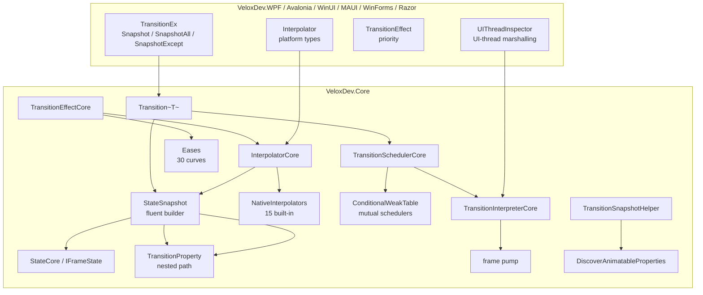

# Feature Map — Transition System

## Responsibility Boundaries

The Transition System is a **cross-platform, code-driven interpolation animation engine**. Its guiding principle is *"everything is a state"*: an animation is a *state snapshot* describing target property values; the engine interpolates every recorded property from its current value to the target over a timed, eased, frame-based timeline. It is split across the core engine (`VeloxDev.Core`) and per-platform adapters.

## Feature → Project → Dependency Mapping

| Feature | Owning Project | Public API Surface | Dependencies | Evidence |
|---|---|---|---|---|
| Fluent animation API | `VeloxDev.Core` | `Transition<T>.StateSnapshot` (`Property`/`Effect`/`Await`/`Then`/`AwaitThen`/`Execute`) | — | Demo |
| State model | `VeloxDev.Core` | `StateCore`, `IFrameState`, `TransitionProperty`, `ITransitionProperty` | `System.Reflection` | Demo + Test |
| Interpolation registry | `VeloxDev.Core` | `InterpolatorCore` (`Register/TryGet/Unregister`), `IValueInterpolator`, `IInterpolable` | — | Demo |
| Native interpolators | `VeloxDev.Core` | 15 interpolators in `VeloxDev.TransitionSystem.NativeInterpolators` | `System.Drawing`, `System.Numerics` | Test |
| Easing | `VeloxDev.Core` | `Eases`, `IEaseCalculator` | — | Demo |
| Effect model | `VeloxDev.Core` | `TransitionEffectCore`, `ITransitionEffectCore`, `TransitionEventArgs` | `WeakTypes.WeakDelegate` | Demo |
| Scheduler | `VeloxDev.Core` | `TransitionSchedulerCore` (`FindOrCreate`, `Execute`, `Exit`) | `ConditionalWeakTable` | Test |
| Interpreter (frame pump) | `VeloxDev.Core` | `TransitionInterpreterCore`, `ITransitionInterpreterCore` | `TimeLine` events | Test |
| Snapshot capture | `VeloxDev.Core` | `TransitionSnapshotHelper` (`CaptureAll`, `CaptureSpecific`, `DiscoverAnimatableProperties`) | `InterpolatorCore` | Demo |
| Platform wiring | each adapter | `TransitionEx`, `Transition`, `Interpolator`, `TransitionEffect`, `TransitionEffects`, `UIThreadInspector` | `VeloxDev.Core` | Demo |

## Entry Points

| Entry Point | Signature | Purpose |
|---|---|---|
| `Transition<T>.Create()` | `StateSnapshot Create()` | Build an animation definition |
| `.Property(...)` / `.Effect(...)` | fluent | Record target values + timing/easing |
| `.Execute(target, CanMutualTask)` | `void Execute(T target, bool CanMutualTask = true)` | Run the animation (may be called from a background thread) |
| `target.Snapshot(All/Except)` | `Transition<T>.StateSnapshot` | Capture the object's current values |
| `Transition.Exit(target, ...)` | `static void Exit<T>(T, bool IncludeMutual, bool IncludeNoMutual)` | Stop running animations |
| `UIThreadInspector.SetWindow/CaptureUIThread` | platform | Required wiring on WinUI / WinForms / Razor |

## Key Files

| File | Role |
|---|---|
| `Src/Core/VeloxDev.Core/TransitionSystem/Transition.cs` | Entry point `Transition<T>`, `Exit`, `Execute` |
| `Src/Core/VeloxDev.Core/TransitionSystem/StateSnapshot.cs` | Fluent builder + segment linking |
| `Src/Core/VeloxDev.Core/TransitionSystem/State.cs` | `IFrameState` implementation |
| `Src/Core/VeloxDev.Core/TransitionSystem/Interpolator.cs` | Interpolator registry + resolution order |
| `Src/Core/VeloxDev.Core/TransitionSystem/TransitionScheduler.cs` | Mutual/non-mutual schedulers |
| `Src/Core/VeloxDev.Core/TransitionSystem/TransitionInterpreter.cs` | Frame pump + auto-reverse/loop |
| `Src/Core/VeloxDev.Core/TransitionSystem/TransitionProperty.cs` | Nested property path resolution |
| `Src/Core/VeloxDev.Core/TransitionSystem/TransitionSnapshotHelper.cs` | State capture |
| `Src/Core/VeloxDev.Core/TransitionSystem/NativeInterpolators/*.cs` | Built-in value interpolators |
| `Src/Adapters/VeloxDev.{WPF,...}/PlatformAdapters/*.cs` | Per-platform `Interpolator`, `TransitionEffect`, `UIThreadInspector` |
