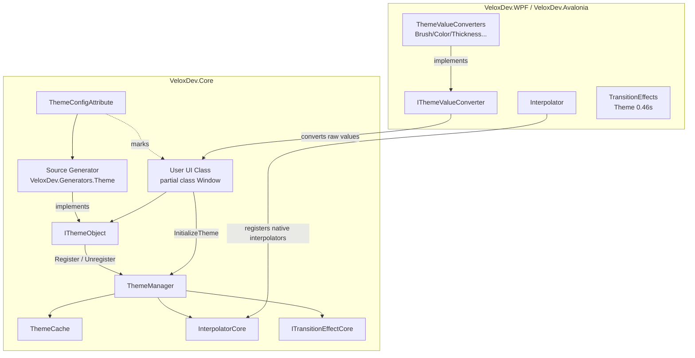

# Feature Map — Dynamic Theme

## Responsibility Boundaries

The Dynamic Theme feature provides **runtime theme switching with animated transitions** at the property-value level. It does not swap `ResourceDictionary`s; instead each theme-aware class declares, per property, the value that property takes under each theme, and `ThemeManager` animates those property values when the theme changes.

## Feature → Project → Dependency Mapping

| Feature | Owning Project | Public API Surface | Dependencies | Evidence |
|---|---|---|---|---|
| Theme declaration | `VeloxDev.Core` | `ThemeConfigAttribute<TConv, TTheme...>`, `ITheme`, `Dark`, `Light` | `VeloxDev.Core.Generator` | Demo |
| Theme orchestration | `VeloxDev.Core` | `ThemeManager` (static), `ThemeCache`, `StartModel`, `IThemeObject`, `IThemeValueConverter` | `VeloxDev.TransitionSystem` (core) | Demo + Test |
| Generated `IThemeObject` | `VeloxDev.Core.Generator` | `InitializeTheme`, `SetThemeValue<T>`, `RestoreThemeValue<T>`, `GetStaticThemeCache`, `GetActiveThemeCache` | `Microsoft.CodeAnalysis.CSharp` | Demo |
| Interpolation engine | `VeloxDev.Core` | `InterpolatorCore`, `ITransitionEffectCore`, `Eases`, `IValueInterpolator` | — | Demo |
| Platform value converters | `VeloxDev.WPF` / `VeloxDev.Avalonia` | `BrushConverter`, `ColorConverter`, `ThicknessConverter`, `DoubleConverter`, `PointConverter`, `CornerRadiusConverter`, `ObjectConverter` | `VeloxDev.Core` | Demo |
| Platform interpolator | `VeloxDev.WPF` / `VeloxDev.Avalonia` | `Interpolator`, `TransitionEffect`, `TransitionEffects` | `VeloxDev.Core` | Demo |

## Entry Points

| Entry Point | Signature | Purpose |
|---|---|---|
| `ThemeManager.Transition<T>` | `void Transition<T>(ITransitionEffectCore effect) where T : ITheme` | Switch theme with animation |
| `ThemeManager.Jump<T>` | `void Jump<T>() where T : ITheme` | Switch theme instantly |
| `ThemeManager.SetPlatformInterpolator` | `void SetPlatformInterpolator<T>(T) where T : InterpolatorCore` | Install adapter interpolator (once) |
| `InitializeTheme()` | generated member | Register instance + apply current theme |
| `SetThemeValue<T>` | `void SetThemeValue<T>(string, object?) where T : ITheme` | Runtime per-instance override |

## Key Files

| File | Role |
|---|---|
| `Src/Core/VeloxDev.Core/DynamicTheme/ThemeManager.cs` | Orchestration: `Transition`, `Jump`, `Register`, `CalculateFrames`, `ExecuteTransition` |
| `Src/Core/VeloxDev.Core/DynamicTheme/ThemeCache.cs` | Static defaults + per-instance overrides |
| `Src/Core/VeloxDev.Core/DynamicTheme/ThemeConfigAttribute.cs` | Declaration attribute (source-generator input) |
| `Src/Generators/VeloxDev.Core.Generator/Theme.cs` | Roslyn incremental generator emitting `IThemeObject` |
| `Src/Core/VeloxDev.Core/TransitionSystem/{Interpolator,TransitionEffect,Eases}.cs` | Interpolation + easing engine |
| `Src/Adapters/VeloxDev.WPF/PlatformAdapters/{ThemeValueConverters,Interpolator,TransitionEffect,TransitionEffects}.cs` | WPF platform wiring |
| `Src/Adapters/VeloxDev.Avalonia/PlatformAdapters/*.cs` | Avalonia platform wiring |
