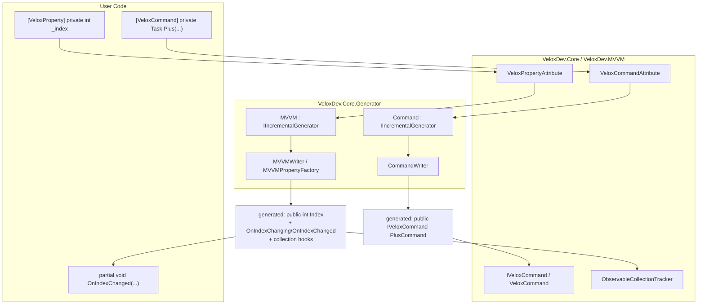

# Feature Map — MVVM

## Responsibility Boundaries

MVVM support is delivered by two cooperating components: the **runtime** types in `VeloxDev.Core` (namespace `VeloxDev.MVVM` — attributes, `IVeloxCommand`, `VeloxCommand`, `ObservableCollectionTracker`) and the **source generators** in the separate assembly `VeloxDev.Core.Generator` (namespace `VeloxDev.Generators`, generators `MVVM` and `Command`). The user writes only `partial` classes with attributes and `partial void` hooks; everything else is produced at compile time.

## Feature → Project → Dependency Mapping

| Feature | Owning Project | Public API Surface | Depends on | Evidence |
|---|---|---|---|---|
| Observable property generation | `VeloxDev.Core.Generator` | `[VeloxProperty]`, generated `INotifyPropertyChanging/Changed` properties, `OnXxxChanging/Changed` partials | `VeloxDev.Core` (attributes) | Demo |
| Collection tracking | `VeloxDev.Core` | `ObservableCollectionTracker` (`EnsureSubscribed`/`Unsubscribe`); generated `OnCollectionChanged<T>`, `OnItemAddedToXxx`/`OnItemRemovedFromXxx`/`OnItemMovedInXxx`/`OnItemsResetInXxx` | `System.Collections.Specialized`, `ConditionalWeakTable` | Demo |
| Command generation | `VeloxDev.Core.Generator` | `[VeloxCommand]`, generated `IVeloxCommand` property, `CanExecuteXxxCommand` partial | `VeloxDev.Core` (attributes, runtime) | Demo |
| Command runtime | `VeloxDev.Core` | `IVeloxCommand`, `VeloxCommand`, `CommandEventType`, `CommandEventArgs`, `CommandEventHandler` | `ICommand`, `SemaphoreSlim`, `Queue<>` | Demo + Test |
| Host-framework detection | `VeloxDev.Core.Generator` | `DetectSetterMode` → delegates to CommunityToolkit.Mvvm / Prism / ReactiveUI / Caliburn.Micro | Roslyn | *inferred from MVVMWriter.cs* |

## Entry Points

| Entry Point | Signature | Purpose |
|---|---|---|
| `[VeloxProperty] private T _field;` | attribute on field / partial property | Declare an observable property |
| `partial void OnXxxChanged(T old, T new);` | partial method | React to a property change |
| `[VeloxCommand] private Task Foo(...)` | attribute on method | Declare a command (`FooCommand`) |
| `private partial bool CanExecuteFooCommand(object? parameter);` | partial method | Gate a command's executability |
| `IVeloxCommand.Execute / ExecuteAsync(object?)` | runtime | Trigger / await a command |
| `IVeloxCommand.Notify()` | runtime | Re-query `CanExecute` and raise `CanExecuteChanged` |
| `ObservableCollectionTracker.EnsureSubscribed` | runtime (called by the generated getter) | Keep the collection subscription alive |

## Key Files

| File | Role |
|---|---|
| `Src/Core/VeloxDev.Core/MVVM/VeloxPropertyAttribute.cs` | Property attribute |
| `Src/Core/VeloxDev.Core/MVVM/VeloxCommandAttribute.cs` | Command attribute |
| `Src/Core/VeloxDev.Core/MVVM/VeloxCommand.cs` | `VeloxCommand`, `CommandEventType`, `CommandEventArgs`, `CommandEventHandler` |
| `Src/Core/VeloxDev.Core/MVVM/ObservableCollectionTracker.cs` | Weak collection-subscription helper |
| `Src/Core/VeloxDev.Core/Interfaces/MVVM/IVeloxCommand.cs` | Command contract |
| `Src/Generators/VeloxDev.Core.Generator/MVVM.cs` | `MVVM` incremental generator |
| `Src/Generators/VeloxDev.Core.Generator/Command.cs` | `Command` incremental generator |
| `Src/Generators/VeloxDev.Core.Generator/Writers/MVVMWriter.cs` | Property + notification infrastructure generation |
| `Src/Generators/VeloxDev.Core.Generator/Writers/CommandWriter.cs` | Command property generation |
| `Src/Generators/VeloxDev.Core.Generator/Base/Analizer.cs` | `MVVMPropertyFactory` — setter/getter/collection body templates |
| `Src/Core/VeloxDev.Core.Test/MVVM/VeloxCommandTests.cs` | Command runtime tests |
| `Examples/MVVM/WPF/Demo/MainWindowViewModel.cs` | Reference usage |
