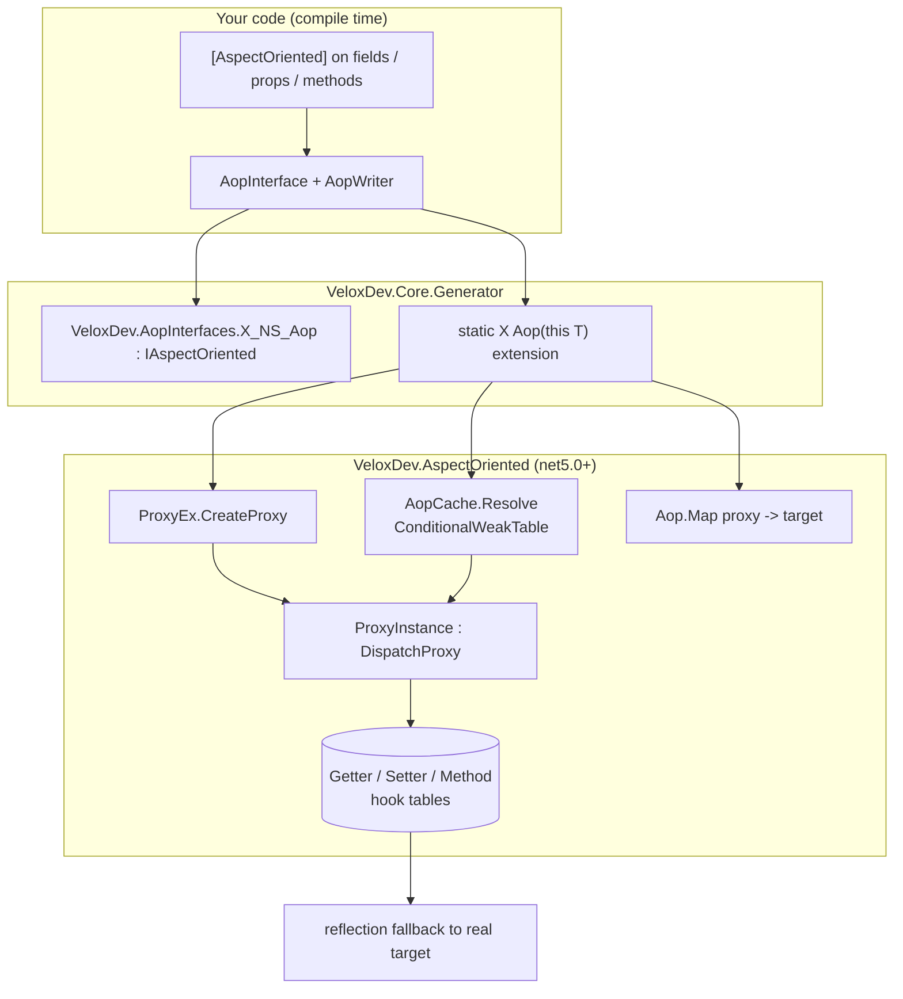
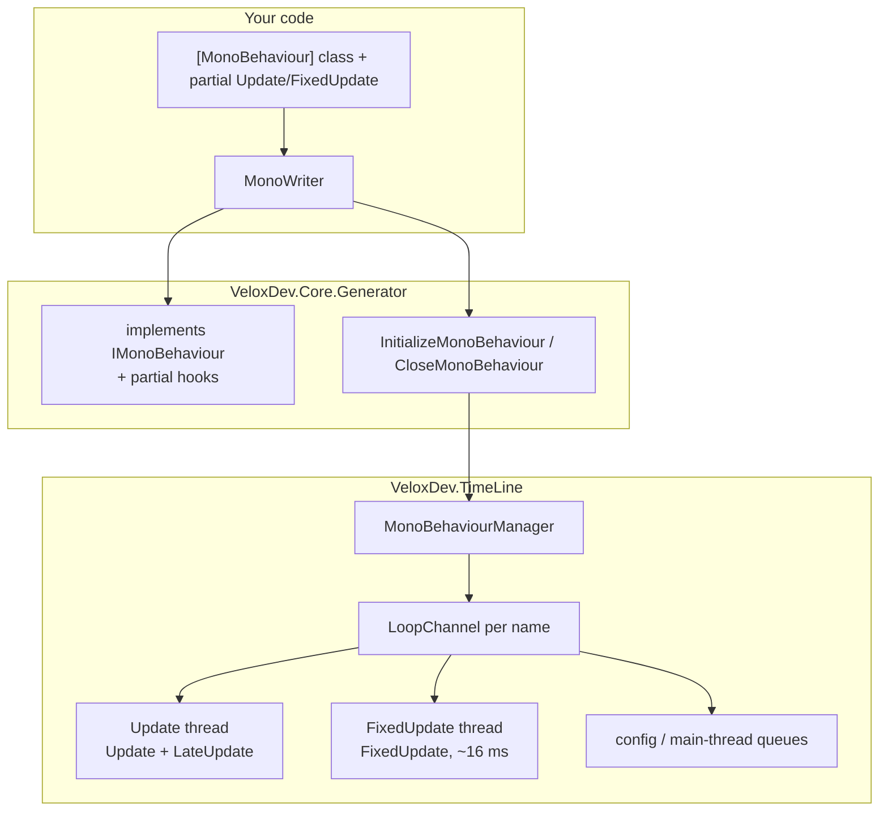
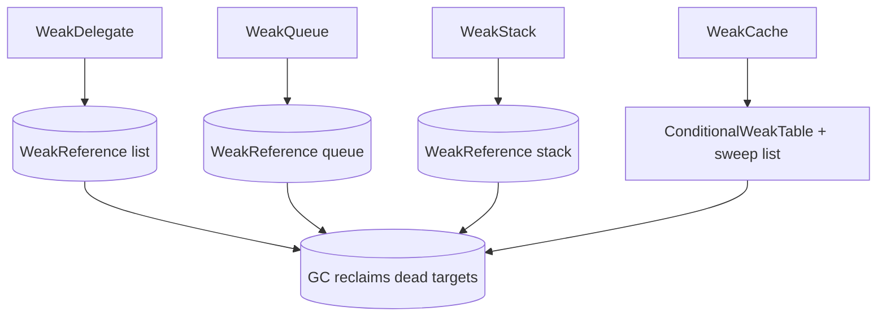

# Feature Map — AOP, MonoBehaviour & WeakTypes

All three features live in the `VeloxDev.Core` assembly (`Src/Core/VeloxDev.Core/`) and rely on the compile-time source generator `VeloxDev.Core.Generator`. AOP is **net5.0+ only** (`#if NET`); the MonoBehaviour and WeakTypes runtimes are multi-target.

## AOP — flow

## MonoBehaviour — flow

## WeakTypes — flow

## Feature → Project → Dependency

| Feature | Owning Project | Public API Surface | Dependencies | Evidence |
|---|---|---|---|---|
| AOP attribute + marker | `VeloxDev.Core` | `AspectOrientedAttribute`, `IAspectOriented` | — | Demo |
| AOP proxy runtime | `VeloxDev.Core` (`#if NET`) | `ProxyEx.CreateProxy/SetProxy`, `ProxyInstance : DispatchProxy`, `ProxyMembers`, `ProxyHandler` | `System.Reflection.DispatchProxy` | Demo |
| AOP cache + reverse lookup | `VeloxDev.Core` (`#if NET`) | `AopCache.Resolve`, `Aop.Map/GetTarget` | `ConditionalWeakTable` | Demo |
| AOP source generator | `VeloxDev.Core.Generator` | `AopInterface`, `AopWriter`, `AopProxy` | Roslyn | Demo build |
| MonoBehaviour attribute | `VeloxDev.Core` | `MonoBehaviourAttribute` (`Channel`, `TargetFPS`) | — | Demo |
| Frame loop manager | `VeloxDev.Core` | `MonoBehaviourManager` (lifecycle/config/query/events) | `VeloxDev.MonoBehaviour.IMonoBehaviour` | Demo + Test |
| Behaviour contract | `VeloxDev.Core` | `IMonoBehaviour`, `FrameEventArgs`, `TimeLineEventArgs`, `ThreadSafeFrameEventArgs`, `TransitionEventArgs`, `MonoBehaviourChannelEventArgs` | `VeloxDev.TimeLine` | Demo + Test |
| MonoBehaviour source generator | `VeloxDev.Core.Generator` | `MonoBehaviour`, `MonoWriter` | Roslyn | Demo build |
| Weak event wrapper | `VeloxDev.Core` | `WeakDelegate<TDelegate>` | `WeakReference<Delegate>` | Test |
| Weak collections | `VeloxDev.Core` | `WeakQueue<T>`, `WeakStack<T>` | `WeakReference<T>` | Test |
| Weak cache | `VeloxDev.Core` | `WeakCache<TTargetKey,TCacheKey>` | `ConditionalWeakTable` | Test |

## Entry Points

| Entry Point | Signature | Purpose |
|---|---|---|
| `instance.Aop()` | generated extension | Get (or create) the cached AOP proxy for a `[AspectOriented]` class |
| `proxy.SetProxy(...)` | `(ProxyMembers, name, start, coverage, end)` | Attach interception hooks |
| `MonoBehaviourManager.Start()` | `void Start(string channel = "default")` | Start a channel's frame loop |
| `MonoBehaviourManager.StopAsync()` | `Task StopAsync(string channel = "default")` | Stop the loop and join threads |
| `MonoBehaviourManager.RegisterBehaviour(b, channel)` | `void` | Register a behaviour (also done by `InitializeMonoBehaviour()`) |
| `new WeakDelegate<Action>()` | ctor | Leak-free event subscription |
| `new WeakQueue<T>()` / `new WeakStack<T>()` | ctor | Weak FIFO / LIFO containers |
| `new WeakCache<K, V>()` | ctor | Weak-key cache with periodic sweep |

## Key Files

| File | Role |
|---|---|
| `Src/Core/VeloxDev.Core/AspectOriented/AspectOrientedAttribute.cs` | `[AspectOriented]` attribute |
| `Src/Core/VeloxDev.Core/AspectOriented/ProxyEx.cs` | `ProxyMembers`, `CreateProxy`, `SetProxy` |
| `Src/Core/VeloxDev.Core/AspectOriented/ProxyInstance.cs` | `DispatchProxy` interceptor (`Invoke`) |
| `Src/Core/VeloxDev.Core/AspectOriented/Aop.cs` | Proxy→target reverse lookup |
| `Src/Core/VeloxDev.Core/AspectOriented/AopCache.cs` | `ConditionalWeakTable` proxy cache |
| `Src/Generators/VeloxDev.Core.Generator/AopInterface.cs` | Generates `{Class}_{NS}_Aop` interface |
| `Src/Generators/VeloxDev.Core.Generator/Writers/AopWriter.cs` | Generates partial class + `Aop()` extension |
| `Src/Core/VeloxDev.Core/TimeLine/MonoBehaviourManager.cs` | Loop channels, threads, queries, events |
| `Src/Core/VeloxDev.Core/TimeLine/MonoBehaviourAttribute.cs` | `[MonoBehaviour]` attribute |
| `Src/Core/VeloxDev.Core/TimeLine/FrameEventArgs.cs` | Per-frame payload |
| `Src/Generators/VeloxDev.Core.Generator/Writers/MonoWriter.cs` | Generates `IMonoBehaviour` bridge + partial hooks |
| `Src/Core/VeloxDev.Core/WeakTypes/WeakDelegate.cs` | Weak event wrapper |
| `Src/Core/VeloxDev.Core/WeakTypes/WeakQueue.cs` / `WeakStack.cs` | Weak FIFO / LIFO |
| `Src/Core/VeloxDev.Core/WeakTypes/WeakCache.cs` | Weak cache + sweep |
